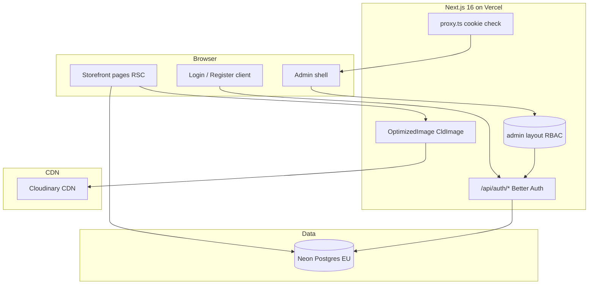

# Phase 1: Foundation, Auth & Design System — Research

**Researched:** 2026-05-16  
**Domain:** Greenfield Next.js 16 monolith — auth, design system, Neon Postgres, Cloudinary delivery  
**Confidence:** **HIGH** (locked stack + official docs); **MEDIUM** (Prisma 7 `prisma.config.ts` edge cases, admin role vs buyer on signup)

<user_constraints>

## User Constraints (from CONTEXT.md)

### Locked Decisions

**Visual identity (легкий, повітряний)**
- **D-01:** Тільки **світла тема** на v1 — багато whitespace, м’які нейтралі (slate/zinc 50–100), один акцент (наприклад, `oklch` блакитний/teal для CTA).
- **D-02:** **shadcn/ui** стиль `new-york`, Tailwind v4 `@theme` токени в `globals.css` (radius великий, тіні легкі).
- **D-03:** Шрифт **Geist Sans** (або Inter fallback) — читабельність UA тексту, розмір body ≥ 16px на mobile.
- **D-04:** Без dark mode до окремого запиту.

**Auth (Better Auth)**
- **D-05:** Лише **email + пароль** (без OAuth / magic link на v1).
- **D-06:** Реєстрація **відкрита** для покупців (`role: buyer`).
- **D-07:** **Перший admin** — через `prisma db seed` + env `ADMIN_EMAIL` / `ADMIN_PASSWORD`; публічна реєстрація **не** може отримати `admin`.
- **D-08:** Better Auth **admin plugin** + `prismaAdapter`; сесія в cookie, persist після refresh (AUTH-05).
- **D-09:** Сторінки: `/uviity` (login), `/reiestratsiia` (sign-up), `/kabinet` (заглушка кабінету після входу).

**App shell & routing**
- **D-10:** Route groups: `app/(storefront)/` і `app/(admin)/admin/` — різні layout.
- **D-11:** **Головна Phase 1:** hero (Львів, б/у техніка) + сітка **8 категорій** (seed, без PDP) + блок «Як купити» + footer з контактами-заглушками.
- **D-12:** Header: лого, посилання на категорії (ведуть на `/katalog/[slug]` — сторінки-заглушки «незабаром» або 404 з м’яким текстом до Phase 2).
- **D-13:** Middleware: `/admin/*` → redirect якщо не admin; публічні маршрути без auth.

**Cloudinary (PERF-01)**
- **D-14:** Phase 1: **delivery only** — `next-cloudinary` `CldImage` wrapper (`f_auto`, `q_auto`, responsive sizes); env `CLOUDINARY_*`.
- **D-15:** Демо-зображення на головній (1–2 з Cloudinary demo або завантажені вручну в cloud).
- **D-16:** **Signed upload у адмінці** — Phase 4 (не зараз).

**Infrastructure**
- **D-17:** Production DB: **Neon Postgres**, region **EU** (`eu-central-1` або найближчий EU).
- **D-18:** Local dev: `docker compose` Postgres **або** Neon dev branch — обрати один шлях у PLAN (рекомендація: Neon branch для parity).
- **D-19:** Seed Phase 1: **8 категорій** (назви з PROJECT.md) + **1 admin user**; без товарів.
- **D-20:** Deploy target: **Vercel** + env у preview/production з першого PR.

### Claude's Discretion

- Точні OKLCH значення акценту, copy на головній, структура `prisma/schema` для User/Category (мінімум для auth + seed).
- Вибір між Docker Postgres vs Neon-only для local — за parity з Vercel.

### Deferred Ideas (OUT OF SCOPE)

- OAuth / magic link — v2 або за запитом
- Dark mode
- Повноцінний каталог і PDP — **Phase 2**
- Signed Cloudinary upload UI — **Phase 4**
- Pusher / chat — **Phase 5**
- Юридичні сторінки (оферта, privacy) — можна Phase 6 або окремий polish; не блокує foundation

</user_constraints>

<phase_requirements>

## Phase Requirements

| ID | Description | Research Support |
|----|-------------|------------------|
| AUTH-01 | Каталог без реєстрації | Storefront routes public; no auth on `(storefront)/*`; category stubs OK |
| AUTH-02 | Реєстрація / вхід email через Better Auth | `emailAndPassword`, `/reiestratsiia`, `/uviity`, `authClient` forms |
| AUTH-05 | Сесія після перезавантаження | HTTP-only session cookie + `auth.api.getSession` on `/kabinet` |
| UI-01 | Українська мова | `lang="uk"`, UA copy, `metadata` Ukrainian |
| UI-02 | Легкий повітряний стиль | shadcn `new-york` + OKLCH `@theme inline` tokens (D-01–D-04) |
| UI-03 | Адаптив mobile-first | shadcn responsive primitives; body ≥16px; grid breakpoints on home |
| PERF-01 | Оптимізовані зображення Cloudinary | `CldImage` wrapper with `f_auto`, `q_auto`, `sizes` |

</phase_requirements>

## Summary

Phase 1 — це **вертикальний greenfield зріз**: застосунок збирається, деплоїться на Vercel, підключається до **Neon EU**, має **український повітряний UI-shell**, публічну головну з 8 seed-категоріями, **Better Auth** (email/пароль, buyer signup, seeded admin), заглушку `/kabinet`, захищений shell `/admin`, і **єдиний Cloudinary delivery-компонент** без signed upload.

**Primary recommendation:** Будувати **6 вертикальних слайсів** (scaffold+deploy → DB+seed → design tokens+layouts → home → auth → admin guard+media), а не «шар за шаром». Локально й на preview використовувати **Neon dev branch** (той самий `DATABASE_URL`/`DIRECT_URL` патерн, що production) замість Docker Postgres — parity з Vercel serverless + Prisma 7 adapter. Admin RBAC: **cookie/proxy лише для redirect**, **role перевіряти в `(admin)/admin/layout.tsx`** через `auth.api.getSession` — не покладатися на `getSessionCookie()` для безпеки.

**Confidence:** HIGH на стек і маршрути; MEDIUM на точну схему `role` (admin plugin `defaultRole` vs custom `buyer`) — потрібна перевірка під час `npx @better-auth/cli generate`.

## Architectural Responsibility Map

| Capability | Primary Tier | Secondary Tier | Rationale |
|------------|-------------|----------------|-----------|
| Session / login | API Route Handler `app/api/auth/[...all]` | Server Components (`getSession`) | Better Auth mount point; RSC reads session, не пише cookies |
| Buyer signup/login UI | Browser (Client Components) | Server Actions + `nextCookies` plugin | Forms reactive; cookies via `nextCookies()` on server actions |
| Admin route guard | Frontend Server (admin layout RSC) | `proxy.ts` (cookie-only redirect) | Role must be validated server-side; proxy не замінює RBAC |
| Category seed display | Frontend Server (storefront RSC) | Database (Prisma read) | SEO-friendly HTML; no client-only home |
| Design tokens / theme | CDN / static CSS (`globals.css`) | — | Tailwind v4 `@theme inline` |
| Optimized images | CDN (Cloudinary) | Browser (`CldImage` → Next/Image pipeline) | Transforms at edge; wrapper enforces `f_auto,q_auto` |
| Env secrets | Vercel / `.env` (server) | — | `CLOUDINARY_API_SECRET`, `BETTER_AUTH_SECRET` never client |
| DB persistence | Database (Neon Postgres) | API via Prisma adapter | Single source of truth for User, Session, Category |

## Standard Stack

### Core (Phase 1 install set)

| Library | Version (npm 2026-05-16) | Purpose | Why Standard |
|---------|--------------------------|---------|--------------|
| `next` | **16.2.6** [VERIFIED: npm registry] | App Router, RSC, metadata, `proxy.ts` | Locked mandate; Next 16 replaces middleware with proxy [CITED: better-auth.com/docs/integrations/next] |
| `react` / `react-dom` | **19.2.6** | UI | Peer of Next 16 |
| `typescript` | **~5.8.0** (pin; npm latest 6.0.3) | Types | Ecosystem lag on TS 6 with eslint-config-next — pin 5.8 per STACK.md |
| `prisma` / `@prisma/client` | **7.8.0** | ORM + migrations | Locked; Prisma 7: URL in `prisma.config.ts`, not `schema.prisma` [CITED: neon.com/docs/guides/prisma] |
| `@prisma/adapter-neon` | **7.8.0** | Serverless pooled connections | Vercel + Neon standard path |
| `better-auth` | **1.6.11** | Auth, sessions, admin plugin | Locked; built-in `prismaAdapter` from `better-auth/adapters/prisma` [CITED: prisma.io/docs/guides/authentication/better-auth/nextjs] |
| `tailwindcss` | **4.3.0** | Styling | v4 `@theme` + shadcn |
| `next-cloudinary` | **6.17.5** | `CldImage` delivery | PERF-01; Phase 1 delivery-only |
| `geist` | **1.7.0** | Geist Sans font | D-03; `next/font` integration |

### Supporting (Phase 1)

| Library | Version | Purpose | When to Use |
|---------|---------|---------|-------------|
| `zod` | **4.4.3** | Env + form validation | `src/lib/env.ts`, auth form schemas |
| `react-hook-form` + `@hookform/resolvers` | **7.76.x** / **5.2.x** | Login/register forms | AUTH-02 UI |
| `slugify` | **1.6.x** | Category slugs | Seed + `/katalog/[slug]` stubs |
| `dotenv` | latest | Prisma CLI | `prisma.config.ts` |
| `lucide-react` | latest | Icons | Via shadcn |
| `class-variance-authority`, `clsx`, `tailwind-merge` | latest | shadcn deps | Auto with `shadcn init` |

### Deferred to later phases (do not install in Phase 1 unless plan expands scope)

`nuqs`, `pusher`, `@tanstack/react-query`, `schema-dts`, `cloudinary` (server SDK) — Phase 2+ / Phase 4 / Phase 5.

### Alternatives Considered

| Instead of | Could Use | Tradeoff |
|------------|-----------|----------|
| Neon dev branch (D-18 rec.) | Docker Postgres 16 | Docker works offline; Neon branch = prod parity, no drift |
| `better-auth/adapters/prisma` | `@better-auth/prisma-adapter` | Official Prisma guide uses **built-in** adapter; prefer built-in unless CLI dictates otherwise |
| `proxy.ts` + layout RBAC | Full session in proxy only | Proxy DB session on every request is slower; layout guard required anyway |

**Installation (Wave 0 — pin at init):**

```bash
npx create-next-app@16.2.6 . --typescript --tailwind --eslint --app --src-dir --turbopack --yes
npx shadcn@latest init   # style: new-york, base: zinc, cssVariables: true
npm install prisma@7.8.0 @prisma/client@7.8.0 @prisma/adapter-neon@7.8.0 dotenv
npm install better-auth@1.6.11 zod@4.4.3 react-hook-form@7.76.0 @hookform/resolvers@5.2.2
npm install next-cloudinary@6.17.5 geist slugify
npm install -D prisma@7.8.0 typescript@~5.8.0 vitest@4.1.6 @vitejs/plugin-react @testing-library/react@16.3.2 @playwright/test@1.60.0
npx prisma init
npx @better-auth/cli@latest generate   # merge User/Session/Account into schema
```

## Package Legitimacy Audit

> **slopcheck unavailable** at research time — all packages below require planner `checkpoint:human-verify` before install unless team runs slopcheck locally. Versions verified via `npm view` 2026-05-16. No suspicious `postinstall` scripts on `better-auth`, `next-cloudinary`, `@prisma/adapter-neon`.

| Package | Registry | slopcheck | Disposition |
|---------|----------|-----------|-------------|
| next@16.2.6 | npm | n/a | Approved — official Vercel |
| better-auth@1.6.11 | npm | n/a | Approved — official docs |
| prisma / @prisma/client@7.8.0 | npm | n/a | Approved — official |
| @prisma/adapter-neon@7.8.0 | npm | n/a | Approved — Prisma + Neon docs |
| next-cloudinary@6.17.5 | npm | n/a | Approved — Cloudinary community |
| geist@1.7.0 | npm | n/a | Approved — Vercel font package |

**Packages removed due to slopcheck [SLOP]:** none  
**Packages flagged [SUS]:** none (slopcheck not run)

## Recommended Implementation Order (Vertical Slices)

Порядок для planner — **кожен слайс = deployable increment**, не «спочатку вся БД, потім весь UI».

| Slice | Deliverable | Verifies |
|-------|-------------|----------|
| **S1 — Scaffold & deploy** | `create-next-app`, Git, Vercel project, `.env.example`, `lang="uk"` root layout, empty home | App builds; preview URL exists (D-20) |
| **S2 — Database** | Neon EU project + **dev branch**; `prisma.config.ts`; `lib/db.ts` + Neon adapter; `Category` model; migrate; seed 8 categories + admin via Better Auth API in `prisma/seed.ts` | Categories on DB; admin login works locally |
| **S3 — Design system** | shadcn `new-york`, `globals.css` OKLCH tokens, Geist, `(storefront)/layout` header/footer shell | UI-02, UI-03 baseline |
| **S4 — Home (public)** | Hero + category grid from Prisma + «Як купити» + footer; `/katalog/[slug]` stub page | AUTH-01, UI-01, D-11, D-12 |
| **S5 — Auth** | `lib/auth.ts`, `api/auth/[...all]`, client, `/uviity`, `/reiestratsiia`, `/kabinet` stub; open registration → role buyer | AUTH-02, AUTH-05 |
| **S6 — Admin shell + media** | `(admin)/admin/layout` role guard; `proxy.ts` matcher `/admin`; `components/media/optimized-image.tsx`; hero `CldImage` | D-13, PERF-01; pitfall admin RBAC |

**Do not block S4 on S5** — home is public (AUTH-01). **Do block S6 admin pages on S5** — need session. **S2 before S4** — category grid reads DB.

## Auth Setup (Better Auth)

### File map

```
src/
├── lib/
│   ├── auth.ts              # betterAuth + prismaAdapter + plugins
│   ├── auth-client.ts       # createAuthClient from better-auth/react
│   └── db.ts                  # Prisma singleton + PrismaNeon adapter
├── app/
│   ├── api/auth/[...all]/route.ts
│   ├── (storefront)/
│   │   ├── uviity/page.tsx
│   │   ├── reiestratsiia/page.tsx
│   │   └── kabinet/page.tsx
│   └── (admin)/admin/
│       ├── layout.tsx         # requireAdmin() — primary RBAC
│       └── page.tsx           # dashboard stub Phase 1
```

### Server config (prescriptive pattern)

```typescript
// src/lib/auth.ts
// Source: [CITED: prisma.io/docs/guides/authentication/better-auth/nextjs]
//         [CITED: better-auth.com/docs/integrations/next]
import { betterAuth } from "better-auth";
import { prismaAdapter } from "better-auth/adapters/prisma";
import { admin } from "better-auth/plugins";
import { nextCookies } from "better-auth/next-js";
import { prisma } from "@/lib/db";

export const auth = betterAuth({
  database: prismaAdapter(prisma, { provider: "postgresql" }),
  emailAndPassword: { enabled: true }, // D-05 — skip requireEmailVerification v1
  plugins: [
    admin({
      defaultRole: "buyer", // D-06 — map to admin plugin role field; verify CLI output
    }),
    nextCookies(), // MUST be last — D-08 server actions set cookies
  ],
  trustedOrigins: [process.env.BETTER_AUTH_URL!],
});
```

```typescript
// src/app/api/auth/[...all]/route.ts
import { auth } from "@/lib/auth";
import { toNextJsHandler } from "better-auth/next-js";

export const { GET, POST } = toNextJsHandler(auth);
```

### Client

```typescript
// src/lib/auth-client.ts
import { createAuthClient } from "better-auth/react";
import { adminClient } from "better-auth/client/plugins";

export const authClient = createAuthClient({
  baseURL: process.env.NEXT_PUBLIC_APP_URL,
  plugins: [adminClient()],
});
```

### Routes (D-09)

| Path | Component | Auth |
|------|-----------|------|
| `/uviity` | Login form (`signIn.email`) | Public |
| `/reiestratsiia` | Sign-up (`signUp.email`) | Public; never expose role selector |
| `/kabinet` | «Вітаємо, {name}» stub | `getSession` → redirect `/uviity` |

### Seed admin (D-07)

In `prisma/seed.ts` after `generate`:

1. Read `ADMIN_EMAIL`, `ADMIN_PASSWORD` from env (fail if missing in dev).
2. Create user via `auth.api.signUpEmail` **or** Prisma `user.create` + `account` with hashed password using Better Auth's password hash helper — **prefer documented seed pattern from Better Auth CLI examples**.
3. Set `role: "admin"` on user row (admin plugin field) [CITED: better-auth.com/docs/plugins/admin].
4. Never accept `role` from signup request body.

### Session persistence (AUTH-05)

- Verify manually: login → `/kabinet` → hard refresh → still authenticated.
- E2E: Playwright `storageState` after login (Wave 0).

### Admin plugin vs custom `buyer` role

Admin plugin adds `role` with default `user` in docs; project wants **`buyer`**. **Planner task:** after `auth generate`, set `admin({ defaultRole: "buyer" })` and confirm enum/string in schema. If plugin only allows `user`/`admin`, map `user` → buyer in app copy and document in PLAN — do not fork auth.

## DB Schema Minimum (Phase 1)

### Better Auth tables (from CLI `npx @better-auth/cli generate`)

`User`, `Session`, `Account`, `Verification` — merge into `prisma/schema.prisma` [CITED: prisma.io/docs/guides/authentication/better-auth/nextjs].

**Extend `User` for app (if not added by admin plugin):**

```prisma
// After CLI generate — admin plugin adds role, banned, etc.
// role: "buyer" | "admin"  (verify exact values from generated schema)
```

### App: Category (D-19)

```prisma
model Category {
  id          String   @id @default(cuid())
  name        String   // Ukrainian display name
  slug        String   @unique
  description String?
  sortOrder   Int      @default(0)
  createdAt   DateTime @default(now())
  updatedAt   DateTime @updatedAt
}
```

### Seed: 8 categories (from PROJECT.md)

| name (UA) | suggested slug |
|-----------|----------------|
| Пральні машини | `pralni-mashyny` |
| Холодильники | `kholodylnyky` |
| Морозильні камери | `morozylni-kamery` |
| Телевізори | `televizory` |
| Плити | `plyty` |
| Духові шафи | `dukhovi-shafy` |
| Варильні поверхні | `varylni-poverkhni` |
| Сушарки для одягу | `susharky-dlia-odyahu` |

No `Product` table in Phase 1 — Phase 2.

### Prisma 7 + Neon wiring

**`prisma.config.ts`** (project root):

```typescript
import "dotenv/config";
import { defineConfig, env } from "prisma/config";

export default defineConfig({
  schema: "prisma/schema.prisma",
  datasource: { url: env("DIRECT_URL") },
});
```

**`src/lib/db.ts`:**

```typescript
import { PrismaClient } from "@/generated/prisma/client"; // path from `prisma init --output`
import { PrismaNeon } from "@prisma/adapter-neon";

const adapter = new PrismaNeon({ connectionString: process.env.DATABASE_URL! });
const globalForPrisma = globalThis as { prisma?: PrismaClient };
export const prisma = globalForPrisma.prisma ?? new PrismaClient({ adapter });
if (process.env.NODE_ENV !== "production") globalForPrisma.prisma = prisma;
```

[CITED: neon.com/docs/guides/prisma]

**Commands:**

```bash
npx prisma migrate dev --name init_foundation
npx prisma db seed
```

## UI / Design Tokens (D-01–D-04)

### shadcn init

```bash
npx shadcn@latest init
# style: new-york, base color: zinc, cssVariables: true
```

[CITED: ui.shadcn.com/docs/tailwind-v4] — new projects use Tailwind v4 + React 19; OKLCH colors; `@theme inline`.

### `src/app/globals.css` (discretion — starting point)

```css
@import "tailwindcss";

:root {
  --background: oklch(0.99 0.002 247);
  --foreground: oklch(0.22 0.02 260);
  --card: oklch(1 0 0);
  --primary: oklch(0.58 0.14 200);      /* airy teal/cyan CTA */
  --primary-foreground: oklch(0.99 0 0);
  --muted: oklch(0.96 0.01 260);
  --border: oklch(0.92 0.01 260);
  --radius: 0.75rem;                   /* large radius D-02 */
}

@theme inline {
  --color-background: var(--background);
  --color-foreground: var(--foreground);
  --color-primary: var(--primary);
  --color-muted: var(--muted);
  --font-sans: var(--font-geist-sans);
}
```

### Root layout

```typescript
// src/app/layout.tsx — metadata UA, lang uk (UI-01)
import { GeistSans } from "geist/font/sans";

export default function RootLayout({ children }: { children: React.ReactNode }) {
  return (
    <html lang="uk" className={GeistSans.className}>
      <body className="min-h-dvh bg-background text-foreground antialiased text-base">
        {children}
      </body>
    </html>
  );
}
```

**Mobile:** `text-base` (16px+), generous `py-12` / `gap-8` on home sections (D-01 whitespace).

## Cloudinary — Delivery Only (PERF-01, D-14–D-16)

### Env (Phase 1)

| Variable | Scope | Required Phase 1 |
|----------|-------|------------------|
| `NEXT_PUBLIC_CLOUDINARY_CLOUD_NAME` | client | yes |
| `NEXT_PUBLIC_CLOUDINARY_API_KEY` | client | optional (not needed for CldImage only) |
| `CLOUDINARY_API_SECRET` | server | no until Phase 4 signed upload |

[CITED: github.com/cloudinary-community/next-cloudinary — installation.mdx]

### Wrapper: `src/components/media/optimized-image.tsx`

```tsx
"use client";
// Source: [CITED: github.com/cloudinary-community/next-cloudinary]
import { CldImage, type CldImageProps } from "next-cloudinary";

type OptimizedImageProps = Omit<CldImageProps, "src"> & {
  src: string; // Cloudinary public_id
};

export function OptimizedImage({ src, sizes = "100vw", ...props }: OptimizedImageProps) {
  return (
    <CldImage
      src={src}
      deliveryType="upload"
      format="auto"
      quality="auto"
      sizes={sizes}
      {...props}
    />
  );
}
```

**Hero usage:** `priority`, `sizes="(max-width: 768px) 100vw, 50vw"`, fixed `width`/`height` to limit CLS.

**Demo assets (D-15):** Use 1–2 public_ids from your Cloudinary Media Library (e.g. `samples/ecommerce/...`) or upload manually once — document public_ids in seed/constants file `src/lib/demo-assets.ts`.

## Middleware & Route Groups (D-10, D-13)

### Structure

```
src/app/
├── layout.tsx
├── proxy.ts                    # Next 16 — repo root OR src/ per create-next-app
├── (storefront)/
│   ├── layout.tsx              # Header + footer
│   ├── page.tsx                # Home
│   ├── katalog/[slug]/page.tsx # Stub «Незабаром»
│   ├── uviity/
│   ├── reiestratsiia/
│   └── kabinet/
└── (admin)/
    └── admin/
        ├── layout.tsx          # RBAC + noindex
        └── page.tsx
```

### `proxy.ts` (optimistic only — D-13)

```typescript
// src/proxy.ts — Next 16
// Source: [CITED: better-auth.com/docs/integrations/next]
import { NextRequest, NextResponse } from "next/server";
import { getSessionCookie } from "better-auth/cookies";

export function proxy(request: NextRequest) {
  if (!request.nextUrl.pathname.startsWith("/admin")) {
    return NextResponse.next();
  }
  const sessionCookie = getSessionCookie(request);
  if (!sessionCookie) {
    return NextResponse.redirect(new URL("/uviity", request.url));
  }
  return NextResponse.next();
}

export const config = {
  matcher: ["/admin/:path*"],
};
```

**Critical:** `(admin)/admin/layout.tsx` must call `auth.api.getSession` and `session.user.role === "admin"` (or plugin equivalent) → redirect `/uviity`. Without this, pitfall #2 (PITFALLS.md) applies.

```typescript
// src/lib/permissions.ts
import { auth } from "@/lib/auth";
import { headers } from "next/headers";
import { redirect } from "next/navigation";

export async function requireAdmin() {
  const session = await auth.api.getSession({ headers: await headers() });
  if (!session?.user || session.user.role !== "admin") {
    redirect("/uviity");
  }
  return session;
}
```

Admin layout: `export const metadata = { robots: { index: false, follow: false } }`.

## Vercel Deploy + Neon Branch (D-17, D-18, D-20)

### Recommendation: **Neon branch for local = parity** [HIGH confidence for planner default]

| Environment | Database | Notes |
|-------------|----------|-------|
| Local dev | Neon **dev** branch | Same adapter/pooling as Vercel |
| Vercel Preview | Neon **preview** branch per PR (optional) or shared staging | Set in Vercel Integrations |
| Production | Neon **main** EU (`eu-central-1`) | D-17 |

**Why not Docker for Phase 1 default:** Prisma 7 Neon adapter + pooled `DATABASE_URL` behavior differs from local `pg`; fewer «works locally, fails on Vercel» surprises [MEDIUM — team can still choose Docker via discretion].

### Env vars (Vercel + `.env.example`)

```bash
# App
NEXT_PUBLIC_APP_URL=https://your-app.vercel.app
BETTER_AUTH_SECRET=          # openssl rand -base64 32
BETTER_AUTH_URL=             # same as NEXT_PUBLIC_APP_URL in prod

# Neon
DATABASE_URL=                # pooled (-pooler host)
DIRECT_URL=                  # direct, for prisma migrate

# Seed (local/CI only — NOT production Vercel unless bootstrap)
ADMIN_EMAIL=
ADMIN_PASSWORD=

# Cloudinary
NEXT_PUBLIC_CLOUDINARY_CLOUD_NAME=
```

**Vercel build:** `prisma generate && next build` — add `postinstall`: `prisma generate` in `package.json`.

**First PR checklist:** Link repo → import env → deploy → smoke: home 200, `/api/auth/get-session` reachable.

## Architecture Patterns

### System Architecture Diagram



### Anti-Patterns to Avoid

- **Prisma in Client Components** — use RSC + server only.
- **Admin security = proxy only** — PITFALLS #2; layout + future Server Actions must use `requireAdmin()`.
- **Signed upload in Phase 1** — D-16 defers to Phase 4.
- **`getSessionCookie` for mutations** — insecure [CITED: better-auth.com/docs/integrations/next].
- **Dark mode tokens** — D-04 out of scope.

## Don't Hand-Roll

| Problem | Don't Build | Use Instead | Why |
|---------|-------------|-------------|-----|
| Session/cookies | Custom JWT middleware | Better Auth | Cookie cache, rotation, CSRF patterns |
| Auth tables | Manual User/Session SQL | `@better-auth/cli generate` | Schema drift |
| Image CDN transforms | `` + manual URLs | `CldImage` + `f_auto,q_auto` | Format/width edge cases |
| Admin roles | DIY role string in cookie | Better Auth admin plugin | Ban/role fields documented |
| DB pooling on Vercel | Raw `pg` per request | `@prisma/adapter-neon` | Serverless connection limits |
| Form validation | Manual if/else | Zod 4 + RHF resolvers | Shared client/server |

## Common Pitfalls (Phase 1 relevant from PITFALLS.md)

### Pitfall: Admin secured only by middleware/proxy cookie (PITFALLS #2)

**Avoid:** Role check only in `proxy.ts`.  
**Do:** `requireAdmin()` in admin layout; document for Phase 4 Server Actions.  
**Verify:** Log in as buyer → GET `/admin` → redirect or 403, not admin UI.

### Pitfall: Cloudinary unsigned upload (PITFALLS #5) — Phase 1 partial

**Phase 1:** Delivery only — no upload widget. **Risk:** putting `CLOUDINARY_API_SECRET` in client.  
**Verify:** `grep` build client bundle / no secret in `NEXT_PUBLIC_*`.

### Pitfall: Client-only public pages (SEO prep)

**Phase 1:** Home + stubs as RSC. **Verify:** View source shows category names in HTML.

### Pitfall: English metadata / missing `lang="uk"` (PITFALLS #4 partial)

**Verify:** `<html lang="uk">`; `metadata.title` Ukrainian on home.

### Pitfall: Registration elevates to admin

**Verify:** Sign-up API never accepts `role: admin`; only seed sets admin.

## Code Examples

### Public page session check (`/kabinet`)

```typescript
// Source: [CITED: better-auth.com/docs/integrations/next]
import { auth } from "@/lib/auth";
import { headers } from "next/headers";
import { redirect } from "next/navigation";

export default async function KabinetPage() {
  const session = await auth.api.getSession({ headers: await headers() });
  if (!session) redirect("/uviity");
  return <main className="mx-auto max-w-3xl p-6"><h1>Вітаємо, {session.user.name}</h1></main>;
}
```

### Category grid (home)

```typescript
import { prisma } from "@/lib/db";
import Link from "next/link";

export default async function HomePage() {
  const categories = await prisma.category.findMany({ orderBy: { sortOrder: "asc" } });
  return (
    <section className="grid gap-4 sm:grid-cols-2 lg:grid-cols-4">
      {categories.map((c) => (
        <Link key={c.id} href={`/katalog/${c.slug}`} className="rounded-xl border p-6">
          {c.name}
        </Link>
      ))}
    </section>
  );
}
```

## Project Constraints (from .cursor/rules/)

- **Stack locked:** Next.js App Router, TypeScript, Prisma, PostgreSQL, Tailwind, shadcn, Cloudinary, Better Auth — no substitutes.
- **GSD workflow:** Implementation via `/gsd-execute-phase` plans; avoid drive-by edits outside phase scope.
- **Locale:** Ukrainian UI only; no `next-intl` for v1.
- **Business:** Single-store Lviv; used appliances only.

## State of the Art

| Old Approach | Current Approach | When Changed | Impact |
|--------------|------------------|--------------|--------|
| `middleware.ts` | `proxy.ts` in Next 16 | Next 16 | Rename + function name `proxy` |
| Prisma URL in schema | `prisma.config.ts` + adapter | Prisma 7 | Planner must add config file Wave 0 |
| shadcn `default` style | `new-york` default | 2025 shadcn | Match D-02 |
| HSL theme vars | OKLCH + `@theme inline` | Tailwind v4 / shadcn | globals.css pattern |

## Assumptions Log

| # | Claim | Section | Risk if Wrong |
|---|-------|---------|---------------|
| A1 | `admin({ defaultRole: "buyer" })` is valid | Auth | Signups get wrong role — verify after CLI generate |
| A2 | Built-in `prismaAdapter` sufficient (no `@better-auth/prisma-adapter`) | Stack | Wrong import path at install |
| A3 | `proxy.ts` lives at `src/proxy.ts` for this scaffold | Routing | File location mismatch — follow create-next-app output |
| A4 | Geist package `geist` works with Next 16 without `next/font/local` | UI | Font load failure — fallback Inter in layout |
| A5 | Phase 1 skips `requireEmailVerification` | Auth | Simpler signup; revisit for production abuse |

## Open Questions

1. **Better Auth role string for buyers**  
   - Known: admin plugin defaults to `user` in docs.  
   - Unclear: whether `buyer` is accepted as `defaultRole`.  
   - Recommendation: Spike in Wave 0 task 1 — generate schema, test signup, adjust PLAN.

2. **Preview DB strategy**  
   - Known: Neon supports branches.  
   - Unclear: per-PR branch vs shared staging for solo dev.  
   - Recommendation: Solo → one dev branch; enable per-PR when team grows.

## Environment Availability

| Dependency | Required By | Available | Version | Fallback |
|------------|-------------|-----------|---------|----------|
| Node.js | Next 16, Prisma 7 | ✓ | v24.14.0 | Prisma docs ask 20.19+ — OK |
| npm | install | ✓ | 11.9.0 | — |
| ctx7 CLI | doc fallback | ✗ | — | Context7 MCP used instead |
| slopcheck | package audit | ✗ | — | Human verify before install |
| Neon account | DATABASE_URL | ? | — | Blocker if missing — create EU project |
| Vercel account | D-20 | ? | — | Blocker for deploy slice |
| Cloudinary account | PERF-01 demo | ? | — | Can use public sample public_ids temporarily |

**Missing with no fallback:** Neon + Vercel credentials for deploy slice S1/S2.

## Validation Architecture

### Test Framework

| Property | Value |
|----------|-------|
| Framework | Vitest **4.1.6** + Playwright **1.60.0** (install Wave 0) |
| Config file | none — create `vitest.config.ts`, `playwright.config.ts` in Wave 0 |
| Quick run command | `npm run test` → `vitest run` |
| Full suite command | `npm run test:e2e` → `playwright test` |

### Phase Requirements → Test Map

| Req ID | Behavior | Test Type | Automated Command | File Exists? |
|--------|----------|-----------|-------------------|--------------|
| AUTH-01 | Guest opens `/` and `/katalog/*` | e2e | `playwright test e2e/public-browse.spec.ts` | ❌ Wave 0 |
| AUTH-02 | Register + login | e2e | `playwright test e2e/auth.spec.ts` | ❌ Wave 0 |
| AUTH-05 | Session survives reload | e2e | `playwright test e2e/session-persist.spec.ts` | ❌ Wave 0 |
| UI-01 | `lang="uk"` + UA title | e2e | `playwright test e2e/locale.spec.ts` | ❌ Wave 0 |
| UI-02/03 | Home layout smoke | e2e | `playwright test e2e/home-layout.spec.ts` | ❌ Wave 0 |
| PERF-01 | Hero uses optimized image | e2e + manual | Check response URLs contain Cloudinary/res.cloudinary | ❌ Wave 0 |
| — | Env schema valid | unit | `vitest run src/lib/env.test.ts` | ❌ Wave 0 |
| — | Category seed count | unit/integration | `vitest run prisma/seed.test.ts` | ❌ Wave 0 |

### Sampling Rate

- **Per task commit:** `vitest run` (when tests exist)
- **Per wave merge:** `playwright test` on auth + public paths
- **Phase gate:** Manual: login → refresh `/kabinet`; buyer denied `/admin`; Lighthouse quick on home images

### Wave 0 Gaps

- [ ] `vitest.config.ts` + `package.json` scripts `test`, `test:e2e`
- [ ] `playwright.config.ts` + `e2e/auth.spec.ts`, `e2e/public-browse.spec.ts`
- [ ] `src/lib/env.ts` + `env.test.ts` (Zod parse `DATABASE_URL`, `BETTER_AUTH_SECRET`, Cloudinary cloud name)
- [ ] CI stub: `npm run lint && vitest run && playwright test` (optional Phase 1 tail)

## Security Domain

### Applicable ASVS Categories

| ASVS Category | Applies | Standard Control |
|---------------|---------|------------------|
| V2 Authentication | yes | Better Auth email/password; bcrypt/hash via library |
| V3 Session Management | yes | HTTP-only cookies; `getSession` server-side |
| V4 Access Control | yes (admin shell) | `requireAdmin()` in layout; proxy redirect only auxiliary |
| V5 Input Validation | yes | Zod on auth forms; Prisma parameterized queries |
| V6 Cryptography | partial | `BETTER_AUTH_SECRET`; no custom crypto |

### Known Threat Patterns

| Pattern | STRIDE | Standard Mitigation |
|---------|--------|---------------------|
| Privilege escalation via signup body | Elevation | No role field on public signup; seed-only admin |
| Fake session cookie | Spoofing | `getSession` on protected routes, not cookie presence alone |
| Missing RBAC on `/admin` | Elevation | Layout + future action guards (PITFALLS #2) |
| Secret in client bundle | Info disclosure | Only `NEXT_PUBLIC_CLOUDINARY_CLOUD_NAME` Phase 1 |

## Sources

### Primary (HIGH confidence)

- [/better-auth/better-auth](https://github.com/better-auth/better-auth) — email/password, admin plugin, Next integration (Context7)
- [better-auth.com/docs/integrations/next](https://www.better-auth.com/docs/integrations/next) — proxy, getSession, nextCookies
- [prisma.io/docs/guides/authentication/better-auth/nextjs](https://www.prisma.io/docs/guides/authentication/better-auth/nextjs) — prismaAdapter, CLI generate
- [neon.com/docs/guides/prisma](https://neon.tech/docs/guides/prisma) — Prisma 7 + Neon adapter, DIRECT_URL
- [/vercel/next.js/v16.1.6](https://github.com/vercel/next.js/tree/v16.1.6/docs) — proxy, root layout, metadata (Context7)
- [ui.shadcn.com/docs/tailwind-v4](https://ui.shadcn.com/docs/tailwind-v4) — new-york, OKLCH, @theme inline
- [/cloudinary-community/next-cloudinary](https://github.com/cloudinary-community/next-cloudinary) — CldImage, env vars (Context7)
- [npm registry](https://www.npmjs.com/) — versions 2026-05-16

### Secondary (MEDIUM confidence)

- `.planning/research/PITFALLS.md` — admin RBAC, Cloudinary, SEO prep
- `.planning/research/ARCHITECTURE.md` — route groups, services layer (Phase 2+)

## Metadata

**Confidence breakdown:**

- Standard stack: **HIGH** — mandated + npm + official docs
- Architecture / slice order: **HIGH** — CONTEXT + ARCHITECTURE aligned
- Auth role naming (`buyer`): **MEDIUM** — verify post-CLI
- Prisma 7 config: **MEDIUM** — evolving docs; validate on init

**Research date:** 2026-05-16  
**Valid until:** 2026-06-16 (stable stack); re-verify Better Auth/Prisma minors if upgrading

## RESEARCH COMPLETE
