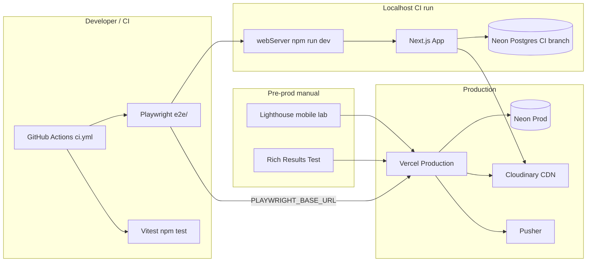

# Phase 6: Polish & Launch — Research

**Researched:** 2026-05-17  
**Domain:** Production hardening — CI (GitHub Actions), Playwright E2E gate, SEO/robots/sitemap verification, mobile CWV lab gate, Vercel deploy + smoke  
**Confidence:** HIGH (codebase + locked CONTEXT); MEDIUM (CI Neon secrets pattern — not yet in repo)

## Summary

Phase 6 is **verification and hardening only**: no new product features. The codebase already has **23 Playwright specs**, Vitest unit tests, `sitemap.ts` with `AVAILABLE`-only products, `OptimizedImage` (`format="auto"`, `quality="auto"`), Prisma catalog queries with `include` (no list N+1), and composite indexes on `Product`. Gaps vs locked decisions: **no `.github/workflows/ci.yml`**, **no `src/app/robots.ts`**, **thin `catalog-seo.spec.ts` / `smoke-deploy.spec.ts`**, **no `critical-journey.spec.ts`**, **`.env.example` lacks Production section**.

CI must run `npm ci` → `lint` → `vitest` → `playwright test` on **localhost** via existing `playwright.config.ts` `webServer` (`npm run dev`). E2E `global-setup.js` runs `npx prisma db seed` — **CI requires a real Postgres URL** (Neon branch in GitHub Secrets), not placeholders. Optional specs (`chat-realtime`, Cloudinary sign in `admin-rbac`) use `test.skip()` and must not fail CI (D-06-24).

**Primary recommendation:** Ship five vertical plans — (1) GitHub Actions CI + documented CI env secrets, (2) `critical-journey` + SEO/smoke spec extensions, (3) `robots.ts` + `.env.example` Production, (4) manual Lighthouse + Rich Results checklist in `06-VERIFICATION.md`, (5) production deploy smoke docs — without changing locked D-06-01…26.

## Architectural Responsibility Map

| Capability | Primary Tier | Secondary Tier | Rationale |
|------------|-------------|----------------|-----------|
| PR CI gate (lint, unit, E2E) | CI / GitHub Actions | Local dev scripts | Runs on push/PR; no app runtime |
| E2E user journeys | Browser (Playwright) | Frontend server (webServer) | Asserts full stack against localhost |
| SEO metadata / JSON-LD / sitemap | Frontend server (RSC, `sitemap.ts`) | E2E `request` API checks | Generated at request/build time |
| `robots.txt` | Frontend server (`app/robots.ts`) | — | Metadata route, cached by default [CITED: next.js robots.mdx] |
| Image CWV (LCP) | CDN (Cloudinary) + Browser | React (`CldImage` props) | Transforms at edge; `priority`/`sizes` in components |
| Catalog query perf | API / DB (Prisma) | — | `findMany` + `include`; indexes in schema |
| Production env / deploy | Vercel platform | Docs (`06-ENV-CHECKLIST.md`) | Env vars on Vercel; smoke via `PLAYWRIGHT_BASE_URL` |
| Manual perf/SEO gate | Human (lab tools) | `06-VERIFICATION.md` | No Lighthouse CI per D-06-08 |

<user_constraints>

## User Constraints (from CONTEXT.md)

### Locked Decisions

#### E2E gate (area 1)
- **D-06-01:** Phase gate = `npm test && npm run test:e2e` — entire `e2e/` directory.
- **D-06-02:** Keep **separate spec files** per domain — do not merge into one monolith.
- **D-06-03:** Add **`e2e/critical-journey.spec.ts`**: one authenticated happy-path — catalog or PDP → cart → checkout → order confirmation with **unique marker**. No admin/chat in same file.
- **D-06-04:** `e2e/chat-realtime.spec.ts` stays **optional** — `test.skip(!hasPusherSecrets())`. Auth, persistence, widget, admin-chat — **required**.
- **D-06-05:** Admin upload E2E with Cloudinary — skip without `hasCloudinarySecrets()`; do not block CI without secrets.

#### Performance / CWV (area 2)
- **D-06-06:** **Mobile lab Lighthouse** on 3 URLs before production promote: `/`, `/katalog`, one seed PDP.
- **D-06-07:** Targets v1 (lab, mobile): **LCP ≤ 2.5s**, **CLS ≤ 0.1**, **INP ≤ 200ms** on those three pages. If missed — perf task in plan, not ship without record in VERIFICATION.
- **D-06-08:** **No Lighthouse CI** or new SaaS on v1 — manual gate + scores in `06-VERIFICATION.md`.
- **D-06-09:** Perf pass: `OptimizedImage` / `CldImage` (`f_auto`, `q_auto`, `sizes`, PDP `priority`); Prisma catalog without N+1 (PITFALLS §Performance).

#### SEO verification (area 3)
- **D-06-10:** **Automated:** extend `e2e/catalog-seo.spec.ts` — `<html lang="uk">`, JSON-LD on PDP, `GET /sitemap.xml` 200, sample sitemap URL 200, **sold slug not in sitemap** (seed fixture).
- **D-06-11:** **Manual before prod:** Rich Results Test — home (LocalBusiness, Lviv) + one PDP (Product + `UsedCondition`); review `robots.txt` if present.
- **D-06-12:** **GSC** — post-launch, out of phase scope.
- **D-06-13:** SEO gate on **preview deployment** before production promote.

#### Production deploy & smoke (area 4)
- **D-06-14:** **Env checklist** (plan or `06-ENV-CHECKLIST.md`): prod required — `DATABASE_URL`, `DIRECT_URL`, `BETTER_AUTH_*`, `NEXT_PUBLIC_APP_URL`, Cloudinary trio, Pusher six vars; **not** `ADMIN_PASSWORD` on prod.
- **D-06-15:** `NEXT_PUBLIC_APP_URL` and `BETTER_AUTH_URL` = production origin (https, no trailing-slash mismatch).
- **D-06-16:** Promote: preview green (CI/local) → manual Lighthouse + SEO → production deploy → production smoke.
- **D-06-17:** Post-deploy: `PLAYWRIGHT_BASE_URL=https://<prod> npx playwright test e2e/smoke-deploy.spec.ts` plus extended smoke (home + `/katalog` + `/robots.txt` or `sitemap.xml`).
- **D-06-18:** `.env.example` — **Production** section with required/forbidden comments.

#### Launch cut line (area 5)
- **D-06-19:** **Ship blockers:** E2E gate, env checklist, manual perf, SEO auto + manual, production smoke.
- **D-06-20:** **Defer:** Sentry/APM, legal pages, NOTF-01, Lighthouse CI, GSC, analytics beyond Vercel Analytics.
- **D-06-21:** Public catalog/checkout — soft local launch, not friends-only beta.
- **D-06-22:** If `robots.txt` missing or no sitemap reference — add minimal `app/robots.ts`.

#### CI / PR gate (area 6)
- **D-06-23:** **`.github/workflows/ci.yml`**: on `pull_request` and `push` to `main` — `npm ci`, `npm run lint`, `npm test`, `npx playwright test` with `webServer` (localhost), no production secrets.
- **D-06-24:** CI must not fail on skipped optional specs; required specs green.
- **D-06-25:** **No** E2E against Vercel preview URL in CI v1 — preview smoke manual.
- **D-06-26:** Keep `forbidOnly: !!process.env.CI` in Playwright config.

### Claude's Discretion

User delegated all six areas; locks are D-06-01…26. Planner may split into 3–5 plans (CI, E2E journey, SEO/perf verify, deploy docs, smoke) without changing locks.

### Deferred Ideas (OUT OF SCOPE)

- Sentry / error tracking  
- Legal pages (privacy, offer)  
- Google Search Console onboarding  
- Lighthouse CI / Speedcurve  
- E2E on Vercel preview in CI  
- NOTF-01 email/SMS  

</user_constraints>

<phase_requirements>

## Phase Requirements

| ID | Description | Research Support |
|----|-------------|------------------|
| SEO-01 | Unique meta title/description for categories and products | Already implemented (`generateMetadata`); extend E2E title checks; manual Rich Results optional |
| SEO-02 | JSON-LD Product + LocalBusiness (Lviv) | `page.tsx` LocalBusiness; `product-json-ld.ts`; strengthen E2E for `UsedCondition` / `@type:Product` |
| PERF-01 | Optimized Cloudinary images | `OptimizedImage` uses `format="auto"`, `quality="auto"`; PDP `priority`; verify `sizes` on catalog cards; manual Lighthouse gate |
| Cross-cutting | E2E catalog→cart→checkout→admin→chat | 23 specs exist; add `critical-journey`; CI runs full `e2e/`; optional Pusher/Cloudinary skips |
| Cross-cutting | Production deploy on Vercel | `vercel.json` minimal; env checklist + smoke with `PLAYWRIGHT_BASE_URL` |

</phase_requirements>

## Standard Stack

### Core (already installed — no new packages required for phase)

| Library | Version (verified) | Purpose | Why Standard |
|---------|-------------------|---------|--------------|
| `next` | **16.2.6** [VERIFIED: package.json] | App Router, `robots.ts`, `sitemap.ts` | Project stack; metadata routes [CITED: /vercel/next.js robots.mdx] |
| `@playwright/test` | **1.60.0** [VERIFIED: npm registry via `npm view`] | E2E gate | Official CI pattern [CITED: playwright.dev/docs/ci-intro] |
| `vitest` | **4.1.6** [VERIFIED: package.json] | Unit gate (`npm test`) | Existing service/route tests |
| `next-cloudinary` / `cloudinary` | **6.17.5** / **2.10.0** | `CldImage` perf | PERF-01 delivery |
| `prisma` | **7.8.0** | Catalog queries, seed for E2E | Indexes present; `listPublicProductSlugsForSitemap` filters `AVAILABLE` |

### Supporting

| Tool | Purpose | When to Use |
|------|---------|-------------|
| GitHub Actions | CI workflow | D-06-23 |
| Chrome DevTools Lighthouse / PageSpeed | Mobile lab CWV | D-06-06–07 (manual) |
| Google Rich Results Test | JSON-LD validation | D-06-11 (manual) |
| Vercel CLI / dashboard | Production deploy + env | D-06-14–17 |

### Alternatives Considered

| Instead of | Could Use | Tradeoff |
|------------|-----------|----------|
| GitHub Actions | Other CI | User repo standard; Playwright docs target GHA [CITED: playwright CI] |
| Manual Lighthouse | Lighthouse CI | **Rejected** by D-06-08 |
| `app/robots.ts` | Static `robots.txt` | Dynamic `sitemap` URL from `NEXT_PUBLIC_APP_URL` — use `robots.ts` [CITED: next.js] |

**Installation:** None required for phase scope (workflow + app files only).

## Package Legitimacy Audit

> Phase 6 does **not** introduce new npm dependencies. Existing gate packages already in `package.json`.

| Package | Registry | slopcheck | Disposition |
|---------|----------|-----------|-------------|
| *(no new installs)* | — | unavailable | N/A |

**slopcheck:** Not available in research environment — no new packages to audit.

## Architecture Patterns

### System Architecture Diagram



### Recommended Project Structure (changes only)

```
.github/workflows/ci.yml          # NEW — D-06-23
src/app/robots.ts                 # NEW — D-06-22
e2e/critical-journey.spec.ts      # NEW — D-06-03
e2e/catalog-seo.spec.ts         # EXTEND — D-06-10
e2e/smoke-deploy.spec.ts          # EXTEND — D-06-17
.env.example                      # EXTEND Production section — D-06-18
.planning/phases/06-polish-launch/
  06-ENV-CHECKLIST.md             # OPTIONAL — D-06-14
  06-VERIFICATION.md              # Manual Lighthouse + SEO scores — D-06-07/11
```

### Pattern 1: GitHub Actions CI with Playwright webServer

**What:** Single job: install deps, browsers, lint, unit tests, E2E. Playwright starts dev server when `PLAYWRIGHT_BASE_URL` is unset (current config).

**When to use:** Every push/PR to `main` (D-06-23).

**Example:**

```yaml
# Source: [CITED: https://playwright.dev/docs/ci-intro]
# Adapted: add npm run lint && npm test before playwright
name: CI
on:
  push:
    branches: [main]
  pull_request:
    branches: [main]
jobs:
  test:
    timeout-minutes: 60
    runs-on: ubuntu-latest
    env:
      CI: true
      # Required for app boot + global-setup seed (see Environment Availability)
      DATABASE_URL: ${{ secrets.DATABASE_URL }}
      DIRECT_URL: ${{ secrets.DIRECT_URL }}
      BETTER_AUTH_SECRET: ${{ secrets.BETTER_AUTH_SECRET }}
      BETTER_AUTH_URL: http://localhost:3000
      NEXT_PUBLIC_APP_URL: http://localhost:3000
      NEXT_PUBLIC_CLOUDINARY_CLOUD_NAME: ${{ secrets.NEXT_PUBLIC_CLOUDINARY_CLOUD_NAME }}
    steps:
      - uses: actions/checkout@v4
      - uses: actions/setup-node@v4
        with:
          node-version: "20"
          cache: npm
      - run: npm ci
      - run: npm run lint
      - run: npm test
      - run: npx playwright install --with-deps chromium
      - run: npx playwright test
```

**CI env note:** `global-setup.js` runs `npx prisma db seed` — **DATABASE_URL/DIRECT_URL must point to a disposable CI database** (Neon branch). Use fixed `BETTER_AUTH_SECRET` (≥32 chars) in GitHub Secrets. Do **not** use production URLs (D-06-23). Pusher/Cloudinary API secrets optional — optional tests skip.

### Pattern 2: Optional E2E skip (existing — preserve)

**What:** `test.skip(!hasPusherSecrets())` / `hasCloudinarySecrets()` at describe or test level.

**Files:** `e2e/chat-realtime.spec.ts`, `e2e/admin-rbac.spec.ts` (sign route only).

**CI behavior:** Skipped tests report as skipped, not failed [CITED: Playwright test.skip semantics] — satisfies D-06-24.

### Pattern 3: `app/robots.ts` with dynamic sitemap URL

**What:** Disallow admin/API; point crawlers to absolute sitemap URL from `getEnv().NEXT_PUBLIC_APP_URL`.

**Example:**

```typescript
// Source: [CITED: node_modules/next/dist/docs/.../robots.md]
//         [CITED: /vercel/next.js — MetadataRoute.Robots]
import type { MetadataRoute } from "next";
import { getEnv } from "@/lib/env";

export default function robots(): MetadataRoute.Robots {
  const baseUrl = getEnv().NEXT_PUBLIC_APP_URL.replace(/\/$/, "");
  return {
    rules: {
      userAgent: "*",
      allow: "/",
      disallow: ["/admin", "/api/"],
    },
    sitemap: `${baseUrl}/sitemap.xml`,
  };
}
```

### Pattern 4: Critical journey with unique order marker

**What:** Reuse `e2e/helpers/catalog.ts` + checkout flow; put unique string in **notes** field (`checkout-form.tsx` → `order.notes`); assert on confirmation URL `ASL-…` and visible marker.

**Seed constant for sold sitemap exclusion:** `samsung-kholodylnyk-sold-demo-sold` (from `prisma/seed-products.ts` + `e2e/product-pdp.spec.ts`).

**Example sketch:**

```typescript
// Pattern from e2e/checkout.spec.ts + D-06-03
const marker = `E2E-JOURNEY-${Date.now()}`;
// ... register, openFirstCatalogProduct, addCurrentProductToCart ...
await page.getByLabel("Коментар").fill(marker);
// ... submit ...
await expect(page).toHaveURL(/\/zamovlennia\/pidtverdzhennia\/ASL-/);
await expect(page.getByText(marker)).toBeVisible(); // if shown on confirmation
```

*Verify confirmation page renders `notes` — if not, assert marker via order number only and/or kabinet history in a follow-up assertion.*

### Pattern 5: Production smoke (remote base URL)

**What:** `PLAYWRIGHT_BASE_URL` set → `playwright.config.ts` disables `webServer`; run subset `e2e/smoke-deploy.spec.ts` against prod/preview.

```bash
PLAYWRIGHT_BASE_URL=https://your-domain.vercel.app npx playwright test e2e/smoke-deploy.spec.ts
```

### Anti-Patterns to Avoid

- **E2E against Vercel preview in CI:** Forbidden by D-06-25; flaky + secrets.
- **Lighthouse CI service:** Forbidden by D-06-08.
- **Merging all E2E into one file:** Forbidden by D-06-02.
- **Failing CI when Pusher/Cloudinary missing:** Use skips (D-06-04/05/24).
- **Shipping without VERIFICATION record when CWV miss target:** D-06-07.

## Don't Hand-Roll

| Problem | Don't Build | Use Instead | Why |
|---------|-------------|-------------|-----|
| CI browser install | Custom Docker | `npx playwright install --with-deps` | Official browser deps [CITED: playwright CI] |
| robots.txt | Manual static file only | `app/robots.ts` | Sync sitemap URL with env |
| CWV automation v1 | Custom perf pipeline | Manual Lighthouse + doc | D-06-08 |
| E2E runner | Custom harness | Playwright + existing `webServer` | Already configured |
| Image optimization | Raw `` + manual URLs | `OptimizedImage` / `CldImage` | f_auto, q_auto, CDN |
| Sitemap sold filter | Ad-hoc XML | `listPublicProductSlugsForSitemap` + E2E assertion | Single source of truth |

## Codebase Audit (2026-05-17)

| Item | Status | Action |
|------|--------|--------|
| `.github/workflows/ci.yml` | **Missing** | Create per Pattern 1 |
| `src/app/robots.ts` | **Missing** (no `robots.txt` route) | Create per D-06-22 |
| `e2e/critical-journey.spec.ts` | **Missing** | Add; overlap OK with `checkout.spec.ts` (gate vs domain) |
| `e2e/catalog-seo.spec.ts` | Partial (3 tests) | Add lang, UsedCondition, sold∉sitemap, sitemap URL 200 |
| `e2e/smoke-deploy.spec.ts` | 1 test (home only) | Add `/katalog`, `/robots.txt` or `sitemap.xml` |
| `e2e/locale.spec.ts` | Has `lang="uk"` | D-06-10: duplicate in catalog-seo or import shared helper — avoid drift |
| `playwright.config.ts` | `forbidOnly: !!CI`, `webServer`, retries | Keep D-06-26 |
| `catalog.service.ts` | Single `findMany` + `cardInclude` | N+1 **not present** on list; optional EXPLAIN in perf task |
| `Product` indexes | `@@index([status, …])` ×5 | Aligned with PITFALLS — no migration unless EXPLAIN fails |
| `OptimizedImage` | `format="auto"`, `quality="auto"` | PDP `priority` in `product-gallery.tsx`, hero — D-06-09 satisfied |
| `listPublicProductSlugsForSitemap` | `status: AVAILABLE` only | E2E: assert `SOLD_SLUG` absent from XML |
| SOLD fixture slug | `samsung-kholodylnyk-sold-demo-sold` | Reuse in catalog-seo |

## Common Pitfalls

### Pitfall 1: CI without database — E2E seed fails

**What goes wrong:** `global-setup.js` runs `prisma db seed`; CI has no `DATABASE_URL` → job fails before any test.

**Why:** Playwright config always uses global setup; env schema requires DB URLs at runtime.

**How to avoid:** Add GitHub Secrets for Neon **CI branch**; run `prisma migrate deploy` in CI before tests [ASSUMED: migrate step needed if schema drift — verify in plan Wave 0].

**Warning signs:** `prisma db seed` error in CI logs; connection refused.

### Pitfall 2: `NEXT_PUBLIC_APP_URL` / `BETTER_AUTH_URL` mismatch on prod

**What goes wrong:** Auth callbacks break; sitemap hosts wrong domain.

**How to avoid:** D-06-15 — same origin, https, no trailing slash; verify in env checklist.

### Pitfall 3: Optional tests treated as failures

**What goes wrong:** CI fails on skipped realtime/upload tests.

**How to avoid:** Keep `test.skip()` guards; do not use `test.fail()` for missing secrets.

### Pitfall 4: Sold SKU in sitemap

**What goes wrong:** Google indexes dead PDPs (PITFALLS §4).

**How to avoid:** Service filter + E2E assertion on `samsung-kholodylnyk-sold-demo-sold`.

### Pitfall 5: Shipping with CWV miss undocumented

**What goes wrong:** Launch blocker ambiguity.

**How to avoid:** Record scores in `06-VERIFICATION.md`; open perf task if LCP/CLS/INP miss (D-06-07).

### Pitfall 6: Playwright `test.only` in CI

**What goes wrong:** CI runs subset only or fails `forbidOnly`.

**How to avoid:** D-06-26 — already `forbidOnly: !!process.env.CI`.

## Code Examples

### Extend catalog-seo: sold slug not in sitemap

```typescript
// Constant: e2e/product-pdp.spec.ts
const SOLD_SLUG = "samsung-kholodylnyk-sold-demo-sold";

test("sitemap excludes sold product slug", async ({ request }) => {
  const res = await request.get("/sitemap.xml");
  const body = await res.text();
  expect(body).not.toContain(`/tovar/${SOLD_SLUG}`);
});

test("sample sitemap product URL returns 200", async ({ request }) => {
  const res = await request.get("/sitemap.xml");
  const match = (await res.text()).match(/<loc>([^<]*\/tovar\/[^<]+)<\/loc>/);
  expect(match).toBeTruthy();
  expect((await request.get(new URL(match![1]).pathname)).ok()).toBeTruthy();
});
```

### JSON-LD UsedCondition assertion

```typescript
test("PDP JSON-LD includes used condition", async ({ page }) => {
  // ... navigate to PDP ...
  const content = await page.locator('script[type="application/ld+json"]').textContent();
  expect(content).toMatch(/UsedCondition|RefurbishedCondition/);
});
```

### Playwright config (preserve)

```6:30:playwright.config.ts
export default defineConfig({
  testDir: "./e2e",
  globalSetup: "./e2e/global-setup.js",
  fullyParallel: true,
  forbidOnly: !!process.env.CI,
  retries: process.env.CI ? 2 : 0,
  workers: process.env.CI ? 1 : undefined,
  // ...
  webServer: process.env.PLAYWRIGHT_BASE_URL
    ? undefined
    : {
        command: "npm run dev",
        url: baseURL,
        reuseExistingServer: !process.env.CI,
      },
});
```

## State of the Art

| Old Approach | Current Approach | When Changed | Impact |
|--------------|------------------|--------------|--------|
| `middleware.ts` auth redirect | `proxy.ts` (Next 16) | Next 16 | Don't add legacy middleware for launch |
| Manual robots.txt | `app/robots.ts` | Next 13.3+ [CITED: next.js] | Dynamic sitemap line |
| Cookie-only admin check | `getSession` + role in layout/actions | Phase 4 | Keep for launch verification |

**Deprecated/outdated:**
- Lighthouse CI as launch blocker — deferred (D-06-20).
- E2E on preview in CI — deferred (D-06-25).

## Assumptions Log

| # | Claim | Section | Risk if Wrong |
|---|-------|---------|---------------|
| A1 | CI needs `prisma migrate deploy` before seed | CI pattern | Migrations fail on fresh CI DB |
| A2 | Order confirmation page shows `notes`/marker | critical-journey | Assert only `ASL-` URL if notes hidden |
| A3 | Node 20 on GHA sufficient for Next 16 | CI | Use LTS matching Vercel default |
| A4 | Skipped Playwright tests exit 0 on GHA | CI | Confirm with first CI run |

## Open Questions

1. **Neon CI branch + GitHub Secrets naming**  
   - What we know: E2E requires DB; D-06-23 forbids production secrets.  
   - Unclear: Whether team already has `DATABASE_URL` in GitHub.  
   - Recommendation: Plan task to create Neon branch `ci` and document secrets in `06-ENV-CHECKLIST.md`.

2. **Confirmation page displays order notes**  
   - Recommendation: Planner verifies `pidtverdzhennia` page; if no notes UI, critical-journey asserts unique `ASL-` order number only.

3. **Seed PDP slug for Lighthouse**  
   - Use first available product from `/katalog/kholodylnyky` or document fixed seed slug in VERIFICATION (e.g. first `AVAILABLE` in seed).

## Environment Availability

| Dependency | Required By | Available | Version | Fallback |
|------------|------------|-----------|---------|----------|
| Node.js | build, CI | ✓ | v24.14.0 (local) | Pin 20.x in GHA for parity |
| npm | scripts | ✓ | 11.9.0 | — |
| PostgreSQL (Neon) | E2E seed, app | ✓ local `.env` | — | CI: GitHub Secret required |
| Playwright browsers | E2E | ✓ local | 1.60.0 | `install --with-deps` in CI |
| `.github/workflows/ci.yml` | D-06-23 | ✗ | — | **Create in phase** |
| slopcheck | package audit | ✗ | — | No new packages |
| Vercel project | deploy | [ASSUMED] | — | Manual deploy docs |

**Missing dependencies with no fallback:**
- GitHub Secrets `DATABASE_URL` / `DIRECT_URL` for CI (blocks automated E2E in GHA until configured).

**Missing dependencies with fallback:**
- Pusher secrets — realtime E2E skipped.
- Cloudinary API secrets — only `admin-rbac` sign test skipped; `NEXT_PUBLIC_CLOUDINARY_CLOUD_NAME` still required for app boot.

## Validation Architecture

### Test Framework

| Property | Value |
|----------|-------|
| Framework | Vitest **4.1.6** + Playwright **1.60.0** |
| Config file | `vitest.config.ts`, `playwright.config.ts` |
| Quick run command | `npm test` |
| Full suite command | `npm test && npm run test:e2e` (D-06-01 phase gate) |

### Phase Requirements → Test Map

| Req ID | Behavior | Test Type | Automated Command | File Exists? |
|--------|----------|-----------|-------------------|--------------|
| SEO-01 | Category/product titles | e2e | `npx playwright test e2e/catalog-seo.spec.ts` | ✅ extend |
| SEO-02 | JSON-LD Product + LocalBusiness | e2e + manual | `e2e/catalog-seo.spec.ts` + Rich Results | ✅ partial |
| SEO-02 | robots + sitemap | e2e | `e2e/catalog-seo.spec.ts`, `smoke-deploy.spec.ts` | ❌ robots.ts |
| PERF-01 | Cloudinary transforms | code review + manual Lighthouse | visual/ Lighthouse | ✅ component |
| Cross | Full user journeys | e2e | `npm run test:e2e` | ✅ + critical-journey |
| Cross | CI gate | ci | GHA workflow | ❌ ci.yml |
| Cross | Prod smoke | e2e remote | `PLAYWRIGHT_BASE_URL=… playwright test e2e/smoke-deploy.spec.ts` | ✅ extend |

### Sampling Rate

- **Per task commit:** `npm test`  
- **Per wave merge:** `npm run lint && npm run test:e2e`  
- **Phase gate:** Full suite green + manual VERIFICATION + prod smoke  

### Wave 0 Gaps

- [ ] `.github/workflows/ci.yml` — CI workflow + secrets documentation  
- [ ] `src/app/robots.ts` — D-06-22  
- [ ] `e2e/critical-journey.spec.ts` — D-06-03  
- [ ] Extend `e2e/catalog-seo.spec.ts` — D-06-10  
- [ ] Extend `e2e/smoke-deploy.spec.ts` — D-06-17  
- [ ] `.env.example` Production section — D-06-18  
- [ ] `06-ENV-CHECKLIST.md` / `06-VERIFICATION.md` — deploy + manual gates  
- [ ] GitHub repository secrets for CI database  

## Security Domain

### Applicable ASVS Categories

| ASVS Category | Applies | Standard Control |
|---------------|---------|------------------|
| V2 Authentication | yes | Better Auth — prod URL alignment (D-06-15) |
| V3 Session Management | yes | httpOnly cookies; no change in phase |
| V4 Access Control | yes | Existing admin E2E (`admin-rbac`); verify 403 |
| V5 Input Validation | yes | Zod validators (unchanged) |
| V6 Cryptography | no new work | `BETTER_AUTH_SECRET` in Vercel secrets only |

### Known Threat Patterns for Launch

| Pattern | STRIDE | Standard Mitigation |
|---------|--------|---------------------|
| Admin bypass | Elevation | E2E `admin-rbac`; session+role on server |
| Secrets in CI logs | Information disclosure | GitHub Secrets; no prod credentials (D-06-23) |
| Wrong-origin auth callbacks | Spoofing | `BETTER_AUTH_URL` = prod origin |
| Indexed admin URLs | Information disclosure | `robots.ts` disallow `/admin` |
| Chat channel IDOR | Information disclosure | Existing route tests; not phase scope |

## Project Constraints (from .cursor/rules/)

- **Stack locked:** Next.js App Router, Prisma, Better Auth, Tailwind/shadcn, Cloudinary, Ukrainian-only UI (`.cursor/rules/gsd.mdc`).
- **Next.js 16:** Read `node_modules/next/dist/docs/` before API changes — training data may be stale (`AGENTS.md`).
- **Single-store used appliances, Lviv** — no payment v1, no hreflang.
- **Admin security:** Role checks on server actions, not cookie-only middleware.
- **Commit discipline:** Planner executes; research does not contradict D-06 locks.

## Sources

### Primary (HIGH confidence)

- [CITED: /vercel/next.js — `robots.ts` MetadataRoute] — dynamic robots + sitemap field  
- [CITED: node_modules/next/dist/docs/.../robots.md] — project-local Next docs  
- [CITED: https://playwright.dev/docs/ci-intro] — GitHub Actions workflow  
- [CITED: /microsoft/playwright.dev — CI workflow with `install --with-deps`]  
- Codebase: `playwright.config.ts`, `e2e/*`, `catalog.service.ts`, `sitemap.ts`, `optimized-image.tsx`, `06-CONTEXT.md`

### Secondary (MEDIUM confidence)

- `.planning/research/PITFALLS.md` — N+1, SEO sold URLs, CWV  
- Phase 1 research — Neon `DATABASE_URL` / CI env pattern  

### Tertiary (LOW / ASSUMED)

- Confirmation page shows order notes — verify at implementation  
- `prisma migrate deploy` required in CI — verify against Neon branch state  

## Metadata

**Confidence breakdown:**
- Standard stack: **HIGH** — pinned in package.json, no new deps  
- Architecture: **HIGH** — matches CONTEXT locks + codebase audit  
- Pitfalls: **HIGH** for CI DB seed; **MEDIUM** for CI secrets setup  

**Research date:** 2026-05-17  
**Valid until:** 2026-06-17 (stable toolchain); re-check Playwright/Next patch releases if upgrading  
