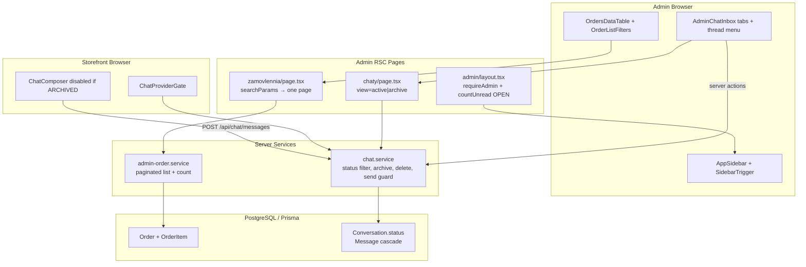

# Phase 8: Admin UX & Chat Lifecycle — Research

**Researched:** 2026-05-17  
**Domain:** Next.js 16 admin shell (shadcn Sidebar + Data Table), Prisma chat lifecycle, server-paginated orders  
**Confidence:** HIGH (codebase + official shadcn/TanStack docs); MEDIUM (totalKopiyky server sort)

<user_constraints>
## User Constraints (from CONTEXT.md)

### Locked Decisions

**Dashboard fix (FIX-01)**
- **D-08-01:** `StatCard` «Чернетки» на `/admin` → `href="/admin/tovary?status=DRAFT"` (сторінка вже парсить `status`; змінити лише посилання).

**Admin Sidebar (ADM-01)**
- **D-08-02:** Встановити shadcn **`sidebar`**; обгорнути admin layout у **`SidebarProvider`** + блок `AppSidebar` (патерн з офіційного Sidebar block).
- **D-08-03:** **Mobile (`<md`):** sidebar прихований; **`SidebarTrigger`** у header контенту відкриває **Sheet** (вбудована поведінка shadcn sidebar).
- **D-08-04:** **Desktop (`md+`):** sidebar **завжди видимий**; дозволити **collapse до icon-only** через `collapsible="icon"` + `SidebarRail` (не обовʼязково зберігати стан у localStorage на MVP).
- **D-08-05:** Пункти nav **без змін:** Панель, Категорії, Товари, Замовлення, Чати + badge unread на «Чати» + «На сайт» / «Вийти» внизу (логіка з `admin-nav.tsx`, перенести в sidebar menu).
- **D-08-06:** `requireAdmin()` і `countUnreadForAdmin()` лишаються в **server** `admin/layout.tsx`; sidebar — client shell навколо children.

**Orders Data Table (ADM-02)**
- **D-08-07:** Встановити shadcn **`table`**, **`pagination`**, патерн **Data Table** (`@tanstack/react-table` + приклад shadcn).
- **D-08-08:** **Серверна пагінація** (не client-only на весь список): `listOrdersAdminPaginated({ filter, page, pageSize, sort })` + `countOrdersAdmin(filter)`.
- **D-08-09:** URL `searchParams` на `/admin/zamovlennia`:
  - `filter` — як зараз (`all` | `new` | `in_progress` | `completed` | `cancelled`)
  - `page` — default `1`
  - `pageSize` — `10` | `20` | `50`, default **`20`**
  - `sort` — `createdAt` | `totalKopiyky` | `orderNumber` | `status`
  - `dir` — `asc` | `desc`, default **`desc`** для `createdAt`
- **D-08-10:** Зміна `filter` або `pageSize` → **`page=1`**.
- **D-08-11:** **Сортування** лише для колонок: дата створення, сума, номер, статус (клік по header → toggle `sort`/`dir` у URL).
- **D-08-12:** **`OrderListFilters`** (таби статусів) **залишаються** над таблицею; пагінація під таблицею (shadcn Pagination + селект page size).
- **D-08-13:** RSC page завантажує **одну сторінку** замовлень; інтерактивність сортування/пагінації — client `OrdersDataTable` або `Link` на ті самі query keys (planner: мінімум client JS).

**Categories table (ADM-03)**
- **D-08-14:** На `/admin/kategorii` **прибрати колонку Slug** з таблиці (slug лишається в формі редагування).

**Chat lifecycle — data model (CHAT-05, CHAT-06)**
- **D-08-15:** Prisma **`ConversationStatus`** enum: `OPEN` | `ARCHIVED`; поле `status` на `Conversation`, default **`OPEN`**; індекс `@@index([status, lastMessageAt])`.
- **D-08-16:** **Hard delete** після підтвердження адміна: `prisma.conversation.delete` (messages каскадом уже `onDelete: Cascade`). **Без** `deletedAt` soft-delete на MVP.
- **D-08-17:** **Архів** = `status: ARCHIVED`; історія повідомлень **зберігається**; активний inbox показує лише `OPEN`.

**Chat lifecycle — admin UX (CHAT-05, CHAT-06)**
- **D-08-18:** На `/admin/chaty` **вкладки** (або `Tabs`): **«Активні»** | **«Архів»** через `searchParams` `view=active|archive` (default `active`); **один URL**, без `/arkhiv` route.
- **D-08-19:** Дії в **шапці треду** (коли діалог обраний): **Архівувати** / **Повернути з архіву** / **Видалити назавжди** (`DropdownMenu` + `AlertDialog` для delete).
- **D-08-20:** Текст confirm видалення українською; після delete — зняти selection, оновити список (router.refresh / optimistic).
- **D-08-21:** **`countUnreadForAdmin`** і badge nav — лише **`OPEN`** діалоги з непрочитаними buyer-повідомленнями.
- **D-08-22:** Після архівації/видалення — **Pusher** не обовʼязковий для списку; достатньо `router.refresh()` або refetch conversations у `AdminChatProvider`.

**Chat lifecycle — buyer UX**
- **D-08-23:** Покупець у **ARCHIVED** діалозі: **read-only** — історія видима, **composer вимкнений**, банер «Діалог закрито магазином».
- **D-08-24:** `sendMessage` / server action **відхиляє** нові повідомлення для `ARCHIVED` з зрозумілою помилкою (не створювати новий `Conversation`).
- **D-08-25:** `getOrCreateConversation` для buyer лишає **той самий** запис (не fork thread).

**Verification**
- **D-08-26:** Vitest: `listConversationsForAdmin` фільтр по `status`; archive/delete actions; paginated orders helper.
- **D-08-27:** Оновити **`e2e/admin-chat.spec.ts`** лише якщо змінюється базовий flow відкриття чату; archive/delete — **manual checklist** у плані верифікації.

### Claude's Discretion

Planner може обрати:
- `nuqs` vs plain `searchParams` для admin orders/chat view
- monolithic `OrdersDataTable` client vs header sort через `<Link>`
- exact Sidebar component file split (`app-sidebar.tsx`)

### Deferred Ideas (OUT OF SCOPE)

- Soft-delete (`deletedAt`) для чатів
- Окремий route `/admin/chaty/arkhiv`
- Data Table для товарів/категорій
- Push/email при новому повідомленні — v2
</user_constraints>

<phase_requirements>
## Phase Requirements

| ID | Description | Research Support |
|----|-------------|------------------|
| FIX-01 | «Чернетки» → `/admin/tovary?status=DRAFT` | One-line `StatCard` href in `admin/page.tsx` (D-08-01); `tovary/page.tsx` already parses `status` |
| ADM-01 | shadcn Sidebar, mobile collapse | Install `sidebar`; replace grid layout; migrate `admin-nav.tsx` → `AppSidebar`; CSS tokens already in `globals.css` |
| ADM-02 | Orders Data Table + pagination + page size | `@tanstack/react-table` + shadcn `table`/`pagination`; `listOrdersAdminPaginated` + Zod parser (mirror `listAdminProducts`) |
| ADM-03 | Drop Slug column on categories | Remove `<th>`/`<td>` in `kategorii/page.tsx` only |
| CHAT-05 | Admin archive dialog | Prisma `ConversationStatus`; `archiveConversation` / `unarchiveConversation`; tabs `view=active\|archive` |
| CHAT-06 | Admin hard delete with confirm | `prisma.conversation.delete`; `AlertDialog` UA copy; extend `chat.actions` or new `admin/chat.actions.ts` |
</phase_requirements>

## Summary

Phase 8 — це **еволюція існуючої адмінки**, не greenfield: layout уже має sidebar CSS variables, чат і admin services з Phase 4–5, а пагінація товарів (`listAdminProducts`) — готовий шаблон для замовлень. Головні технічні роботи: (1) shadcn Sidebar замість `grid md:grid-cols-[240px_1fr]`, (2) серверна пагінація замовлень з URL state (рекомендуємо **plain `searchParams` + `<Link>`**, як на `/admin/tovary`, не client-only TanStack pagination), (3) Prisma enum `ConversationStatus` + фільтри/дії в `chat.service.ts` + read-only buyer UX.

**Primary recommendation:** Встановити shadcn `sidebar`, `table`, `pagination`, `tabs` + npm `@tanstack/react-table@^8.21.3`; будувати orders table як **RSC fetch + URL-driven sort/page** з TanStack лише для column/render API; chat lifecycle — **міграція enum → service guards → admin thread menu → buyer composer gate**.

## Architectural Responsibility Map

| Capability | Primary Tier | Secondary Tier | Rationale |
|------------|-------------|----------------|-----------|
| Admin nav / sidebar shell | Frontend Server (layout RSC) + Browser (Sidebar client) | — | `requireAdmin` + unread count на сервері; collapse/Sheet — client shadcn |
| Orders list pagination/sort | API/Backend (`admin-order.service`) | Frontend Server (parse `searchParams`, fetch page) | DB `skip/take/orderBy`; URL — contract між RSC і UI |
| Orders table UI | Browser (client island) | Frontend Server (initial data props) | TanStack renders rows; navigation via links minimizes state |
| Category slug column removal | Frontend Server (RSC page) | — | Presentational only |
| Conversation status persistence | Database (Prisma) | API/Backend (services) | Single source of truth for archive/delete |
| Archive / delete / send guards | API/Backend (`chat.service`) | Route Handler (`/api/chat/messages`) | Business rules before Pusher trigger |
| Admin chat tabs & thread actions | Browser (`admin-chat-inbox`, `chat-thread`) | Server Actions | Optimistic UX; `requireAdmin` on actions |
| Buyer archived read-only | Browser (`chat-provider`, `chat-composer`) | API/Backend (`sendMessage` reject) | UI disable + server enforcement (defense in depth) |
| Unread badge on nav | Frontend Server (`admin/layout.tsx`) | API/Backend (`countUnreadForAdmin`) | SSR badge; filter `status: OPEN` in service |

## Project Constraints (from .cursor/rules/)

- **Stack:** Next.js App Router + TypeScript, Prisma + PostgreSQL, Tailwind 4, shadcn `base-nova`, Better Auth, UI українською (`gsd.mdc`).
- **Next.js:** Читати актуальні гайди в `node_modules/next/dist/docs/` — API можуть відрізнятися від training data (`AGENTS.md`).
- **Admin auth:** `requireAdmin()` у кожному server action, не покладатися лише на layout (`04-PATTERNS.md`, PITFALLS).
- **Chat:** DB-first, потім Pusher; один `Conversation` на buyer (`05-CONTEXT`).

## Standard Stack

### Core

| Library | Version | Purpose | Why Standard |
|---------|---------|---------|--------------|
| shadcn `sidebar` | CLI latest (`shadcn@^4.7.0` in project) | Admin shell, mobile Sheet | [CITED: ui.shadcn.com/docs/components/base/sidebar] Official block; tokens already in `globals.css` |
| shadcn `table` + `pagination` | CLI latest | Data Table markup + page controls | [CITED: ui.shadcn.com/docs/components/data-table] |
| shadcn `tabs` | CLI latest | Chat Active/Archive | Not in project yet; needed for D-08-18 |
| `@tanstack/react-table` | **8.21.3** | Column defs, sort UI, manual pagination mode | [VERIFIED: npm registry] [CITED: tanstack.com/table — manualPagination/manualSorting] |
| Prisma | **7.8.0** (project) | `ConversationStatus`, paginated orders | [VERIFIED: codebase `package.json`] |
| Zod | **4.4.x** | `listOrdersAdminSchema`, chat action inputs | Matches `listAdminProductsSchema` pattern |
| Existing: `dropdown-menu`, `alert-dialog`, `sheet` | installed | Thread actions, delete confirm, mobile nav | Already used in chat/admin |

### Supporting

| Library | Version | Purpose | When to Use |
|---------|---------|---------|-------------|
| `nuqs` | **2.8.9** (installed) | URL state | **Optional** for admin; storefront/catalog already uses it — admin pages today use plain `searchParams` |
| Vitest | **4.1.6** | Service unit tests | D-08-26 |
| Playwright | **1.60.0** | Regression on chat open | D-08-27 — minimal touch |

### Alternatives Considered

| Instead of | Could Use | Tradeoff |
|------------|-----------|----------|
| URL + Link pagination | TanStack `onPaginationChange` only | More client state; worse SSR/refresh alignment |
| `nuqs` on admin orders | Plain `searchParams` Promise (Next 16) | **Recommend plain** — matches `zamovlennia` + `tovary` admin pages |
| Soft-delete conversations | Hard delete (locked D-08-16) | User chose DB removal for MVP |

**Installation:**

```bash
npx shadcn@latest add sidebar table pagination tabs
npm install @tanstack/react-table@^8.21.3
```

**Version verification:** `npm view @tanstack/react-table version` → `8.21.3` (2026-05-17). shadcn components are copied into `src/components/ui/`, not separate npm packages.

## Package Legitimacy Audit

> slopcheck unavailable at research time — npm registry check only.

| Package | Registry | Age | Downloads | Source Repo | slopcheck | Disposition |
|---------|----------|-----|-----------|-------------|-----------|-------------|
| `@tanstack/react-table` | npm | mature | very high | github.com/TanStack/table | — | Approved [VERIFIED: npm registry] |
| shadcn CLI components | n/a (scaffold) | mature | n/a | github.com/shadcn-ui/ui | — | Approved via official CLI |

**Packages removed due to slopcheck [SLOP] verdict:** none  
**Packages flagged as suspicious [SUS]:** none  

*Planner: if slopcheck becomes available before execute, re-run gate on `@tanstack/react-table` only.*

## Architecture Patterns

### System Architecture Diagram



### Recommended Project Structure

```
src/
├── app/(admin)/admin/
│   ├── layout.tsx              # SidebarProvider + AppSidebar + unread badge
│   ├── page.tsx                # FIX-01 StatCard href
│   ├── zamovlennia/page.tsx    # parse searchParams → paginated fetch
│   ├── kategorii/page.tsx      # drop Slug column
│   └── chaty/page.tsx          # view param + filtered list
├── components/
│   ├── admin/
│   │   ├── app-sidebar.tsx     # NEW — migrated nav from admin-nav.tsx
│   │   ├── orders-data-table.tsx  # NEW — TanStack + Link sort/pagination
│   │   └── order-list-filters.tsx # UPDATE — reset page=1 on filter
│   ├── chat/
│   │   ├── admin-chat-inbox.tsx   # tabs + pass status
│   │   ├── chat-thread.tsx        # DropdownMenu lifecycle actions
│   │   ├── chat-provider.tsx      # archived banner + disable send
│   │   └── chat-composer.tsx      # respect archived from context
├── server/
│   ├── services/
│   │   ├── admin-order.service.ts # listOrdersAdminPaginated, countOrdersAdmin
│   │   └── chat.service.ts        # status, archive, delete, send guard
│   ├── validators/
│   │   ├── admin-order.ts         # NEW — page, pageSize, sort, dir, filter
│   │   └── chat.ts                # extend if needed
│   └── actions/
│       ├── chat.actions.ts        # existing read markers
│       └── admin/chat.actions.ts  # NEW — archive, unarchive, delete
prisma/
└── migrations/                   # ConversationStatus enum
```

### Pattern 1: shadcn Sidebar admin shell

**What:** Replace `grid md:grid-cols-[240px_1fr]` with `SidebarProvider` → `AppSidebar` + `SidebarInset` for main content.  
**When to use:** ADM-01; all admin routes.  
**Example:**

```tsx
// Source: [CITED: https://ui.shadcn.com/docs/components/base/sidebar]
import { SidebarProvider, SidebarInset, SidebarTrigger } from "@/components/ui/sidebar"
import { AppSidebar } from "@/components/admin/app-sidebar"

export default function AdminLayout({ children }: { children: React.ReactNode }) {
  return (
    <SidebarProvider>
      <AppSidebar unreadChatCount={unreadChatCount} />
      <SidebarInset>
        <header className="flex h-12 items-center gap-2 border-b px-4 md:hidden">
          <SidebarTrigger />
        </header>
        <motion.main className="p-4 md:p-6">{children}</motion.main>
      </SidebarInset>
    </SidebarProvider>
  )
}
```

```tsx
// AppSidebar — collapsible="icon" + SidebarRail on desktop
<Sidebar collapsible="icon">
  <SidebarHeader>Адмін-панель</SidebarHeader>
  <SidebarContent>{/* nav items from admin-nav */}</SidebarContent>
  <SidebarFooter>{/* На сайт + Вийти */}</SidebarFooter>
  <SidebarRail />
</Sidebar>
```

**Note:** `globals.css` already defines `--sidebar-*` tokens (lines 32–39, 109–116) — no theme migration needed.

### Pattern 2: Server-paginated orders (mirror products)

**What:** RSC parses URL → Zod schema → `listOrdersAdminPaginated` + `countOrdersAdmin` in parallel.  
**When to use:** ADM-02; avoid `listAllOrders` for main table.  
**Analog:** `listAdminProducts` in `admin-product.service.ts` (skip/take + count).

```typescript
// Source: codebase pattern — admin-product.service.ts
export async function listOrdersAdminPaginated(params: ListOrdersAdminParams) {
  const where = buildOrderWhere(params.filter);
  const skip = (params.page - 1) * params.pageSize;
  const orderBy = buildOrderOrderBy(params.sort, params.dir);

  const [total, orders] = await Promise.all([
    prisma.order.count({ where }),
    prisma.order.findMany({
      where,
      include: { items: true },
      orderBy,
      skip,
      take: params.pageSize,
    }),
  ]);

  return {
    items: orders.map(mapOrderSummary),
    total,
    page: params.page,
    pageSize: params.pageSize,
    totalPages: Math.max(1, Math.ceil(total / params.pageSize)),
  };
}
```

**URL builder helper** (shared by `OrderListFilters`, column headers, pagination):

```typescript
export function adminOrdersUrl(params: {
  filter?: AdminOrderListFilter;
  page?: number;
  pageSize?: number;
  sort?: string;
  dir?: "asc" | "desc";
}) {
  const sp = new URLSearchParams();
  if (params.filter && params.filter !== "all") sp.set("filter", params.filter);
  if (params.page && params.page > 1) sp.set("page", String(params.page));
  if (params.pageSize && params.pageSize !== 20) sp.set("pageSize", String(params.pageSize));
  if (params.sort && params.sort !== "createdAt") sp.set("sort", params.sort);
  if (params.dir && params.dir !== "desc") sp.set("dir", params.dir);
  const q = sp.toString();
  return q ? `/admin/zamovlennia?${q}` : "/admin/zamovlennia";
}
```

### Pattern 3: Data Table with manual server pagination

**What:** TanStack with `manualPagination: true`, `manualSorting: true`, `pageCount` from server; **no** `getPaginationRowModel()` on full dataset.  
**When to use:** ADM-02 + D-08-13 (minimal client JS → prefer `<Link>` in headers/footer over `table.nextPage()`).

```tsx
// Source: [CITED: https://tanstack.com/table — manualPagination/manualSorting]
"use client";

export function OrdersDataTable({ data, page, pageSize, total, sort, dir, filter }: Props) {
  const table = useReactTable({
    data,
    columns,
    getCoreRowModel: getCoreRowModel(),
    manualPagination: true,
    manualSorting: true,
    pageCount: Math.ceil(total / pageSize),
    state: {
      pagination: { pageIndex: page - 1, pageSize },
      sorting: [{ id: sort, desc: dir === "desc" }],
    },
  });

  // Column header: <Link href={adminOrdersUrl({ ..., sort: "createdAt", dir: nextDir })}>
  // Footer: shadcn Pagination as Links, not table.nextPage()
}
```

### Pattern 4: Chat lifecycle

**Schema:**

```prisma
enum ConversationStatus {
  OPEN
  ARCHIVED
}

model Conversation {
  // ...existing fields
  status ConversationStatus @default(OPEN)
  @@index([status, lastMessageAt])
}
```

**Service API (new exports in `chat.service.ts`):**

| Function | Behavior |
|----------|----------|
| `listConversationsForAdmin({ status })` | `where: { status }`, `orderBy: { lastMessageAt: 'desc' }` |
| `archiveConversation(id)` | `update status ARCHIVED` |
| `unarchiveConversation(id)` | `update status OPEN` |
| `deleteConversation(id)` | `prisma.conversation.delete` (messages cascade) |
| `countUnreadForAdmin()` | add `status: OPEN` to where |
| `sendMessage` | if `conversation.status === ARCHIVED` → throw `CHAT_ARCHIVED` |

**Admin actions** (`src/server/actions/admin/chat.actions.ts`):

```typescript
"use server";
import { revalidatePath } from "next/cache";
import { requireAdmin } from "@/lib/permissions";
import { archiveConversation, deleteConversation, unarchiveConversation } from "@/server/services/chat.service";

export async function archiveConversationAction(conversationId: string) {
  await requireAdmin();
  await archiveConversation(conversationId);
  revalidatePath("/admin/chaty");
  revalidatePath("/", "layout"); // nav badge
  return { ok: true as const };
}
```

**Buyer read-only:** Extend `ConversationSummaryDto` / gate props with `status`; `ChatProvider` sets `canSend = status === "OPEN"`; `ChatComposer` shows UA banner; API maps `CHAT_ARCHIVED` → 403 with message.

### Anti-Patterns to Avoid

- **Client-side pagination on full `listAllOrders`:** Breaks at scale; contradicts D-08-08.
- **Unread count without `status: OPEN`:** Badge lies after archive (violates D-08-21).
- **Delete without `requireAdmin` in action:** Security regression.
- **Only UI-disable send for archived:** Must guard in `sendMessage` (D-08-24).
- **New conversation on archived buyer:** `getOrCreateConversation` must return existing row (D-08-25).

## Don't Hand-Roll

| Problem | Don't Build | Use Instead | Why |
|---------|-------------|-------------|-----|
| Admin sidebar + mobile drawer | Custom grid + manual Sheet | shadcn `Sidebar` + `SidebarTrigger` | Keyboard, focus, collapse modes built-in [CITED: shadcn sidebar] |
| Table sort/pagination state machine | Ad-hoc useState for page/sort | URL `searchParams` + Zod + TanStack manual mode | Shareable URLs, RSC refresh, matches catalog/admin patterns |
| Chat archive storage | `deletedAt` / separate Archive table | `ConversationStatus` enum (locked) | Simpler queries; ROADMAP aligned |
| Delete messages one-by-one | Loop delete Message | `conversation.delete` cascade | Already `onDelete: Cascade` on Message |

## Common Pitfalls

### Pitfall 1: Sorting by `totalKopiyky` in Prisma

**What goes wrong:** `totalKopiyky` is computed in `mapOrderSummary` from `OrderItem` rows; no column on `Order`.  
**Why it happens:** D-08-11 requires sum sort; Prisma `orderBy` cannot express `SUM(priceSnapshot * quantity)` on relation without raw SQL.  
**How to avoid:** For `sort=totalKopiyky`, use `$queryRaw` subquery for ordered IDs, then `findMany({ where: { id: { in: ids } }, include })` **or** document MVP fallback: sort only `createdAt`, `orderNumber`, `status` in v8.0 and add total in v8.1 — **planner must confirm with success criteria**.  
**Recommendation:** Implement raw SQL order for total (single sort path) — keeps ADM-02 acceptance.  
**Warning signs:** Paginated data wrong order; sort works on page 1 only.

### Pitfall 2: Filter change leaves `page=5` empty

**What goes wrong:** User on page 5 switches filter → zero rows.  
**How to avoid:** D-08-10 — `OrderListFilters` links always omit `page` or set `page=1` when `filter`/`pageSize` changes.  
**Warning signs:** «Нічого не знайдено» with high page number in URL.

### Pitfall 3: Archive tab still shows unread styling

**What goes wrong:** Archived threads counted in badge or shown as unread in archive list.  
**How to avoid:** `countUnreadForAdmin` and list unread flag only for `OPEN`; optional: hide unread badge in archive tab UI.  
**Warning signs:** Badge nonzero when all active chats read.

### Pitfall 4: Admin composes on archived thread

**What goes wrong:** Admin sends into archived conversation.  
**How to avoid:** Hide/disable `AdminChatComposer` when `selectedConversation.status === "ARCHIVED"`; optional server guard for `senderRole: STORE`.  
**Warning signs:** New messages after «Архівувати».

### Pitfall 5: shadcn Sidebar inside wrong provider tree

**What goes wrong:** `useSidebar` hook errors; mobile sheet broken.  
**How to avoid:** Single `SidebarProvider` in `admin/layout.tsx` wrapping both sidebar and `SidebarInset`.  
**Warning signs:** Runtime «SidebarProvider not found».

### Pitfall 6: E2E brittle after sidebar DOM change

**What goes wrong:** `getByRole("link", { name: /^Чати/ })` fails if nav moves into menubar.  
**How to avoid:** D-08-27 — update selectors only if structure breaks; keep accessible names on chat link.  
**Warning signs:** `admin-chat.spec.ts` red after ADM-01.

## Code Examples

### FIX-01 — StatCard href

```tsx
// src/app/(admin)/admin/page.tsx — change only href
<StatCard
  label="Чернетки"
  count={stats.draftProducts}
  href="/admin/tovary?status=DRAFT"
/>
```

### Prisma migration — ConversationStatus

```sql
-- Generated by prisma migrate; illustrative
CREATE TYPE "ConversationStatus" AS ENUM ('OPEN', 'ARCHIVED');
ALTER TABLE "Conversation" ADD COLUMN "status" "ConversationStatus" NOT NULL DEFAULT 'OPEN';
CREATE INDEX "Conversation_status_lastMessageAt_idx" ON "Conversation"("status", "lastMessageAt");
```

### sendMessage guard

```typescript
// Source: extend chat.service.ts sendMessage path
if (conversation.status === "ARCHIVED") {
  throw new ChatServiceError(
    "CHAT_ARCHIVED",
    "Діалог закрито магазином. Написати більше не можна.",
  );
}
```

### Chat page — dual lists via view param

```typescript
// src/app/(admin)/admin/chaty/page.tsx
const view = searchParams.view === "archive" ? "ARCHIVED" : "OPEN";
const conversations = await listConversationsForAdmin({ status: view });
```

### OrderListFilters — reset page

```tsx
// When building filter link, do not carry over page
href={adminOrdersUrl({ filter: filter.key, page: 1, pageSize, sort, dir })}
```

## State of the Art

| Old Approach | Current Approach | When Changed | Impact |
|--------------|------------------|--------------|--------|
| CSS grid admin nav | shadcn Sidebar + SidebarInset | Phase 8 | Mobile Sheet, icon collapse |
| `listAllOrders` | Paginated service + URL state | Phase 8 | Performance, shareable admin URLs |
| Implicit «all chats active» | `ConversationStatus` enum | Phase 8 | Archive + buyer read-only |
| Plain HTML `<table>` orders | shadcn Table + TanStack columns | Phase 8 | Sortable headers, pagination component |

**Deprecated/outdated:**
- ROADMAP note «optional deletedAt» — superseded by CONTEXT D-08-16 hard delete.

## Assumptions Log

| # | Claim | Section | Risk if Wrong |
|---|-------|---------|---------------|
| A1 | `totalKopiyky` server sort achievable via Prisma `$queryRaw` without schema change | Pitfall 1 | May need descope sort column or add `Order.totalKopiyky` column |
| A2 | shadcn v4 CLI `add sidebar` works with `base-nova` + existing sidebar CSS vars | Standard Stack | CLI conflict — fallback to manual copy from docs |
| A3 | Admin may still read archived threads but not send (composer hidden) | Pattern 4 | Clarify if store replies should reopen — not in requirements |
| A4 | Plain `searchParams` preferred over `nuqs` for admin orders | Pattern 2 | Inconsistent with catalog — acceptable per admin precedent |

## Open Questions

1. **`totalKopiyky` sort implementation**
   - What we know: Required by D-08-11; no DB column.
   - What's unclear: Accept raw SQL in service vs narrow sort columns.
   - Recommendation: Implement `$queryRaw` ID ordering for that sort key only; unit test order mapping.

2. **Admin reply on archived thread**
   - What we know: Buyer read-only locked; admin not explicitly forbidden.
   - Recommendation: Disable `AdminChatComposer` for `ARCHIVED` (symmetry); unarchive action to reply.

## Environment Availability

| Dependency | Required By | Available | Version | Fallback |
|------------|------------|-----------|---------|----------|
| Node.js | build/test | ✓ | v24.14.0 | — |
| npm | install packages | ✓ | (bundled) | — |
| Prisma CLI | migration | ✓ | 7.8.0 | — |
| PostgreSQL | migrate + dev | ✓ (project uses Neon adapter) | — | — |
| shadcn CLI | add components | ✓ | 4.7.0 dep | Manual copy from ui.shadcn.com |
| slopcheck | package audit | ✗ | — | npm view + planner checkpoint |

**Missing dependencies with no fallback:** none blocking.

## Validation Architecture

### Test Framework

| Property | Value |
|----------|-------|
| Framework | Vitest 4.1.6 |
| Config file | `vitest.config.ts` |
| Quick run command | `npm test -- src/server/services/chat.service.test.ts src/server/services/admin-order.service.test.ts` |
| Full suite command | `npm test` |

### Phase Requirements → Test Map

| Req ID | Behavior | Test Type | Automated Command | File Exists? |
|--------|----------|-----------|-------------------|-------------|
| FIX-01 | Drafts StatCard href | manual / smoke | — | N/A (one attribute) |
| ADM-01 | Sidebar renders | manual / e2e optional | — | ❌ defer manual |
| ADM-02 | Paginated list respects page/filter/sort | unit | `npm test -- src/server/services/admin-order.service.test.ts -t paginated` | ❌ Wave 0 |
| ADM-02 | URL parser defaults / clamp pageSize | unit | `npm test -- src/server/validators/admin-order.test.ts` | ❌ Wave 0 |
| ADM-03 | No slug column | manual | — | N/A |
| CHAT-05 | `listConversationsForAdmin({ status })` | unit | `npm test -- src/server/services/chat.service.test.ts -t listConversations` | ❌ extend existing |
| CHAT-05 | `archiveConversation` sets ARCHIVED | unit | same file `-t archive` | ❌ Wave 0 |
| CHAT-06 | `deleteConversation` calls delete | unit | same file `-t delete` | ❌ Wave 0 |
| CHAT-06 | `sendMessage` rejects ARCHIVED | unit | same file `-t CHAT_ARCHIVED` | ❌ Wave 0 |
| CHAT-05/06 | Admin archive/delete UX | manual checklist | — | Plan verification |
| ADM-01/02 | E2E admin nav + orders | e2e optional | `npm run test:e2e -- e2e/admin-chat.spec.ts` | ✅ exists — touch only if selectors break |

### Sampling Rate

- **Per task commit:** `npm test -- <affected-service>.test.ts`
- **Per wave merge:** `npm test`
- **Phase gate:** `npm test` + manual chat lifecycle checklist + spot-check orders pagination in browser

### Wave 0 Gaps

- [ ] `src/server/validators/admin-order.ts` — Zod schema for page, pageSize, sort, dir, filter
- [ ] `src/server/services/admin-order.service.test.ts` — paginated list + count tests
- [ ] Extend `src/server/services/chat.service.test.ts` — status filter, archive, delete, CHAT_ARCHIVED
- [ ] `src/server/actions/admin/chat.actions.ts` — optional thin action tests or service-only
- [ ] Install `@tanstack/react-table` + shadcn sidebar/table/pagination/tabs

## Security Domain

### Applicable ASVS Categories

| ASVS Category | Applies | Standard Control |
|---------------|---------|------------------|
| V2 Authentication | yes | `requireAdmin()` on layout + all new chat lifecycle actions |
| V4 Access Control | yes | `assertConversationAccess` unchanged; buyer cannot access others' threads |
| V5 Input Validation | yes | Zod on order list params + `cuid()` on conversationId in actions |
| V6 Cryptography | no | — |

### Known Threat Patterns

| Pattern | STRIDE | Standard Mitigation |
|---------|--------|---------------------|
| Non-admin archive/delete | Spoofing/Elevation | `requireAdmin()` first line in actions |
| Buyer sends to archived chat | Tampering | `sendMessage` status guard + 403 in API route |
| IDOR on conversation actions | Information disclosure | Service verifies conversation exists; admin-only actions |
| Mass assignment via sort param | Tampering | Zod enum whitelist for `sort`/`dir`/`pageSize` |

## Sources

### Primary (HIGH confidence)

- [CITED: https://ui.shadcn.com/docs/components/base/sidebar] — SidebarProvider, collapsible icon, SidebarTrigger, structure
- [CITED: https://ui.shadcn.com/docs/components/data-table] — TanStack setup, pagination section
- [CITED: Context7 `/tanstack/table`] — manualPagination, manualSorting
- Codebase: `admin-product.service.ts`, `admin/layout.tsx`, `chat.service.ts`, `prisma/schema.prisma`, `08-CONTEXT.md`

### Secondary (MEDIUM confidence)

- [VERIFIED: npm registry] `@tanstack/react-table@8.21.3`, `nuqs@2.8.9`
- `.planning/phases/04-admin-operations/04-PATTERNS.md` — server action skeleton

### Tertiary (LOW confidence)

- A1 totalKopiyky raw SQL approach — needs implementation validation during execute

## Metadata

**Confidence breakdown:**
- Standard stack: HIGH — official shadcn + TanStack docs, versions npm-verified
- Architecture: HIGH — mirrors existing admin-product pagination and Phase 5 chat
- Pitfalls: MEDIUM — totalKopiyky sort is the main technical risk

**Research date:** 2026-05-17  
**Valid until:** 2026-06-17 (stable stack); re-check shadcn CLI if `components.json` style changes
