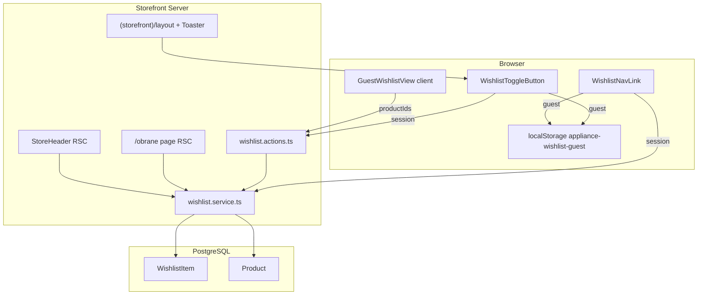

# Phase 9: Wishlist — Research

**Researched:** 2026-05-17  
**Domain:** Guest localStorage wishlist + logged-in Prisma persistence, storefront UX (no login merge)  
**Confidence:** HIGH (patterns verified in codebase; stack already installed)

## Summary

Phase 9 adds **dual-track wishlist**: guests persist product IDs in `localStorage` (`appliance-wishlist-guest`, max 20, no merge on login); logged-in buyers persist rows in **`WishlistItem`** via server actions with `requireBuyer`. After login, UI **silently switches** to DB-only reads; guest data stays in localStorage until logout (D-09-06/07). This is the intentional inverse of cart’s `CartPendingMergeGate` — **do not** add any merge gate or action.

Implementation should **clone cart’s proven split** (`pending-storage.ts` + `add-to-cart-button.tsx` + `cart.actions.ts` + `cart.service.ts`) but with wishlist-specific rules: no auto-prune of SOLD/DRAFT (show «Товар більше недоступний»), Sonner toasts on toggle, header Heart+badge for **all** visitors, routes `/obrane` + kabinet preview.

**Planner note — ROADMAP vs CONTEXT:** ROADMAP success criterion #4 says sold/draft are hidden; **CONTEXT D-09-19/20 overrides** — show unavailable rows, no auto-delete. Plans MUST follow CONTEXT.

**Primary recommendation:** Schema migration first → `guest-storage.ts` + Vitest → `wishlist.service` + actions → `WishlistToggleButton` + storefront `Toaster` → `ProductCard`/PDP → `WishlistNavLink` + `/obrane` + kabinet block → manual checklist D-09-24.

## Architectural Responsibility Map

| Capability | Primary Tier | Secondary Tier | Rationale |
|------------|-------------|----------------|-----------|
| Guest ID storage (add/remove/cap) | Browser / Client | — | `localStorage` only; no server writes for guests |
| Guest wishlist page data | Frontend Server (RSC + Server Action) | Browser | Client reads IDs; server resolves products by ID |
| Logged-in persistence | API / Backend (Server Actions + Prisma) | — | Source of truth in PostgreSQL |
| Toggle UX + toasts | Browser / Client | — | Optimistic Heart + Sonner; `router.refresh()` when session |
| Header badge count | Browser / Client | Frontend Server | Client reads LS or receives `initialCount` from RSC header |
| Unavailable row display | Frontend Server (RSC) | — | Map `Product.status` in service DTO; render in server components |
| Auth boundary | API / Backend | — | `requireBuyer` on mutations only; `/obrane` public |

## User Constraints (from CONTEXT.md)

### Locked Decisions

- **D-09-01:** **Основний список** — окрема сторінка **`/obrane`** (повна сітка/список товарів).
- **D-09-02:** У **`/kabinet`** — короткий блок **«Обране»** (прев’ю останніх товарів; planner: **до 3** карток) + кнопка/лінк **«Дивитись усе»** → `/obrane`.
- **D-09-03:** **`/obrane` доступна без логіну** — гість бачить товари з localStorage; залогінений — з БД.
- **D-09-04:** У **`StoreHeader`** — лінк на `/obrane` (Heart + badge) для **всіх** відвідувачів.
- **D-09-05:** **`WishlistNavLink`** (client): badge count з **localStorage** (гість) або з **БД** (session).
- **D-09-06:** Після **логіну** — badge і `/obrane` показують **лише DB wishlist**; guest-key **не читається** і **не merge’иться**.
- **D-09-07:** Після **logout** — знову guest localStorage для badge і `/obrane`.
- **D-09-08:** Badge приховати або `0`, коли порожньо; при count > 99 — **`99+`**.
- **D-09-09:** **`WishlistToggleButton`** — Heart **overlay** на `ProductCard`; `stopPropagation` / `preventDefault` — не відкривати PDP.
- **D-09-10:** Той самий компонент (або варіант) на **PDP** (`/tovar/[slug]`).
- **D-09-11:** Outline → filled Heart; `aria-pressed`; українські `aria-label`.
- **D-09-12:** Sonner: **«Додано до обраного»** / **«Прибрано з обраного»**; іконка оновлюється синхронно.
- **D-09-13:** Ключ **`appliance-wishlist-guest`**, `{ v: 1, items: { productId: string }[] }` у `src/lib/wishlist/guest-storage.ts`.
- **D-09-14:** **MAX_ITEMS = 20**; 21-й — toast помилки, без додавання.
- **D-09-15:** **Немає** `WishlistPendingMerge` / merge при логіні.
- **D-09-16:** Prisma **`WishlistItem`**: `userId`, `productId`, `@@unique([userId, productId])`.
- **D-09-17:** Server actions + Zod; `requireBuyer` на mutations.
- **D-09-18:** Session toggle — server action + `router.refresh()` (як `AddToCartButton`).
- **D-09-19:** SOLD/DRAFT — рядок **«Товар більше недоступний»**, без «В кошик».
- **D-09-20:** Не auto-delete з wishlist у цій фазі.
- **D-09-21:** **`<Toaster />`** у **`(storefront)/layout.tsx`**.
- **D-09-22:** Toast **`top-center`**, `richColors` (як admin).
- **D-09-23:** **Vitest:** guest storage + server actions/service.
- **D-09-24:** Manual: гість 3 → reload → login (DB без цих 3) → logout (guest знову).

### Claude's Discretion

- Точна кількість прев’ю в `/kabinet` (**до 3** за замовчуванням).
- `WishlistNavLink` server prefetch count vs client-only badge.
- Overlay wrapper: `ProductCard` restructure vs `ProductCardWithWishlist`.
- Empty state copy на `/obrane` і в кабінеті.

### Deferred Ideas (OUT OF SCOPE)

- Auto-prune sold items on page load
- Wishlist merge on login
- Price-drop notifications
- Compare products

## Phase Requirements

| ID | Description | Research Support |
|----|-------------|------------------|
| WISH-01 | Гість додає/прибирає в localStorage | `guest-storage.ts` mirror `pending-storage.ts`; cap + toasts D-09-14 |
| WISH-02 | Залогінений — БД | `WishlistItem` + `wishlist.service` + actions with `requireBuyer` |
| WISH-03 | Без merge при вході | Explicit anti-pattern: no `WishlistPendingMerge`; no layout gate; D-09-06 |
| WISH-04 | Перегляд `/obrane` + kabinet preview | RSC `/obrane` branch + `GuestWishlistView` client; kabinet block ≤3 |
| WISH-05 | Кнопка на картці й PDP | `WishlistToggleButton` on `ProductCard` overlay + PDP |

## Standard Stack

### Core (already in project — no new installs)

| Library | Version (verified) | Purpose | Why Standard |
|---------|-------------------|---------|--------------|
| **Next.js** | 16.2.6 (`package.json`) | App Router, RSC, Server Actions | Existing storefront architecture |
| **Prisma** | 7.8.0 | `WishlistItem` persistence | Same as cart/orders |
| **Zod** | 4.4.3 | `productId` cuid validation | Matches `cart.ts` validators |
| **sonner** | 2.0.7 | Toggle toasts | Already used in admin/chat |
| **lucide-react** | ^1.16.0 | `Heart` icon | Matches `ShoppingCart` in header |
| **Vitest** | 4.1.6 | Unit tests | 21 existing `*.test.ts` files |

### Supporting

| Library | Purpose | When to Use |
|---------|---------|-------------|
| `@/components/ui/sonner` | Themed Toaster wrapper | Optional; admin uses raw `sonner` `Toaster` — either is fine; D-09-21 says `sonner.tsx` exists |
| `better-auth` session | `hasSession` branching | Same as `AddToCartButton` |

### Alternatives Considered

| Instead of | Could Use | Tradeoff |
|------------|-----------|----------|
| localStorage guest list | httpOnly cookie | User locked guest LS; cart pending also uses LS |
| Direct `WishlistItem` on User | Separate `Wishlist` model like `Cart` | YAGNI — CONTEXT specifies flat `WishlistItem` |
| Client-only `/obrane` | Full RSC for logged-in | Hybrid: RSC when session, client fetch for guest |

**Installation:** None required for this phase.

**Version verification:**

```bash
npm view sonner version   # 2.0.7
npm view zod version      # 4.4.3
```

## Package Legitimacy Audit

> No new external packages in this phase. Existing dependencies only.

| Package | Registry | slopcheck | Disposition |
|---------|----------|-----------|-------------|
| sonner | npm (in lockfile) | unavailable | Approved — already installed |
| zod | npm (in lockfile) | unavailable | Approved — already installed |
| @prisma/client | npm (in lockfile) | unavailable | Approved — already installed |

**Packages removed due to slopcheck [SLOP] verdict:** none  
**Packages flagged as suspicious [SUS]:** none  

*slopcheck was unavailable at research time; no new installs — no checkpoint needed.*

## Project Constraints (from .cursor/rules/)

- **Next.js:** Read `node_modules/next/dist/docs/` before API changes; this repo uses App Router 16.x (see `AGENTS.md`).
- **Stack (gsd.mdc):** TypeScript, Prisma + Neon, Tailwind + shadcn, Better Auth, Ukrainian UI only.
- **GSD workflow:** Phase work should go through `/gsd-plan-phase` / `/gsd-execute-phase` (orchestrator context).
- **No new payment/search services** — wishlist stays on Prisma + localStorage.

## Architecture Patterns

### System Architecture Diagram



### Recommended Project Structure

```
src/
├── lib/wishlist/
│   ├── guest-storage.ts          # D-09-13, mirror pending-storage
│   ├── guest-storage.test.ts
│   └── wishlist-events.ts        # optional: dispatch 'wishlist:changed'
├── server/
│   ├── services/wishlist.service.ts
│   ├── services/wishlist.service.test.ts
│   ├── actions/wishlist.actions.ts
│   └── validators/wishlist.ts
├── types/wishlist.ts             # WishlistLineDto, action results
├── components/wishlist/
│   ├── wishlist-toggle-button.tsx
│   ├── wishlist-nav-link.tsx
│   ├── wishlist-grid.tsx         # available + unavailable rows
│   ├── wishlist-unavailable-card.tsx
│   └── guest-wishlist-view.tsx   # client: read LS → resolve products
├── app/(storefront)/
│   ├── obrane/page.tsx
│   └── layout.tsx                # + Toaster (D-09-21)
prisma/
└── schema.prisma                 # WishlistItem model
```

### Pattern 1: Guest storage (clone cart pending)

**What:** Versioned JSON in `localStorage`, idempotent add/remove, max 20.  
**When:** `!hasSession` only.  
**Difference from cart:** Return result enum for max-cap toast; dispatch custom event for nav badge sync.

**Example (from existing cart — extend for wishlist):**

```1:64:src/lib/cart/pending-storage.ts
"use client";

const KEY = "appliance-cart-pending";
const MAX_ITEMS = 20;
// ... readRaw, write, addPendingProduct (silent on max), removePendingProduct
```

Wishlist should add: `addGuestWishlistProduct(id) → 'added' | 'duplicate' | 'max'`, `getGuestWishlistCount()`, and `window.dispatchEvent(new CustomEvent('wishlist:changed'))` after mutations.

### Pattern 2: Session toggle (clone AddToCartButton)

**What:** `useTransition` + server action + `router.refresh()`; guest branch uses storage + toasts.  
**When:** Catalog overlay and PDP.

```51:87:src/components/cart/add-to-cart-button.tsx
  const handleAdd = () => {
    setError(null);

    if (!hasSession) {
      addPendingProduct(productId);
      setInCart(true);
      // cart: redirects guest to login — wishlist does NOT redirect
      return;
    }

    startTransition(async () => {
      const result = await addToCartAction(productId);
      // ...
      router.refresh();
    });
  };
```

Wishlist toggle: **no login redirect** on add; toast success/error; sync `inWishlist` state immediately.

### Pattern 3: Anti-pattern — do NOT replicate cart merge

```1:30:src/components/cart/cart-pending-merge.tsx
"use client";
// mergePendingCartAction on login — FORBIDDEN for wishlist
```

```1:9:src/components/cart/cart-pending-merge-gate.tsx
// Mounted in storefront layout — wishlist must NOT add equivalent gate
```

```14:28:src/app/(storefront)/layout.tsx
            <ChatProviderGate>
              <CartPendingMergeGate />
              {children}
```

### Pattern 4: ProductCard overlay without nested interactive in `<Link>`

**Problem:** Current `ProductCard` wraps entire card in one `Link` — invalid to put `<button>` inside.

```18:55:src/components/catalog/product-card.tsx
    <Link
      href={`/tovar/${product.slug}`}
      className="group block h-full"
    >
      <Card className="h-full overflow-hidden ...">
        <motion.div className="relative aspect-[4/3] ...">
```

**Fix:** Outer `motion.div` with `relative`; `Link` covers card body; `WishlistToggleButton` as **sibling** `absolute right-2 top-2 z-10` (D-09-09). Pass `hasSession` + `initialInWishlist` from catalog pages (fetch `getWishlistedProductIds` once per page when session).

### Pattern 5: Header nav badge

**Reference:** `CartNavLink` — server count + Badge; wishlist differs: **always visible**, guest uses client count.

```10:25:src/components/cart/cart-nav-link.tsx
export async function CartNavLink({ userId }: CartNavLinkProps) {
  const count = await getCartItemCount(userId);
  // Badge: count > 9 ? "9+" — wishlist uses 99+ per D-09-08
```

```40:44:src/components/layout/store-header.tsx
        <motion.div className="flex items-center gap-2">
          {session?.user ? <CartNavLink userId={session.user.id} /> : null}
```

Add `WishlistNavLink` for **all** users; keep cart as-is (logged-in only).

### Pattern 6: Storefront Toaster

Admin pattern (use same props in storefront layout):

```25:25:src/app/(admin)/admin/layout.tsx
      <Toaster richColors position="top-center" />
```

D-09-21: add to `(storefront)/layout.tsx` — can import from `sonner` directly (admin) or `@/components/ui/sonner` (theme-aware).

Toast calls (verified Sonner API) [CITED: Context7 `/emilkowalski/sonner`]:

```typescript
import { toast } from "sonner";
toast.success("Додано до обраного");
toast.success("Прибрано з обраного"); // or neutral toast for remove
toast.error("У обраному вже максимум 20 товарів");
```

### Pattern 7: Prisma `WishlistItem`

[CITED: prisma.io relations docs]

```prisma
model WishlistItem {
  id        String   @id @default(cuid())
  userId    String
  user      User     @relation(fields: [userId], references: [id], onDelete: Cascade)
  productId String
  product   Product  @relation(fields: [productId], references: [id], onDelete: Cascade)
  createdAt DateTime @default(now())

  @@unique([userId, productId])
  @@index([userId])
}
```

Add `wishlistItems WishlistItem[]` on `User` and `Product`. Migration before service code.

### Pattern 8: Wishlist service (contrast with cart)

Cart **auto-deletes** unavailable lines in `getCartForUser`:

```72:84:src/server/services/cart.service.ts
    if (line) {
      lines.push(line);
    } else {
      removedTitles.push(item.product.title);
      staleIds.push(item.id);
    }
  }
  if (staleIds.length > 0) {
    await prisma.cartItem.deleteMany({ where: { id: { in: staleIds } } });
```

Wishlist **must not** prune (D-09-20). Return `WishlistLineDto` with `status` and `available: status === 'AVAILABLE'`. Add still validates AVAILABLE (like `addToCart`); remove always allowed.

### Pattern 9: `/obrane` page split

| Session | Data source | Rendering |
|---------|-------------|-----------|
| None / guest | Client reads LS → `resolveWishlistProductsAction(ids)` | `GuestWishlistView` |
| Logged in | RSC `listWishlistForUser(userId)` | Server `WishlistGrid` |

Public route — **no** `requireBuyer` on page; mutations still require auth.

### Pattern 10: Kabinet preview

`requireBuyer` already on `/kabinet`:

```14:16:src/app/(storefront)/kabinet/page.tsx
export default async function CabinetPage() {
  const session = await requireBuyer("/kabinet");
```

Add section: last 3 wishlist lines (by `createdAt desc`) + link `/obrane`.

### Anti-Patterns to Avoid

- **`WishlistPendingMerge` / merge action** — violates WISH-03 and PROJECT.md.
- **Button inside single card `Link`** — a11y/HTML validity; use sibling overlay.
- **Cart’s silent max** for guest — wishlist needs visible toast (D-09-14).
- **Filtering out SOLD/DRAFT in list query** — contradicts D-09-19; filter only for “active” add, not list display.
- **Reading guest LS when `session.user`** — breaks D-09-06.

## Don't Hand-Roll

| Problem | Don't Build | Use Instead | Why |
|---------|-------------|-------------|-----|
| Toast UI | Custom snackbar | `sonner` + `Toaster` | Already in project; a11y, stacking |
| Guest JSON persistence | IndexedDB wrapper | `localStorage` pattern from `pending-storage.ts` | Proven in repo |
| Auth on mutations | Custom session check | `requireBuyer()` | `src/lib/permissions.ts` |
| Product ID validation | Manual regex | `z.string().cuid()` | Matches cart validators |
| DB uniqueness | App-level only | `@@unique([userId, productId])` | Race-safe toggles |

## Implementation Order

Recommended waves for planner:

| Wave | Tasks | Blocks |
|------|-------|--------|
| **0** | Prisma `WishlistItem` + migrate + `prisma generate` | All DB features |
| **1** | `guest-storage.ts` + `guest-storage.test.ts` + optional `wishlist:changed` event | Guest UX |
| **2** | `wishlist.ts` validators, `wishlist.service.ts`, `wishlist.actions.ts`, service tests | Session UX, `/obrane` logged-in |
| **3** | Storefront `Toaster` in layout; `WishlistToggleButton` | WISH-05 toasts |
| **4** | `ProductCard` restructure + catalog pages pass `hasSession` / wishlisted IDs; PDP | WISH-05 |
| **5** | `WishlistNavLink` + `StoreHeader` (all visitors) | WISH-01/02 header |
| **6** | `/obrane` (guest client + RSC) + `WishlistUnavailableCard` | WISH-04, criterion #4 |
| **7** | `/kabinet` preview (≤3) | WISH-04 |
| **8** | `09-MANUAL-CHECKLIST.md` + run Vitest | D-09-23/24 |

## Common Pitfalls

### Pitfall 1: Accidental merge on login
**What goes wrong:** Copying `CartPendingMergeGate` into layout.  
**Why:** Muscle memory from cart phase.  
**How to avoid:** Code review checklist; grep for `merge.*[Ww]ishlist`.  
**Warning signs:** Guest items appear in DB after login.

### Pitfall 2: Reading guest storage while logged in
**What goes wrong:** Badge or `/obrane` sums guest + DB counts.  
**How to avoid:** Single branch: `if (session?.user) { db } else { localStorage }`.

### Pitfall 3: Nested interactive in Link
**What goes wrong:** Heart click navigates to PDP.  
**How to avoid:** Sibling button + `e.preventDefault(); e.stopPropagation();` on pointer events.

### Pitfall 4: Hiding SOLD/DRAFT (following ROADMAP literally)
**What goes wrong:** Missing «Товар більше недоступний» rows.  
**How to avoid:** Follow CONTEXT D-09-19; update ROADMAP criterion in plan notes.

### Pitfall 5: Badge not updating after guest toggle
**What goes wrong:** Nav shows stale count until reload.  
**How to avoid:** `wishlist:changed` event or lift state; `router.refresh()` only helps session path.

### Pitfall 6: `revalidatePath` omissions
**What goes wrong:** Header count stale after server toggle.  
**How to avoid:** Revalidate `/obrane`, `/kabinet`, `"/", "layout"` in wishlist actions (mirror cart).

```12:15:src/server/actions/cart.actions.ts
function revalidateCartPaths() {
  revalidatePath("/koszyk");
  revalidatePath("/", "layout");
}
```

## Code Examples

### Guest storage shape (target)

```typescript
// src/lib/wishlist/guest-storage.ts — mirror pending-storage KEY/version pattern
const KEY = "appliance-wishlist-guest";
const MAX_ITEMS = 20;
type GuestWishlist = { v: 1; items: { productId: string }[] };
```

### Server action sketch (session)

```typescript
"use server";
import { revalidatePath } from "next/cache";
import { requireBuyer } from "@/lib/permissions";
import { addToWishlist, removeFromWishlist } from "@/server/services/wishlist.service";
import { wishlistProductIdSchema } from "@/server/validators/wishlist";

function revalidateWishlistPaths() {
  revalidatePath("/obrane");
  revalidatePath("/kabinet");
  revalidatePath("/", "layout");
}

export async function addToWishlistAction(productId: string) {
  const session = await requireBuyer();
  const parsed = wishlistProductIdSchema.parse({ productId });
  const result = await addToWishlist(session.user.id, parsed.productId);
  revalidateWishlistPaths();
  return result; // { ok: true } | { ok: false, error: 'PRODUCT_UNAVAILABLE' }
}
```

### Zod validator (match cart)

```1:6:src/server/validators/cart.ts
export const addToCartSchema = z.object({
  productId: z.string().cuid("Невірний ідентифікатор товару"),
  quantity: z.literal(1),
});
```

### WishlistNavLink props (recommended hybrid)

```typescript
type WishlistNavLinkProps = {
  hasSession: boolean;
  initialCount?: number; // from getWishlistItemCount when session
};
// Client: if (!hasSession) read guest-storage + listen 'wishlist:changed'
```

### Unavailable row (UI contract)

```tsx
// When !line.available — no AddToCart, muted card, copy:
<p className="text-sm text-muted-foreground">Товар більше недоступний</p>
// WishlistToggleButton still shown to allow manual remove
```

## State of the Art

| Old Approach | Current Approach | Impact |
|--------------|------------------|--------|
| ROADMAP: hide sold/draft on `/obrane` | CONTEXT: show unavailable row | Planner uses CONTEXT |
| Cart merge on login | Wishlist explicit no-merge | Separate mental model |
| Admin-only Toaster | Storefront Toaster for wishlist | One-time layout edit |

**Deprecated/outdated:** None for this phase.

## Assumptions Log

| # | Claim | Section | Risk if Wrong |
|---|-------|---------|---------------|
| A1 | Logged-in users have **no** 20-item DB cap (only guest) | Implementation order | DB bloat if users hoard thousands |
| A2 | `resolveWishlistProductsAction` may return SOLD/DRAFT by ID for wishlist display | Pattern 9 | Leak if used outside wishlist context |
| A3 | Cart header stays login-only; wishlist is separate product decision | Pattern 5 | UX inconsistency if user expected guest cart icon |

## Open Questions

1. **Logged-in wishlist max items?**
   - What we know: Guest cap 20 (D-09-14); DB cap unspecified.
   - Recommendation: No DB cap in v1.1 unless product asks; document in PLAN risks.

2. **Remove toast copy**
   - D-09-12 lists add/remove messages; use `toast()` or `toast.success` for both — planner picks consistent Ukrainian strings.

3. **Guest `/obrane` SEO**
   - Client-rendered list for guests — empty shell until hydration. Acceptable for v1.1; no indexable wishlist content required.

## Environment Availability

| Dependency | Required By | Available | Version | Fallback |
|------------|-------------|-----------|---------|----------|
| Node.js | Vitest, Next | ✓ | v24.14.0 | — |
| npm / Vitest | D-09-23 | ✓ | vitest 4.1.6 | — |
| PostgreSQL + Prisma | WISH-02 | ✓ (project) | Prisma 7.8.0 | — |
| sonner | WISH-05 toasts | ✓ | 2.0.7 | — |

**Missing dependencies with no fallback:** none  

**Step 2.6 note:** Phase is code + DB migration; no new CLI tools.

## Validation Architecture

### Test Framework

| Property | Value |
|----------|-------|
| Framework | Vitest 4.1.6 |
| Config file | `vitest.config.ts` |
| Quick run command | `npm test -- src/lib/wishlist/guest-storage.test.ts` |
| Full suite command | `npm test` |

### Phase Requirements → Test Map

| Req ID | Behavior | Test Type | Automated Command | File Exists? |
|--------|----------|-----------|-------------------|-------------|
| WISH-01 | Guest add/remove/idempotent | unit | `npm test -- src/lib/wishlist/guest-storage.test.ts` | ❌ Wave 1 |
| WISH-01 | Guest max 20 | unit | same file | ❌ Wave 1 |
| WISH-02 | Add/remove DB toggle | unit | `npm test -- src/server/services/wishlist.service.test.ts` | ❌ Wave 2 |
| WISH-02 | add only AVAILABLE | unit | service test `canAddProductToWishlist` | ❌ Wave 2 |
| WISH-03 | No merge action | manual/grep | checklist: no `merge.*Wishlist` in codebase | ❌ Wave 8 |
| WISH-04 | List includes unavailable | unit | service maps SOLD/DRAFT with `available: false` | ❌ Wave 2 |
| WISH-05 | Toggle state | manual | D-09-24 checklist overlay + toast | ❌ Wave 8 |

### Sampling Rate

- **Per task commit:** `npm test -- <affected-test-file>`
- **Per wave merge:** `npm test`
- **Phase gate:** Full suite green + manual D-09-24

### Wave 0 Gaps

- [ ] `src/lib/wishlist/guest-storage.test.ts` — WISH-01
- [ ] `src/server/services/wishlist.service.test.ts` — WISH-02, WISH-04 mapping
- [ ] `src/server/validators/wishlist.test.ts` — optional cuid edge cases
- [ ] `.planning/phases/09-wishlist/09-MANUAL-CHECKLIST.md` — WISH-03, WISH-05, D-09-24

## Security Domain

### Applicable ASVS Categories

| ASVS Category | Applies | Standard Control |
|---------------|---------|------------------|
| V2 Authentication | yes | `requireBuyer` on wishlist mutations |
| V3 Session Management | yes | Better Auth session; guest = no server writes |
| V4 Access Control | yes | User can only mutate own `WishlistItem` rows (`userId` from session) |
| V5 Input Validation | yes | Zod `cuid()` on `productId`; max 20 ids on resolve action |
| V6 Cryptography | no | N/A |

### Known Threat Patterns

| Pattern | STRIDE | Standard Mitigation |
|---------|--------|---------------------|
| Toggle other user’s wishlist | Elevation | Scope queries by `session.user.id` |
| Invalid productId injection | Tampering | Zod cuid; Prisma parameterized queries |
| Oversized guest ID list in resolve action | DoS | `z.array().max(20)` on server action input |
| XSS via localStorage | Tampering | Treat IDs as opaque; re-fetch product text from DB |

## Risks

| Risk | Severity | Mitigation |
|------|----------|------------|
| ROADMAP/CONTEXT mismatch on unavailable items | Medium | Plans follow D-09-19; update ROADMAP note in verification |
| ProductCard refactor breaks catalog layout | Low | Visual check on `/katalog` + PDP |
| Guest badge desync | Medium | `wishlist:changed` custom event |
| Duplicate `WishlistItem` race | Low | `@@unique` + upsert pattern |
| Confusion with cart merge | High | Explicit grep + manual D-09-24 |

## Sources

### Primary (HIGH confidence)

- Codebase: `src/lib/cart/pending-storage.ts`, `add-to-cart-button.tsx`, `cart-nav-link.tsx`, `cart-pending-merge.tsx`, `cart.service.ts`, `product-card.tsx`, `store-header.tsx`, `(storefront)/layout.tsx`, `prisma/schema.prisma`
- Context7 `/emilkowalski/sonner` — Toaster props, `toast.success` / `toast.error`
- Context7 `/websites/prisma_io` — `@@unique` relation table pattern
- Phase `09-CONTEXT.md`, `REQUIREMENTS.md`, `ROADMAP.md`

### Secondary (MEDIUM confidence)

- `npm view sonner version` / `npm view zod version` — registry versions

### Tertiary (LOW confidence)

- None material

## Metadata

**Confidence breakdown:**
- Standard stack: **HIGH** — no new packages; versions from `package.json` + npm
- Architecture: **HIGH** — cart patterns verified line-by-line; CONTEXT locked
- Pitfalls: **HIGH** — merge and ProductCard issues are explicit in CONTEXT

**Research date:** 2026-05-17  
**Valid until:** 2026-06-17 (stable stack; revisit if auth/storage patterns change)
