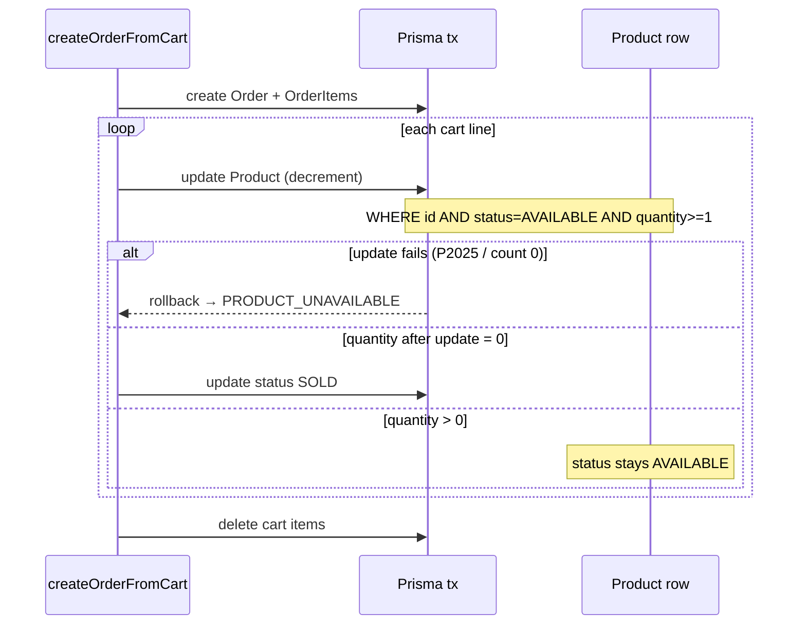

# Phase 13: Product Stock Quantity — Research

**Researched:** 2026-05-18  
**Domain:** Prisma `quantity` on `Product`, admin CRUD/UI, atomic checkout decrement, conditional `SOLD`  
**Confidence:** HIGH (codebase + CONTEXT locked decisions + Prisma official docs via Context7)

<user_constraints>
## User Constraints (from CONTEXT.md)

### Locked Decisions

#### Data model
- **D-13-01:** Поле `quantity Int` на `Product`, `@default(1)`, NOT NULL.
- **D-13-02:** Міграція: усі існуючі рядки `quantity = 1`.
- **D-13-03:** CartItem / OrderItem не змінюємо — лінія кошика лишається `quantity: 1` (одна одиниця за замовлення).

#### Checkout і SOLD
- **D-13-04:** У `createOrderFromCart` (транзакція): для кожного товару в замовленні `quantity -= 1` (atomic per product id).
- **D-13-05:** Якщо після decrement `quantity === 0` → `status: SOLD` (і `quantity` лишається 0). Якщо `quantity > 0` → `status` не чіпати (лишається `AVAILABLE`).
- **D-13-06:** Перед checkout / add-to-cart: не дозволяти купівлю, якщо `status !== AVAILABLE` або `quantity < 1` (узгодити з існуючими перевірками AVAILABLE).
- **D-13-07:** Scope розширено відносно ROADMAP «decrement out of scope» — **свідомий вибір користувача** на discuss-phase.

#### Admin validation (create / edit)
- **D-13-08:** `quantity` — ціле число, `min: 0`, розумний `max` (напр. 999).
- **D-13-09:** **Create:** default `1`, Zod `quantity >= 1` (не створюємо лістинг з нулем).
- **D-13-10:** **Edit:** дозволити `quantity: 0` вручну (напр. списання без продажу); разом з D-13-05 при 0 бажано узгодити з `status` (адмін може виставити SOLD вручну або лишити правило «0 після продажу = SOLD» лише в checkout).

#### Admin UI
- **D-13-11:** Поле «Кількість» у `product-form` (поруч із ціною).
- **D-13-12:** Колонка «Кількість» у `/admin/tovary` (`admin-products-table`); без сортування в v1.2 (опційно пізніше).
- **D-13-13:** Storefront без відображення quantity (текст/badge на PDP і в каталозі).

### Claude's Discretion

- Точний `max` для quantity; чи показувати в таблиці badge при `quantity <= 2`; чи блокувати edit quantity вниз нижче кількості в активних кошиках (ймовірно out of scope).

### Deferred Ideas (OUT OF SCOPE)

- Сортування колонки «Кількість» в admin table — не обговорювали, за бажанням пізніше.
- Показ quantity на storefront (PDP/каталог) — v2 / out of scope.
- Cart line quantity > 1 — суперечить моделі «унікальна б/у одиниця».
- Авто-приховування категорій / каталогу при `quantity=0` але `AVAILABLE` — покладаємось на SOLD після останнього продажу; edge case ручного AVAILABLE+0 — на розсуд planner.
</user_constraints>

<phase_requirements>
## Phase Requirements

| ID | Description | Research Support |
|----|-------------|------------------|
| **ADM-PRD-03** | Адмін вказує кількість при create/edit; залишок видно в адмінці; на storefront не показується | D-13-01–13, admin form/table changes, catalog filters unchanged for display |
</phase_requirements>

## Summary

Phase 13 evolves the product model from **one listing = one physical unit (implicit qty 1)** to **one listing = N identical used units** on a **single PDP/slug**. Stock is **admin-only metadata**; buyers never see counts. Checkout must **atomically decrement** `Product.quantity` per cart line (still one unit per order line) and set `status: SOLD` only when stock hits zero.

The codebase already has the right seams: Prisma interactive transactions in `createOrderFromCart`, `AVAILABLE` guards in `cart.service` / `catalog.service`, and admin product CRUD via Zod + `product-form` / `admin-products-table`. **No new npm packages** — use Prisma `decrement` on `Int` inside the existing `$transaction`. [CITED: prisma.io/docs — atomic `increment`/`decrement`, interactive transactions]

**Primary recommendation:** Add `quantity` to schema + migration; extend validators (create `>= 1`, edit `>= 0`, max `999`); wire admin UI; replace checkout `updateMany → SOLD` with **decrement-then-conditional-SOLD**; extend purchasability checks (`status === AVAILABLE && quantity >= 1`) in cart (and optionally catalog/wishlist for consistency).

## Architectural Responsibility Map

| Capability | Primary Tier | Secondary Tier | Rationale |
|------------|-------------|----------------|-----------|
| `Product.quantity` persistence | Database (Prisma) | — | Source of truth for identical units per listing |
| Admin set/view quantity | API (`admin-product.service`) + Browser (`product-form`, table) | Server Actions | Same pattern as `priceUah` |
| Purchasability guard | API (`cart.service`, checkout) | Catalog/wishlist (optional same rule) | D-13-06 — block before cart mutation |
| Stock decrement + SOLD | API (`order.service` transaction) | Database | D-13-04–05; must be atomic per product id |
| Storefront visibility | Frontend Server (`catalog.service` where) | — | Filter `AVAILABLE` only today; add `quantity >= 1` at planner discretion for ghost listings |
| Order cancel revert | API (`admin-order.service`) | — | **Existing** `revertSoldProductsOnCancel` — does **not** restore quantity (documented risk, out of scope) |

## Current State

### Schema (`prisma/schema.prisma`)

- `Product` has `status: ProductStatus` (`AVAILABLE | SOLD | DRAFT`) but **no `quantity` field**.
- `CartItem.quantity` and `OrderItem.quantity` exist and are always **1** at write time — **unchanged per D-13-03**.

### Checkout (`src/server/services/order.service.ts`)

```115:123:src/server/services/order.service.ts
    for (const line of cart.items) {
      const updated = await tx.product.updateMany({
        where: { id: line.productId, status: "AVAILABLE" },
        data: { status: "SOLD" },
      });

      if (updated.count === 0) {
        throw new Error("PRODUCT_UNAVAILABLE");
      }
```

Every successful checkout marks the **entire listing SOLD**, even if multiple units were intended — this is what Phase 13 replaces.

### Cart (`src/server/services/cart.service.ts`)

- `addToCart` requires `status: AVAILABLE` only — **no stock check**.
- `mapLine` drops non-`AVAILABLE` lines from cart view; `canAddProductToCart(status)` checks status only.

### Admin products

- `upsertProductSchema` / `updateProductSchema` — no `quantity`.
- `createProduct` / `updateProduct` — no `quantity` in Prisma `data`.
- `product-form.tsx` — price field only; no quantity input.
- `admin-products-table.tsx` — columns: photo, title, category, price, status — **no quantity column**.
- Edit page passes `priceUah` in `defaultValues` but not quantity.

### Catalog / wishlist

- `buildPublicProductWhere` filters `status: AVAILABLE` only — products with manual `AVAILABLE` + `quantity: 0` would still appear until Phase 15 / optional filter.
- `wishlist.service` `addToWishlist` — same `AVAILABLE`-only check.

### Order cancel (adjacent, not in phase scope)

- `revertSoldProductsOnCancel` sets `SOLD → AVAILABLE` without touching quantity — **inventory drift** if order cancelled after multi-unit sales.

### Tests

- `order.service.test.ts` — `createOrderFromCart` marked `it.todo` (e2e only).
- `cart.service.test.ts` — `canAddProductToCart` status-only.
- `e2e/checkout.spec.ts` — single-item happy path; no multi-qty scenario.
- Vitest **4.1.6**, Playwright **1.60.0** — `npm test`, `npm run test:e2e`.

## Recommended Approach

### 1. Schema and migration (D-13-01, D-13-02)

```prisma
quantity Int @default(1)
```

Migration SQL pattern (Prisma will generate equivalent):

```sql
ALTER TABLE "Product" ADD COLUMN "quantity" INTEGER NOT NULL DEFAULT 1;
```

All existing rows get `1` via default — satisfies D-13-02 without data backfill script.

### 2. Shared purchasability helper (D-13-06)

Extract small pure function (e.g. `src/server/services/product-availability.ts` or inline in cart):

```typescript
export function isProductPurchasable(
  status: ProductStatus,
  quantity: number,
): boolean {
  return status === "AVAILABLE" && quantity >= 1;
}
```

Use in:

- `addToCart` / `findFirst` where clause: `{ status: "AVAILABLE", quantity: { gte: 1 } }`
- `mapLine` — treat `quantity < 1` like unavailable (remove stale cart line)
- **Planner discretion:** `buildPublicProductWhere` add `quantity: { gte: 1 }` to hide ghost `AVAILABLE+0` listings (recommended, low cost)

### 3. Checkout decrement (D-13-04, D-13-05)

Replace blind `SOLD` `updateMany` with **per-line atomic decrement** inside existing `prisma.$transaction`:

1. `tx.product.update` with compound `where`: `id`, `status: "AVAILABLE"`, `quantity: { gte: 1 }`
2. `data: { quantity: { decrement: 1 } }`, `select: { quantity: true }`
3. On `P2025` (record not found) → `PRODUCT_UNAVAILABLE` (same as today)
4. If `quantity === 0` after update → `tx.product.update({ data: { status: "SOLD" } })`
5. If `quantity > 0` → **do not change status** (listing stays on storefront)

[CITED: prisma.io/docs — `decrement` atomic ops; interactive `$transaction`]

**Why `update` not `updateMany`:** `update` returns the row; `where` with `quantity: { gte: 1 }` makes the decrement **single-statement atomic** at DB level. `updateMany` only returns `count` — workable but needs extra `findUnique` for SOLD decision (also fine in transaction).

**Extract for tests:** `reserveProductUnitForCheckout(tx, productId)` in `order.service.ts` (or sibling module) — unit-testable with mocked `tx`.

### 4. Admin validation (D-13-08–10)

| Context | Zod rule | Default UI |
|---------|----------|------------|
| Create (`upsertProductSchema`) | `z.coerce.number().int().min(1).max(999)` | `quantity: 1` in form `defaultValues` |
| Edit (`updateProductSchema`) | `z.coerce.number().int().min(0).max(999)` | load from `product.quantity` |

**Discretion recommendation (admin edit + zero):** When admin saves `quantity === 0` and product is `AVAILABLE`, **auto-set `status: SOLD`** in `updateProduct` (aligns with checkout semantics, prevents D-13-13 ghost buyable listings). If product already `SOLD`, allow `quantity: 0` without status change. Document in plan — not locked in CONTEXT.

Do **not** add `quantity` to `adminFormProductStatusSchema` / list status select — stock is separate from publish state.

### 5. Admin UI (D-13-11, D-13-12)

- **`product-form.tsx`:** `<Label>Кількість</Label>` + `<Input type="number" min={0|1} max={999}>` beside price; register `quantity` on both modes.
- **`admin-products-table.tsx`:** non-sortable column «Кількість» after «Ціна»; `tabular-nums`; optional badge if `quantity <= 2 && status === AVAILABLE` (discretion).
- **`tovary/[id]/page.tsx`:** pass `quantity` in `defaultValues` (`quantity: product.quantity`).
- **`createProduct` / `updateProduct`:** persist `quantity` field.

### 6. Storefront (D-13-13)

- **No** PDP/catalog quantity display.
- No changes to `CartItem` / guest merge semantics.
- Confirm no `quantity` in `PublicProductCard` / PDP types (grep after implementation).

## Checkout Decrement Pattern

### Sequence (within existing transaction)



### Reference implementation (planner task baseline)

```typescript
// Source: [CITED: prisma.io/docs — decrement + interactive transactions]
async function reserveProductUnitForCheckout(
  tx: Prisma.TransactionClient,
  productId: string,
): Promise<void> {
  let afterQty: number;
  try {
    const row = await tx.product.update({
      where: {
        id: productId,
        status: "AVAILABLE",
        quantity: { gte: 1 },
      },
      data: { quantity: { decrement: 1 } },
      select: { quantity: true },
    });
    afterQty = row.quantity;
  } catch (error) {
    if (isPrismaNotFound(error)) {
      throw new Error("PRODUCT_UNAVAILABLE");
    }
    throw error;
  }

  if (afterQty === 0) {
    await tx.product.update({
      where: { id: productId },
      data: { status: "SOLD" },
    });
  }
}
```

### Concurrency

- Two buyers checking out the **last** unit: second `update` fails `where quantity >= 1` → `PRODUCT_UNAVAILABLE` → whole transaction rolls back — same failure mode as today’s `updateMany` race.
- Two buyers checking out when `quantity = 2`: both succeed; second decrement leaves `quantity = 0` + `SOLD` — correct.

### Cart clear after order

Current code deletes cart items but does not call `clearCart` at end of `createOrderFromCart` — verify cart is emptied via `deleteMany` (yes, lines 136–140). No change needed for quantity phase.

## Admin Validation

| Rule | Create | Edit |
|------|--------|------|
| Min | 1 (D-13-09) | 0 (D-13-10) |
| Max | 999 (recommended discretion) | 999 |
| Type | `z.coerce.number().int()` | same |
| UI default | 1 | DB value |
| SOLD product edit | N/A | Existing `isSold` alert — quantity field **editable** (write-off to 0 allowed); status locked separately |

**Separate schemas:** Keep `upsertProductSchema` for create and `updateProductSchema` for edit (already split) — add `quantity` to each with different `.min()`.

**Tests to extend:** `src/server/validators/admin-product.test.ts` — create rejects 0, edit accepts 0, both reject 1000.

## Migration

| Step | Command / action |
|------|------------------|
| 1 | Add `quantity Int @default(1)` to `Product` in `schema.prisma` |
| 2 | `npx prisma migrate dev --name product_quantity` |
| 3 | `npx prisma generate` (also runs on `postinstall`) |
| 4 | Verify migration SQL sets `NOT NULL DEFAULT 1` on existing rows |

**Rollback:** Drop column migration — only if phase not yet deployed; no runtime state beyond Postgres column.

**Seed:** If seed creates products, ensure explicit `quantity: 1` or rely on default.

## Risks

| Risk | Severity | Mitigation |
|------|----------|------------|
| **Order cancel restores status but not quantity** | MEDIUM | Document; defer increment-on-cancel to future phase. Today `revertSoldProductsOnCancel` only flips `SOLD → AVAILABLE`. |
| **Admin sets AVAILABLE + quantity 0** | LOW | Recommend auto-SOLD on save or catalog `quantity >= 1` filter |
| **Stale cart lines** when stock exhausted | LOW | `getCartForUser` already prunes non-AVAILABLE; extend `mapLine` for `quantity < 1` |
| **E2E assumes one sale = SOLD** | MEDIUM | Add e2e: product `quantity: 2`, two sequential checkouts OR unit test on `reserveProductUnitForCheckout` |
| **Wishlist shows unavailable** | LOW | Extend `isWishlistProductAvailable` with quantity (optional, same release) |
| **Double decrement on retry** | LOW | Checkout is single transaction; idempotent order numbers don’t re-run same cart without user action |

## Files to Touch

| File | Change |
|------|--------|
| `prisma/schema.prisma` | Add `quantity` field |
| `prisma/migrations/*_product_quantity/` | Generated migration |
| `src/server/services/order.service.ts` | Decrement + conditional SOLD; extract helper |
| `src/server/services/cart.service.ts` | `quantity >= 1` on add + mapLine |
| `src/server/validators/admin-product.ts` | `quantity` on create/update schemas |
| `src/server/services/admin-product.service.ts` | Persist `quantity` on create/update; optional auto-SOLD on 0 |
| `src/components/admin/product-form.tsx` | Quantity input |
| `src/components/admin/admin-products-table.tsx` | Quantity column + type |
| `src/app/(admin)/admin/tovary/[id]/page.tsx` | `defaultValues.quantity` |
| `src/server/validators/admin-product.test.ts` | Quantity validation cases |
| `src/server/services/order.service.test.ts` | Implement todo / unit tests for reserve helper |
| `src/server/services/cart.service.test.ts` | Purchasability with quantity |
| `e2e/checkout.spec.ts` or new spec | Multi-unit or decrement assertion (if seed data allows) |
| **Optional** `src/server/services/catalog.service.ts` | `quantity: { gte: 1 }` in public where |
| **Optional** `src/server/services/wishlist.service.ts` | quantity check on add |

**Do not touch (per CONTEXT):** `CartItem` schema, `OrderItem` checkout quantity (stay 1), storefront PDP components for display.

## Standard Stack

| Library | Version | Purpose |
|---------|---------|---------|
| **Prisma** | 7.8.0 (installed) | Schema, migration, atomic `decrement`, `$transaction` |
| **Zod** | 4.4.3 (installed) | Admin quantity validation |
| **react-hook-form** | 7.76.0 (installed) | Admin form field |

**Installation:** none.

## Package Legitimacy Audit

Phase installs **no new packages**.

## Don't Hand-Roll

| Problem | Use Instead | Why |
|---------|-------------|-----|
| Atomic stock decrement | Prisma `quantity: { decrement: 1 }` in `update` | DB-level atomicity; documented race prevention [CITED: prisma.io] |
| Checkout orchestration | Existing `prisma.$transaction` | Already used; rollback on any line failure |
| Custom SQL `UPDATE ... WHERE qty > 0` | Prisma compound `where` | Type-safe, same semantics |

## Common Pitfalls

1. **Marking SOLD on every sale** — forgetting conditional SOLD leaves listings dead after first of N units.
2. **Using `updateMany` without reading new quantity** — need second query or use `update` + `select`.
3. **Validating quantity only in UI** — must be in Zod + service layer.
4. **Showing quantity on storefront** — violates ADM-PRD-03 / D-13-13.
5. **Incrementing stock on order cancel** — out of scope but operators may expect it; document.

## Code Examples

### Prisma schema field

```prisma
quantity Int @default(1)
```

### Cart add guard

```typescript
const product = await prisma.product.findFirst({
  where: { id: productId, status: "AVAILABLE", quantity: { gte: 1 } },
  select: { id: true },
});
```

### Admin Zod (create)

```typescript
quantity: z.coerce.number().int().min(1, "Мінімум 1").max(999, "Максимум 999"),
```

## Validation Architecture

### Test Framework

| Property | Value |
|----------|-------|
| Framework | Vitest 4.1.6 + Playwright 1.60.0 |
| Config | `vitest.config.ts` |
| Quick run | `npm test` |
| Full E2E | `npm run test:e2e` |

### Phase Requirements → Test Map

| Req / Decision | Behavior | Test Type | Automated Command | File Exists? |
|----------------|----------|-----------|-------------------|------------|
| D-13-04–05 | Decrement; SOLD only at 0 | unit | `npm test -- src/server/services/order.service.test.ts` | ❌ Wave 0 — implement |
| D-13-06 | Block add when qty 0 | unit | `npm test -- src/server/services/cart.service.test.ts` | ❌ extend |
| D-13-08–09 | Create schema min 1 | unit | `npm test -- src/server/validators/admin-product.test.ts` | ❌ extend |
| D-13-10 | Edit allows 0 | unit | same | ❌ extend |
| D-13-11–12 | Admin form/table | e2e/manual | `npm run test:e2e -- e2e/admin-products.spec.ts` | ✅ extend |
| ADM-PRD-03 | End-to-end checkout reduces stock | e2e | `npm run test:e2e -- e2e/checkout.spec.ts` | ✅ extend or DB seed test |
| Regression | Single-unit checkout still works | e2e | `e2e/checkout.spec.ts` | ✅ |

### Sampling Rate

- **Per task commit:** `npm test` (targeted file if possible)
- **Per wave merge:** `npm test` + relevant `npm run test:e2e -- <spec>`
- **Phase gate:** full `npm test` before `/gsd-verify-work`

### Wave 0 Gaps

- [ ] `reserveProductUnitForCheckout` (or equivalent) with Vitest mocks for `tx.product.update`
- [ ] `isProductPurchasable` tests (status + quantity matrix)
- [ ] Zod tests for create min 1 / edit min 0
- [ ] E2E: admin fills «Кількість»; optional two-checkout scenario with `quantity: 2` seed

## Security Domain

| ASVS | Applies | Control |
|------|---------|---------|
| V5 Input Validation | yes | Zod on admin quantity; server-side guards on cart/checkout |
| V4 Access Control | yes | Admin mutations already `requireAdmin()` |
| V6 Cryptography | no | — |

| Threat | Mitigation |
|--------|------------|
| Overselling last unit | Atomic `decrement` + `where quantity >= 1` in transaction |
| Negative stock via API | Zod `min(0)` edit / `min(1)` create; DB `NOT NULL` |
| Buyer inferring stock | No storefront quantity field (D-13-13) |

## Project Constraints (from .cursor/rules/)

- **Next.js:** Read `node_modules/next/dist/docs/` before API changes; heed deprecations (`AGENTS.md`).
- **Stack:** Prisma + PostgreSQL, Zod, Ukrainian UI copy, shadcn patterns for admin.
- **Locale:** Admin labels «Кількість», Ukrainian error strings.

## Assumptions Log

| # | Claim | Risk if wrong |
|---|-------|---------------|
| A1 | `max(999)` acceptable for discretion | Admin needs higher cap — trivial schema change |
| A2 | Auto-SOLD when admin sets qty 0 on AVAILABLE | User wanted manual AVAILABLE+0 — mitigated by edit allowing 0 for write-off with SOLD |
| A3 | Order cancel quantity restore out of scope | Ops confusion on cancel — document in admin runbook |

## Open Questions

1. **Catalog filter `quantity >= 1` in Phase 13 or Phase 15?**
   - Recommendation: include in Phase 13 (one-line where clause) to avoid ghost listings before CAT-04.

2. **Badge for low stock (`quantity <= 2`) in admin table?**
   - Discretion: nice-to-have; skip if plan tight.

## Environment Availability

| Dependency | Required By | Available | Version |
|------------|-------------|-----------|---------|
| Node.js | build/test | ✓ | (project standard) |
| Prisma CLI | migration | ✓ | 7.8.0 |
| PostgreSQL | migrate dev | ✓ (local Neon/Docker per project) | — |

Step 2.6: External deps limited to existing DB — no new tools.

## Sources

### Primary (HIGH)

- [CITED: prisma.io/docs] — atomic `increment`/`decrement`, interactive transactions (Context7 `/websites/prisma_io`)
- Codebase: `order.service.ts`, `cart.service.ts`, `admin-product.service.ts`, `schema.prisma`, `13-CONTEXT.md`

### Secondary (MEDIUM)

- `.planning/phases/03-cart-checkout/03-RESEARCH.md` — CartItem.quantity always 1

## Metadata

**Confidence breakdown:**

- Standard stack: HIGH — no new deps; Prisma patterns verified
- Architecture: HIGH — clear replacement of `updateMany → SOLD`
- Pitfalls: MEDIUM — order-cancel quantity drift acknowledged, out of scope

**Research date:** 2026-05-18  
**Valid until:** 2026-06-18

## RESEARCH COMPLETE
