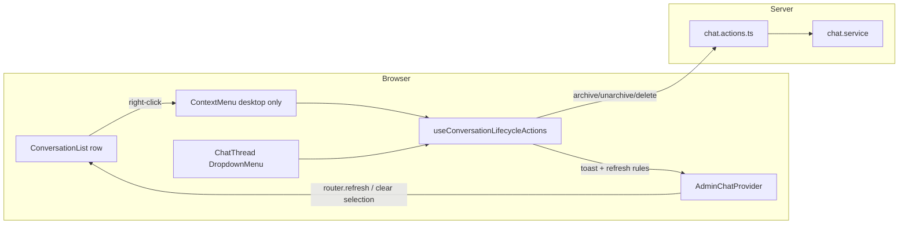

# Phase 14: Admin Chat Context Menu — Research

**Researched:** 2026-05-18  
**Domain:** Admin chat inbox UI (shadcn ContextMenu on Base UI, shared lifecycle actions, Playwright e2e)  
**Confidence:** HIGH (codebase + shadcn dry-run + Base UI docs); MEDIUM (selection refresh edge case interpretation)

## Summary

Phase 14 adds **desktop right-click lifecycle actions** to inbox rows on `/admin/chaty`, matching the existing **⋮ DropdownMenu** in `chat-thread.tsx` without new server mutations. The project already uses **shadcn base-nova** with **`@base-ui/react`** for menus (`dropdown-menu.tsx`); `context-menu` is **not installed yet** but CLI dry-run shows a single new file `src/components/ui/context-menu.tsx` mirroring dropdown-menu APIs (`ContextMenuItem` with `variant="destructive"`, `render` on trigger).

The highest-impact implementation risks are: (1) **Base UI `ContextMenuTrigger` opens on long-press** as well as right-click — on mobile this would violate D-14-09 unless ContextMenu is **not rendered** below `md`; (2) **listbox a11y** — trigger defaults to `<motion.div>` but supports **`render` + `nativeButton`** to keep `<button role="option">`; (3) **post-action selection** — thread handlers always call `clearSelectionAndRefresh()`, but list actions on a **non-selected** row should refresh without clearing another open thread (D-14-08).

**Primary recommendation:** Install `context-menu` via shadcn CLI; extract `useConversationLifecycleActions(conversationId)` + shared menu items + one delete `AlertDialog` pattern; wrap each inbox row with `ContextMenu` only when `!isMobile` (767px, same as `admin-chat-inbox.tsx`); use `ContextMenuTrigger` `render={<button role="option" ... />}` with `nativeButton`; extend `e2e/admin-chat.spec.ts` with `click({ button: 'right' })` and `getByRole('menuitem')`.

<user_constraints>
## User Constraints (from CONTEXT.md)

### Locked Decisions

#### Context menu component (ADM-CHAT-01)
- **D-14-01:** Встановити shadcn **`context-menu`** (`npx shadcn@latest add context-menu`). ПКМ на рядку inbox — **`ContextMenu`** + `ContextMenuTrigger` / `ContextMenuContent` / `ContextMenuItem` (destructive для delete).
- **D-14-02:** **`DropdownMenu` у шапці треда** (`chat-thread.tsx`) **залишити** — не замінювати на ContextMenu; семантика різна (кнопка ⋮ vs ПКМ по списку).
- **D-14-03:** На `onContextMenu` рядка — **`preventDefault()`**, щоб не показувалось нативне браузерне меню і не конфліктувало з лівим кліком.

#### Shared lifecycle actions
- **D-14-04:** Винести спільну логіку дій (handlers, `useTransition`, `AlertDialog` для delete, toasts, виклики `archiveConversationAction` / `unarchiveConversationAction` / `deleteConversationAction`) в **один shared модуль** — напр. `useConversationLifecycleActions(conversationId, { view, status })` або `ConversationLifecycleMenuItems` + спільний delete dialog. **`chat-thread.tsx` і список** споживають той самий код — без копіпасти трьох handler-ів.
- **D-14-05:** **Ті самі server actions** що зараз у `src/server/actions/admin/chat.actions.ts` — нових mutation не додавати.

#### Action visibility (parity with thread ⋮)
- **D-14-06:** Пункти меню на рядку **ідентичні правилам** `chat-thread.tsx`:
  - `view === "active"` і `status === "OPEN"` → **«Архівувати»**
  - `view === "archive"` і `status === "ARCHIVED"` → **«Повернути з архіву»**
  - **«Видалити назавжди»** — завжди (destructive), з тим самим `AlertDialog` текстом українською що в треді.

#### Post-action behavior
- **D-14-07:** Після дії зі списку — **та сама поведінка**, що з ⋮ у треді (через shared hook):
  - архів / delete → `clearSelectionAndRefresh()` + success toast
  - розархів → `refreshInbox()` + toast
- **D-14-08:** Якщо ПКМ по **необраному** рядку — дія виконується для **цього** `conversationId`; після delete/archive, якщо це був обраний тред — selection знімається (як у треді).

#### Mobile / touch
- **D-14-09:** **Контекстне меню лише для desktop ПКМ** — не імплементувати long-press і не додавати ⋮ на рядок списку на mobile.
- **D-14-10:** На **mobile (`<md`)** адмін робить archive/delete/unarchive через **⋮ у шапці треда** після відкриття діалогу (існуючий UX Phase 8) — без регресії.

#### Click vs menu (list row)
- **D-14-11:** Рядок inbox лишається **клікабельним** (`onClick` → `onSelect`); вибір пункту контекстного меню — **`onSelect` на MenuItem** без спрацьовування navigate/select (стандартна поведінка ContextMenu, не bubble до row click після закриття меню).
- **D-14-12:** Патерн Phase 11: якщо на рядку з’являться додаткові інтерактивні елементи — **`stopPropagation`**; у цій фазі рядок = trigger + click, без окремих кнопок на рядку.

#### Accessibility
- **D-14-13:** Список лишає **`role="listbox"`** / `role="option"` на рядках. ContextMenu з shadcn дає keyboard/focus для меню; **keyboard-only шлях для lifecycle** на MVP — відкрити тред → ⋮ (не дублювати окрему клавіатурну ⋮ на рядку).
- **D-14-14:** `aria-label` на trigger/меню українською (напр. «Дії з діалогом») — узгодити з тредом.

#### Verification
- **D-14-15:** Розширити **`e2e/admin-chat.spec.ts`** (якщо є) — desktop: ПКМ → архів з active list; за потреби skip на mobile viewport.
- **D-14-16:** Manual checklist: ПКМ не ламає лівий клік; delete показує confirm; після delete рядок зникає; mobile без ПКМ — тред ⋮ працює.

### Claude's Discretion
- Точна форма shared модуля (hook vs compound component + один `AlertDialog` provider).
- Чи обгортати весь `<button>` рядка в `ContextMenuTrigger`, чи wrapper `motion.div` навколо row (planner: зберегти a11y listbox).
- Refactor `chat-thread.tsx` лише настільки, щоб прибрати дубль — без зміни візуалу шапки.

### Deferred Ideas (OUT OF SCOPE)
- ⋮ на кожному рядку inbox (mobile + desktop) — відхилено; залишено desktop ПКМ + thread ⋮.
- Long-press context menu на mobile — out of scope (нестабільна веб-поведінка).
- Keyboard ⋮ на рядку списку — deferred; достатньо thread ⋮ для a11y MVP.
</user_constraints>

<phase_requirements>
## Phase Requirements

| ID | Description | Research Support |
|----|-------------|------------------|
| ADM-CHAT-01 | ПКМ по чату в списку `/admin/chaty` відкриває context menu: архівувати / розархівувати / видалити (той самий набір, що ⋮ у відкритому треді) | shadcn `context-menu` (Base UI); shared lifecycle module from `chat-thread.tsx`; `useAdminChat().view` + `conversation.status`; desktop-only wrapper; e2e right-click |
</phase_requirements>

## Architectural Responsibility Map

| Capability | Primary Tier | Secondary Tier | Rationale |
|------------|-------------|----------------|-----------|
| Archive / unarchive / delete mutations | API / Backend (Server Actions) | — | Already in `chat.actions.ts` + `chat.service`; phase reuses |
| Menu visibility rules (`view`, `status`) | Browser / Client | — | Derived from `AdminChatProvider` + row DTO |
| Context menu UI + RCM handling | Browser / Client | — | shadcn ContextMenu on inbox row |
| Inbox refresh / selection after action | Browser / Client (provider) | Frontend SSR (`router.refresh`) | `clearSelectionAndRefresh` / `refreshInbox` in `admin-chat-provider.tsx` |
| AuthZ for mutations | API / Backend | — | `requireAdmin()` in actions (unchanged) |
| E2E verification | Test (Playwright) | — | `e2e/admin-chat.spec.ts` |

## Standard Stack

### Core

| Library | Version | Purpose | Why Standard |
|---------|---------|---------|--------------|
| `@base-ui/react` (context-menu) | **^1.4.1** (already in `package.json`) | Headless context menu primitive | Project shadcn preset is **base-nova**; `dropdown-menu` already uses `@base-ui/react/menu` [VERIFIED: `package.json`, `dropdown-menu.tsx`] |
| shadcn `context-menu` | CLI **^4.7.0** (`shadcn` devDep) | Styled `ContextMenu*` components | Locked D-14-01; dry-run creates `src/components/ui/context-menu.tsx` only [VERIFIED: `npx shadcn@latest add context-menu --dry-run`] |
| `sonner` | **^2.0.7** | Success/error toasts | Same as `chat-thread.tsx` [VERIFIED: codebase] |
| Server actions | existing | `archiveConversationAction`, `unarchiveConversationAction`, `deleteConversationAction` | D-14-05 [VERIFIED: `chat.actions.ts`] |

### Supporting

| Library | Version | Purpose | When to Use |
|---------|---------|---------|-------------|
| `@playwright/test` | **^1.60.0** | E2E right-click + menu assertions | D-14-15 [VERIFIED: `package.json`] |
| `vitest` + `@testing-library/react` | **^4.1.6** / **^16.3.2** | Optional unit test for shared hook | If planner adds hook unit test in Wave 0 |

### Alternatives Considered

| Instead of | Could Use | Tradeoff |
|------------|-----------|----------|
| shadcn ContextMenu | DropdownMenu + manual `onContextMenu` | Rejected in CONTEXT (D-14-01) — wrong semantics, more positioning hacks |
| Per-row delete dialog | Single dialog + `targetConversationId` state | Planner discretion; per-row dialog scales poorly |

**Installation:**

```bash
npx shadcn@latest add context-menu
```

No additional npm dependency beyond existing `@base-ui/react` — CLI adds one source file.

**Version verification:** `@base-ui/react` **1.4.1** in `package.json`; shadcn CLI **4.7.0** in devDependencies [VERIFIED: npm project manifest].

## Package Legitimacy Audit

> Phase installs **no new npm packages** — only shadcn source file. `slopcheck` was unavailable in research environment.

| Package | Registry | Age | Downloads | Source Repo | slopcheck | Disposition |
|---------|----------|-----|-----------|-------------|-----------|-------------|
| `context-menu` (shadcn component) | n/a (CLI scaffold) | — | — | ui.shadcn.com | n/a | Approved — uses existing `@base-ui/react` |
| `@base-ui/react` | npm | existing dep | high | github.com/mui/base-ui | unavailable | Already in project |

**Packages removed due to slopcheck [SLOP] verdict:** none  
**Packages flagged as suspicious [SUS]:** none  

*slopcheck unavailable — no new external package names introduced beyond existing `@base-ui/react`.*

## Architecture Patterns

### System Architecture Diagram



### Recommended Project Structure

```
src/components/chat/
├── conversation-list.tsx          # ContextMenu per row (desktop)
├── chat-thread.tsx                # DropdownMenu only (refactor to shared)
├── use-conversation-lifecycle-actions.ts   # NEW — hook (recommended)
├── conversation-lifecycle-menu-items.tsx   # NEW — shared items
├── conversation-lifecycle-delete-dialog.tsx  # NEW — shared AlertDialog
└── admin-chat-inbox.tsx           # pass enableContextMenu={!isMobile}

src/components/ui/
└── context-menu.tsx               # NEW via shadcn CLI
```

### Pattern 1: shadcn install + ContextMenuTrigger with `button` `role="option"`

**What:** Per-row `ContextMenu` with trigger composed onto the existing listbox option button via Base UI **`render`** prop (same pattern as `DropdownMenuTrigger` in `chat-thread.tsx`).

**When to use:** Desktop inbox rows only (`enableContextMenu === true`).

**Example:**

```tsx
// Source: https://base-ui.com/react/components/context-menu.md [CITED]
// Source: https://ui.shadcn.com/docs/components/base/context-menu [CITED]
// Pattern aligned with chat-thread.tsx DropdownMenuTrigger render=

<ContextMenu>
  <ContextMenuTrigger
    nativeButton
    render={
      <button
        type="button"
        role="option"
        aria-selected={isSelected}
        aria-label="Дії з діалогом"
        onClick={() => onSelect(conversation.id)}
        onContextMenu={(event) => event.preventDefault()}
        className={rowClassName}
      />
    }
  />
  <ContextMenuContent>
    <ConversationLifecycleMenuItems
      Item={ContextMenuItem}
      view={view}
      status={conversation.status}
      pending={pending}
      onArchive={handleArchive}
      onUnarchive={handleUnarchive}
      onRequestDelete={() => setDeleteOpen(true)}
    />
  </ContextMenuContent>
</ContextMenu>
```

**Planner note:** Default `ContextMenuTrigger` renders a `<div>` [CITED: Base UI docs] — do **not** nest `<button>` inside div without `render`; that breaks listbox semantics and clickable area.

### Pattern 2: Shared lifecycle extraction from `chat-thread.tsx`

**What:** Centralize handlers, `useTransition`, delete dialog state, visibility flags, and toasts.

**Reference implementation today** (`chat-thread.tsx` lines 96–131, 172–189, 219–238) [VERIFIED: codebase]:

| Concern | Current location | Shared target |
|---------|------------------|---------------|
| `handleArchive` / `handleUnarchive` / `handleDelete` | `ChatThread` | `useConversationLifecycleActions(conversationId)` |
| Menu items visibility | `view` + `selectedConversation.status` | Same rules; list passes **row** `status` |
| Delete `AlertDialog` UA copy | `ChatThread` | Shared component |
| `pending` | `useTransition` | Exposed from hook |

**Recommended hook signature:**

```typescript
function useConversationLifecycleActions(conversationId: string, status: ConversationStatus) {
  const { view, selectedConversationId, clearSelectionAndRefresh, refreshInbox } = useAdminChat();
  // ...
}
```

**Post-action refresh (critical for D-14-08):**

```typescript
function afterArchiveOrDelete() {
  if (selectedConversationId === conversationId) {
    clearSelectionAndRefresh();
  } else {
    refreshInbox();
  }
}
// Unarchive: always refreshInbox() (matches thread today)
```

Thread path keeps calling `clearSelectionAndRefresh()` on archive/delete because `conversationId === selectedConversationId` always.

**Menu items component:** Accept `Item` as `typeof DropdownMenuItem | typeof ContextMenuItem` — both expose `variant="destructive"`, `disabled`, `onClick` in generated shadcn file [VERIFIED: dry-run `ContextMenuItem` mirrors `DropdownMenuItem`].

### Pattern 3: `useAdminChat().view` for menu visibility

**What:** `ConversationList` (or row subcomponent) calls `useAdminChat()` inside `AdminChatProvider` tree.

**Visibility rules** (must match `chat-thread.tsx`):

```typescript
const showArchive = view === "active" && status === "OPEN";
const showUnarchive = view === "archive" && status === "ARCHIVED";
const showDelete = true; // always, destructive
```

[VERIFIED: `chat-thread.tsx` lines 172–188; `admin-chat-provider.tsx` exports `view`; `AdminChatView` in `admin-chat-url.ts`]

### Pattern 4: Desktop-only — no ContextMenu on mobile

**What:** Do not render `ContextMenu` wrapper when `max-width: 767px` (project `useIsMobile` in `admin-chat-inbox.tsx`).

**Why:** Base UI trigger opens on **right-click or long-press** [CITED: base-ui.com/react/components/context-menu.md] — long-press on mobile would violate D-14-09 even without custom long-press code.

```tsx
// admin-chat-inbox.tsx — pass prop
<ConversationList enableContextMenu={!isMobile} ... />
```

### Anti-Patterns to Avoid

- **Wrapping `<button role="option">` in a plain `ContextMenuTrigger` div** — duplicates focus target; use `render` + `nativeButton`.
- **Calling `clearSelectionAndRefresh()` for every list action** — clears wrong thread when archiving a non-selected row (D-14-08).
- **Relying only on “no right mouse on mobile”** — long-press still opens Base UI context menu.
- **Replacing thread `DropdownMenu` with ContextMenu** — rejected D-14-02.

## Don't Hand-Roll

| Problem | Don't Build | Use Instead | Why |
|---------|-------------|-------------|-----|
| Context menu positioning/focus | Custom `position: fixed` menu | shadcn `ContextMenu` (Base UI) | Focus trap, escape, submenu, collision detection |
| Archive/delete API | New routes | Existing server actions | D-14-05; `requireAdmin` + zod already wired |
| Mobile breakpoint | New hook | Reuse `useIsMobile` pattern from `admin-chat-inbox.tsx` or `src/hooks/use-mobile.ts` | Consistent 767px / 768px breakpoint |
| Native browser menu | CSS-only hacks | `preventDefault` on `contextmenu` + Base UI menu | D-14-03 |

**Key insight:** The phase is **UI composition + DRY refactor**, not backend work.

## Common Pitfalls

### Pitfall 1: Long-press opens menu on mobile (Base UI default)

**What goes wrong:** Admin long-presses row on phone → context menu appears despite “desktop only” intent.  
**Why it happens:** `ContextMenu.Trigger` documents “right click **or long press**” [CITED: Base UI].  
**How to avoid:** Conditionally **omit** entire `ContextMenu` subtree when `isMobile` / `enableContextMenu={false}`.  
**Warning signs:** QA on iOS simulator shows menu without ⋮.

### Pitfall 2: Listbox / option semantics broken

**What goes wrong:** Screen readers see div wrapper; keyboard list navigation breaks.  
**Why it happens:** Default trigger is `<motion.div>`, not `<button>`.  
**How to avoid:** `ContextMenuTrigger` `render={button}` + `nativeButton`.  
**Warning signs:** Extra tab stop; `role="option"` not on focused element.

### Pitfall 3: `preventDefault` missing → native menu + custom menu

**What goes wrong:** Browser context menu flashes under custom menu.  
**How to avoid:** `onContextMenu={(e) => e.preventDefault()}` on the option button (D-14-03).  
**Warning signs:** Double menus on Windows/Linux testing.

### Pitfall 4: Wrong refresh after action on non-selected row

**What goes wrong:** Admin archives row B while thread A is open → selection cleared unexpectedly.  
**How to avoid:** Shared hook compares `selectedConversationId === conversationId` before `clearSelectionAndRefresh()`.  
**Warning signs:** Thread pane blanks while another row was right-clicked.

### Pitfall 5: E2E uses wrong locator scope

**What goes wrong:** Menu not found — rendered in portal at `document.body`.  
**How to avoid:** `page.getByRole('menuitem', { name: '...' })` at page level after right-click [CITED: Playwright input docs; Base UI `role="menuitem"` on items].  
**Warning signs:** Test passes locally only when menu happens to be in row subtree.

### Pitfall 6: Hydration / `useIsMobile` initial `false`

**What goes wrong:** Brief desktop behavior on first paint on mobile.  
**Why it happens:** Existing pattern in `admin-chat-inbox.tsx` (`useState(false)`).  
**How to avoid:** Accept same as Phase 8 mobile split OR pass `enableContextMenu` from parent already used for layout.  
**Warning signs:** Rare flash of context menu capability — low priority, pre-existing.

## Code Examples

### Install context-menu

```bash
npx shadcn@latest add context-menu
```

[VERIFIED: CLI dry-run — creates `src/components/ui/context-menu.tsx` only]

### Shared visibility + items (parity with thread)

```tsx
// Source: chat-thread.tsx [VERIFIED: codebase]
export function ConversationLifecycleMenuItems({
  Item,
  view,
  status,
  pending,
  onArchive,
  onUnarchive,
  onRequestDelete,
}: {
  Item: React.ComponentType<MenuItemProps>;
  view: AdminChatView;
  status: ConversationStatus;
  pending: boolean;
  onArchive: () => void;
  onUnarchive: () => void;
  onRequestDelete: () => void;
}) {
  const isArchived = status === "ARCHIVED";
  return (
    <>
      {view === "active" && status === "OPEN" ? (
        <Item onClick={onArchive} disabled={pending}>Архівувати</Item>
      ) : null}
      {view === "archive" && isArchived ? (
        <Item onClick={onUnarchive} disabled={pending}>Повернути з архіву</Item>
      ) : null}
      <Item variant="destructive" onClick={onRequestDelete} disabled={pending}>
        Видалити назавжди
      </Item>
    </>
  );
}
```

### Playwright: right-click context menu (ADM-CHAT-01)

```typescript
// Source: https://playwright.dev/docs/input [CITED]
test("desktop right-click opens archive action on active inbox row", async ({ page }) => {
  await loginAsAdmin(page);
  await page.setViewportSize({ width: 1280, height: 720 });
  await page.goto("/admin/chaty");

  const firstRow = page.getByRole("option").first();
  await expect(firstRow).toBeVisible();
  await firstRow.click({ button: "right" });

  await expect(page.getByRole("menuitem", { name: "Архівувати" })).toBeVisible();
  // Optional: confirm archive flow + toast + row removal — needs seed data stability
});

test.describe("mobile viewport", () => {
  test.use({ viewport: { width: 390, height: 844 } });
  test("no context menu on row right-click", async ({ page }) => {
    await loginAsAdmin(page);
    await page.goto("/admin/chaty");
    const firstRow = page.getByRole("option").first();
    if (await firstRow.isVisible()) {
      await firstRow.click({ button: "right" });
      await expect(page.getByRole("menuitem")).toHaveCount(0);
    }
  });
});
```

**E2E data note:** Current `admin-chat.spec.ts` skips archive if no conversations [VERIFIED: existing spec]. Archive test should `test.skip()` when no `option` rows OR seed a conversation in `global-setup` — planner must align with DB seed strategy.

### Delete dialog copy (must stay identical)

Ukrainian strings from `chat-thread.tsx` `AlertDialogTitle` / `AlertDialogDescription` / buttons «Скасувати» / «Видалити» [VERIFIED: codebase lines 222–236].

## State of the Art

| Old Approach | Current Approach | When Changed | Impact |
|--------------|------------------|--------------|--------|
| Radix Context Menu in shadcn | Base UI `@base-ui/react/context-menu` in shadcn v4 base preset | shadcn base-nova | Use `render` / `nativeButton`, not Radix `asChild` |
| Duplicate handlers in thread + list | Shared hook + menu items (this phase) | Phase 14 | Single source for visibility and toasts |

**Deprecated/outdated:**
- Radix-only shadcn docs for this repo — use https://ui.shadcn.com/docs/components/base/context-menu [CITED: `npx shadcn@latest docs context-menu`]

## Assumptions Log

| # | Claim | Section | Risk if Wrong |
|---|-------|---------|---------------|
| A1 | `clearSelectionAndRefresh` only when affected row is selected — implied by D-14-08 vs D-14-07 wording | Pattern 2 | Wrong inbox/selection state after list RCM |
| A2 | `getByRole('menuitem')` works for Base UI menu items | E2E | Locator flake; may need `data-slot="context-menu-item"` |
| A3 | One shared delete dialog per row vs per list is planner choice | Pattern 2 | Minor perf/DOM weight |

## Open Questions

1. **E2E archive mutation side effects**
   - What we know: Archive removes row from active tab; needs conversation with `OPEN` status.
   - What's unclear: Whether global-setup guarantees ≥1 active conversation in CI.
   - Recommendation: Prefer «open menu + visible menuitem» assertion first; full archive flow as second test or manual checklist item D-14-16.

2. **`ConversationList` inside provider only**
   - What we know: Only used from `admin-chat-inbox.tsx` under `AdminChatProvider` [VERIFIED: grep].
   - Recommendation: Call `useAdminChat()` inside list row component without prop-drilling `view`.

## Environment Availability

| Dependency | Required By | Available | Version | Fallback |
|------------|------------|-----------|---------|----------|
| Node.js | shadcn CLI, Playwright | ✓ | (project standard) | — |
| `@base-ui/react` | context-menu | ✓ | 1.4.1 | — |
| Playwright | D-14-15 | ✓ | 1.60.0 | Manual checklist |
| Dev server / DB seed | e2e admin chat | ✓ (webServer in config) | — | `PLAYWRIGHT_BASE_URL` |
| slopcheck | Package audit | ✗ | — | Manual review; no new npm deps |

**Missing dependencies with no fallback:** none identified.

## Validation Architecture

### Test Framework

| Property | Value |
|----------|-------|
| Framework | Vitest **4.1.6** + Playwright **1.60.0** |
| Config file | `vitest.config.ts`, `playwright.config.ts` |
| Quick run command | `npm test` |
| Full suite command | `npm test && npm run test:e2e` |

### Phase Requirements → Test Map

| Req ID | Behavior | Test Type | Automated Command | File Exists? |
|--------|----------|-----------|-------------------|-------------|
| ADM-CHAT-01 | Desktop RCM shows same actions as thread ⋮ | e2e | `npx playwright test e2e/admin-chat.spec.ts -g "right-click"` | ❌ Wave 0 (extend spec) |
| ADM-CHAT-01 | Menu visibility `active`/`archive` | unit (optional) | `npx vitest run src/components/chat/conversation-lifecycle-menu-items.test.tsx` | ❌ Wave 0 optional |
| ADM-CHAT-01 | Server archive/delete | integration | `npx vitest run src/server/services/chat.service.test.ts` | ✅ existing |
| ADM-CHAT-01 | Left click still selects row | e2e | extend `admin-chat.spec.ts` | ✅ partial (click exists) |
| ADM-CHAT-01 | Delete confirm dialog | e2e / manual | Playwright dialog handler or manual D-14-16 | ❌ Wave 0 |
| ADM-CHAT-01 | Mobile: no list context menu | e2e | mobile viewport project in spec | ❌ Wave 0 |

### Sampling Rate

- **Per task commit:** `npm test` (if hook added) + targeted `npx playwright test e2e/admin-chat.spec.ts`
- **Per wave merge:** `npm run test:e2e`
- **Phase gate:** Full suite green before `/gsd-verify-work` + manual D-14-16 checklist

### Wave 0 Gaps

- [ ] Extend `e2e/admin-chat.spec.ts` — desktop `click({ button: 'right' })`, menuitem visibility, optional archive
- [ ] Optional `conversation-lifecycle-menu-items.test.tsx` — pure visibility matrix for `view` × `status`
- [ ] `npx shadcn@latest add context-menu` — creates `src/components/ui/context-menu.tsx`
- [ ] Manual checklist file or Phase 14 MANUAL-CHECKLIST.md (if project pattern) — D-14-16 items

## Security Domain

### Applicable ASVS Categories

| ASVS Category | Applies | Standard Control |
|---------------|---------|------------------|
| V2 Authentication | yes (admin session) | Existing `requireAdmin()` on actions — unchanged |
| V3 Session Management | no change | Better Auth session (unchanged) |
| V4 Access Control | yes | Admin-only routes + server action guards |
| V5 Input Validation | yes | `conversationIdSchema` cuid in `chat.actions.ts` |
| V6 Cryptography | no | — |

### Known Threat Patterns for {stack}

| Pattern | STRIDE | Standard Mitigation |
|---------|--------|---------------------|
| IDOR on conversation mutations | Elevation | `requireAdmin()` + service-layer checks (existing) |
| CSRF on Server Actions | Spoofing | Next.js Server Actions + session (existing) |
| Destructive action without confirm | Tampering | `AlertDialog` before `deleteConversationAction` (shared) |

## Project Constraints (from .cursor/rules/)

- **Next.js:** Read `node_modules/next/dist/docs/` before changing App Router patterns; APIs may differ from training data [AGENTS.md].
- **Locale:** UI copy Ukrainian (already in thread/dialog).
- **Stack:** shadcn base-nova, Tailwind v4 — follow existing `dropdown-menu.tsx` composition (`render` on triggers).
- **GSD:** No new server actions; scope limited to inbox RCM + DRY refactor.

## Sources

### Primary (HIGH confidence)

- Codebase: `chat-thread.tsx`, `conversation-list.tsx`, `admin-chat-provider.tsx`, `admin-chat-inbox.tsx`, `chat.actions.ts`, `e2e/admin-chat.spec.ts`, `components.json`, `package.json`
- `npx shadcn@latest add context-menu --dry-run --view` — generated component structure
- [Base UI Context Menu](https://base-ui.com/react/components/context-menu.md) — trigger behavior, `render` prop [CITED via Context7 `/websites/base-ui_react`]
- [shadcn base context-menu](https://ui.shadcn.com/docs/components/base/context-menu) [CITED: shadcn CLI docs URL]
- [Playwright input — mouse click](https://playwright.dev/docs/input) — `button: 'right'` [CITED: web search verified against official docs]

### Secondary (MEDIUM confidence)

- Phase artifacts: `14-CONTEXT.md`, `14-UI-SPEC.md`, `08-CONTEXT.md` (lifecycle decisions)

### Tertiary (LOW confidence)

- None blocking planning

## Metadata

**Confidence breakdown:**
- Standard stack: **HIGH** — dry-run + existing `@base-ui/react` menu patterns
- Architecture: **HIGH** — clear touchpoints; one selection edge case flagged (A1)
- Pitfalls: **HIGH** — long-press + listbox documented in official Base UI docs

**Research date:** 2026-05-18  
**Valid until:** ~2026-06-18 (stable stack); re-check shadcn CLI if upgrading `shadcn` major

## RESEARCH COMPLETE
