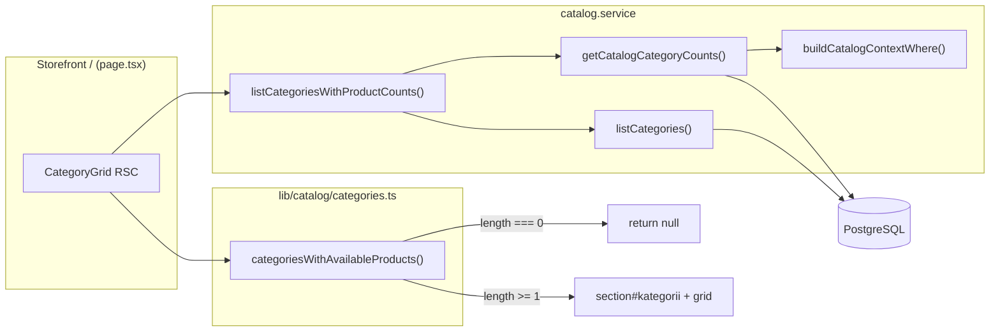

# Phase 25: Homepage empty categories — Research

**Researched:** 2026-05-19  
**Domain:** Storefront homepage RSC data filtering (catalog category visibility parity)  
**Confidence:** HIGH

## Summary

Phase 25 is a **narrow alignment fix**: `CategoryGrid` today loads all categories via raw `prisma.category.findMany` and always renders the «Категорії» section. Header and catalog sidebar already use `listCategoriesWithProductCounts()` → `categoriesWithAvailableProducts()` so empty categories never appear in nav/filters. The implementation is ~15–25 lines in `category-grid.tsx` plus a small extension to the catalog service return shape so cards keep Cloudinary images.

**Available product** in code means `productCount > 0` where counts come from `getCatalogCategoryCounts()` scoped by `buildCatalogContextWhere()` — currently **`quantity: { gte: 1 }` only** (no separate Product `status` / publish flag in schema). CONTEXT wording “published” is shorthand for “visible in catalog”; do not add new filters in this phase.

**Primary recommendation:** In `CategoryGrid`, mirror `StoreHeader`: fetch via `listCategoriesWithProductCounts`, filter with `categoriesWithAvailableProducts`, `return null` when the array is empty; extend `listCategoriesWithProductCounts` mapping to pass through `imagePublicId` and `imageAlt` (already loaded by `listCategories()` — no extra query).

<user_constraints>
## User Constraints (from CONTEXT.md)

### Locked Decisions

#### Data & filter (HOME-03)
- **D-01:** Replace `CategoryGrid`'s raw `prisma.category.findMany` with **`listCategoriesWithProductCounts()`** from `catalog.service`, then **`categoriesWithAvailableProducts(categories)`** — identical pipeline to `StoreHeader` / `catalog-filters`.
- **D-02:** **Available product** means `productCount > 0` where count comes from `getCatalogCategoryCounts()` / `buildCatalogContextWhere()` (published, in-stock catalog rules — no new business logic in this phase).
- **D-03:** Preserve **`sortOrder: "asc"`** from the categories list after filtering (order unchanged from today, minus empty categories).

#### Empty & partial UI
- **D-04:** If **zero** categories remain after filter → **do not render the section at all** (no `<section id="kategorii">`, no `h2`, no grid, no empty-state copy). Homepage continues with hero/other blocks only.
- **D-05:** **`h2` «Категорії»** appears only when at least one category card renders (same condition as D-04 — section and heading are coupled).
- **D-06:** When **1–3** categories remain → keep the **existing responsive grid** (`grid-cols-2` / `md:grid-cols-4`). Do not add centering, column-span hacks, or layout variants for sparse grids.

#### Cards & links (unchanged)
- **D-07:** Keep current card UI: Cloudinary image or «Без фото», `CardTitle` + «Переглянути», link to `/katalog/{slug}`. No product count badge on homepage cards (not in HOME-03; FOOT-04 is mobile drawer only).

#### Tests (ROADMAP)
- **D-08:** Add coverage that documents the filter contract — at minimum extend or add tests so planner can prove empty categories are excluded (unit on filtered list and/or focused test around `CategoryGrid` data path). Existing `categories.test.ts` + catalog tests must stay green; `npm run build` required.

### Claude's Discretion

- Exact test placement (pure function test vs. small component/service wrapper test).
- Whether to extract a shared `getStorefrontCategories()` helper used by header + homepage (only if it reduces duplication without scope creep).
- Minor refactors inside `category-grid.tsx` for readability.

### Deferred Ideas (OUT OF SCOPE)

- **FOOT-04** — show `productCount` next to each category in mobile drawer (Phase 26).
- **Sparse grid visual polish** (centered/wider cards when 1–3 categories) — explicitly rejected; keep standard grid.
</user_constraints>

<phase_requirements>
## Phase Requirements

| ID | Description | Research Support |
|----|-------------|------------------|
| HOME-03 | Секція «Категорії» на головній не показує картки категорій без доступних товарів (та сама логіка, що в хедері) | Use `listCategoriesWithProductCounts` + `categoriesWithAvailableProducts`; early `return null` when filtered list empty; parity with `store-header.tsx` lines 15–18 |
</phase_requirements>

## Architectural Responsibility Map

| Capability | Primary Tier | Secondary Tier | Rationale |
|------------|-------------|----------------|-----------|
| Category product counts | API / Backend (`catalog.service`) | Database (Prisma) | Counts via `prisma.product.count` / `groupBy` with shared `buildCatalogContextWhere` |
| Empty-category filter | Shared lib (`categories.ts`) | — | Pure `productCount > 0` filter; reused by header, catalog UI, homepage |
| Homepage section visibility | Frontend Server (RSC `CategoryGrid`) | — | Server component decides render vs `null` after filtered data |
| Card presentation (image, link) | Frontend Server (`CategoryGrid`) | CDN (Cloudinary via `OptimizedImage`) | Markup unchanged; needs `imagePublicId` / `imageAlt` on category DTO |

## Standard Stack

### Core

| Library | Version | Purpose | Why Standard |
|---------|---------|---------|--------------|
| Next.js | 16.2.6 | App Router, async RSC | Project stack; homepage already RSC |
| Prisma | 7.8.0 | DB access via `catalog.service` | Mandated ORM; header/catalog already use service layer |
| Vitest | 4.1.6 | Unit tests | Existing `categories.test.ts`, `catalog.service.test.ts` |

### Supporting

| Library | Version | Purpose | When to Use |
|---------|---------|---------|-------------|
| — | — | — | **No new packages** for this phase |

### Alternatives Considered

| Instead of | Could Use | Tradeoff |
|------------|-----------|----------|
| Extend `listCategoriesWithProductCounts` map | Second Prisma query in `CategoryGrid` for images | Violates D-01 pipeline; wastes query |
| Shared `getStorefrontCategories()` | Inline duplicate in `CategoryGrid` | Helper only if header + grid both refactored — optional discretion |

**Installation:** None required.

**Version verification:** Confirmed from `package.json` in repo (2026-05-19).

## Package Legitimacy Audit

> Phase installs **no new external packages.**

| Package | Disposition |
|---------|-------------|
| — | N/A |

*slopcheck unavailable at research time — irrelevant because no installs.*

## Project Constraints (from .cursor/rules/)

- **Stack:** Next.js App Router + TypeScript, Prisma + PostgreSQL, Tailwind, shadcn/ui, Ukrainian UI only.
- **Next.js:** Custom/breaking APIs — consult `node_modules/next/dist/docs/` before changing routing/RSC patterns.
- **GSD workflow:** Phase work should flow through GSD execute/plan commands (orchestrator context).
- **Data layer:** Prefer `catalog.service` over ad-hoc Prisma in UI components (already violated by `CategoryGrid` — fix in this phase).

## Architecture Patterns

### System Architecture Diagram



### Recommended Project Structure

No new folders. Touch only:

```
src/components/home/category-grid.tsx     # data source + early return
src/server/services/catalog.service.ts    # optional: pass image fields in map
src/lib/catalog/categories.test.ts        # optional: sort-order preservation
src/server/services/catalog.service.test.ts  # optional: listCategoriesWithProductCounts mock test
```

### Pattern 1: Storefront category pipeline (reference)

**What:** Fetch counts from service, filter in shared pure function.  
**When to use:** Any storefront surface that lists categories with catalog parity.  
**Reference:** `src/components/layout/store-header.tsx`

```typescript
const { categories: categoriesWithCounts } =
  await listCategoriesWithProductCounts();
const availableCategories =
  categoriesWithAvailableProducts(categoriesWithCounts);
```

### Pattern 2: RSC conditional section (homepage empty)

**What:** Async server component returns `null` before any section markup when filtered list is empty.  
**When to use:** D-04/D-05 — hide entire `#kategorii` block.

```typescript
const categories = categoriesWithAvailableProducts(categoriesWithCounts);
if (categories.length === 0) return null;

return (
  <section id="kategorii" className="...">
    <h2 className="...">Категорії</h2>
    {/* existing grid */}
  </section>
);
```

### Pattern 3: Preserve card fields when switching data source

**What:** `listCategoriesWithProductCounts` currently maps categories to `{ id, slug, name, productCount }` only. `CategoryGrid` still needs `imagePublicId` and `imageAlt` for D-07.  
**When to use:** Required for this phase — extend the map; `listCategories()` already returns full `Category` rows (no extra DB round-trip).

```typescript
categories: categories.map((category) => ({
  id: category.id,
  slug: category.slug,
  name: category.name,
  imagePublicId: category.imagePublicId,
  imageAlt: category.imageAlt,
  productCount: counts.byCategoryId[category.id] ?? 0,
})),
```

### Anti-Patterns to Avoid

- **Raw Prisma in `CategoryGrid`:** Current divergence — breaks parity when counts change.
- **Filter in SQL only for homepage:** Would duplicate `buildCatalogContextWhere` logic; use shared pipeline.
- **Empty-state UI:** Explicitly rejected (D-04).
- **Separate count query in component:** Use `listCategoriesWithProductCounts` only.

## Don't Hand-Roll

| Problem | Don't Build | Use Instead | Why |
|---------|-------------|-------------|-----|
| In-stock product counts per category | Custom Prisma in component | `getCatalogCategoryCounts` + `buildCatalogContextWhere` | Single definition for header, catalog, homepage |
| “Has products” filter | Inline `filter` with different rules | `categoriesWithAvailableProducts` | One-line, already tested |
| Catalog visibility rules | New `status` / publish checks | Existing `quantity >= 1` where clause | Schema has no Product publish flag; changing rules is out of scope |

**Key insight:** This phase is wiring, not new business logic.

## Common Pitfalls

### Pitfall 1: Image fields dropped after pipeline swap

**What goes wrong:** Cards lose Cloudinary images and always show «Без фото».  
**Why it happens:** `listCategoriesWithProductCounts` omits `imagePublicId` / `imageAlt` in its map.  
**How to avoid:** Extend service map (see Pattern 3).  
**Warning signs:** TypeScript still compiles but UI regresses visually.

### Pitfall 2: Misunderstanding “available product”

**What goes wrong:** Planner adds `status: PUBLISHED` or admin-only filters.  
**Why it happens:** CONTEXT mentions “published”; schema has no such Product field.  
**How to avoid:** Use existing `buildCatalogContextWhere` unchanged — `[VERIFIED: codebase]` `quantity: { gte: 1 }` only.  
**Warning signs:** New `where` clauses in `catalog.service.ts`.

### Pitfall 3: Section shell renders when grid is empty

**What goes wrong:** Empty `<section>` or orphan `h2` remains.  
**Why it happens:** `return null` placed after opening `<section>` or only inner grid guarded.  
**How to avoid:** Guard **before** any section markup (D-04/D-05).  
**Warning signs:** Homepage shows «Категорії» heading with no cards.

### Pitfall 4: Sort order regression

**What goes wrong:** Filtered categories appear in arbitrary order.  
**Why it happens:** Re-sorting after filter or using unordered query.  
**How to avoid:** `listCategories()` already uses `orderBy: { sortOrder: "asc" }`; filter preserves array order (D-03).  
**Warning signs:** Order differs from admin category list.

## Code Examples

### Filter function (existing)

```typescript
// src/lib/catalog/categories.ts
export function categoriesWithAvailableProducts<
  T extends { productCount: number },
>(categories: T[]): T[] {
  return categories.filter((category) => category.productCount > 0);
}
```

### Catalog context where (existing)

```typescript
// src/server/services/catalog.service.ts
export function buildCatalogContextWhere(
  categoryId?: string,
): Prisma.ProductWhereInput {
  return {
    quantity: { gte: 1 },
    ...(categoryId && { categoryId }),
  };
}
```

### Target CategoryGrid shape (planner implementation sketch)

```typescript
import { categoriesWithAvailableProducts } from "@/lib/catalog/categories";
import { listCategoriesWithProductCounts } from "@/server/services/catalog.service";

export async function CategoryGrid() {
  const { categories: categoriesWithCounts } =
    await listCategoriesWithProductCounts();
  const categories = categoriesWithAvailableProducts(categoriesWithCounts);

  if (categories.length === 0) return null;

  return (
    <section id="kategorii" className="mx-auto max-w-6xl px-4 py-12 sm:px-6">
      {/* unchanged card markup */}
    </section>
  );
}
```

## State of the Art

| Old Approach | Current Approach | When Changed | Impact |
|--------------|------------------|--------------|--------|
| `CategoryGrid` raw `prisma.category.findMany` | Service + shared filter | Phase 25 (this) | Homepage parity with header |
| Storefront shows all DB categories | Filter where `productCount > 0` | Phase 23 deferred → 25 | Empty categories hidden post-purge/seed |

**Deprecated/outdated:**

- Direct Prisma imports in `category-grid.tsx` — remove `@/lib/db` usage there.

## Assumptions Log

| # | Claim | Section | Risk if Wrong |
|---|-------|---------|---------------|
| A1 | Extending `listCategoriesWithProductCounts` return type with image fields is acceptable within phase scope | Pattern 3 | Planner might try a second query instead |
| A2 | Optional `getStorefrontCategories()` helper is not required for HOME-03 | Discretion | Slight duplication in header + grid remains |

**Verified (not assumed):** Filter rule is `productCount > 0`; `buildCatalogContextWhere` is in-stock only; header reference implementation exists.

## Open Questions

1. **Shared `getStorefrontCategories()` helper?**
   - What we know: Header and grid will duplicate two lines unless extracted.
   - What's unclear: Whether refactor header in same phase is worth it.
   - Recommendation: **Optional** — extract to `catalog.service.ts` or `lib/catalog/categories.ts` only if both call sites updated in one commit; otherwise inline in `CategoryGrid` only (YAGNI).

## Environment Availability

| Dependency | Required By | Available | Version | Fallback |
|------------|------------|-----------|---------|----------|
| Node.js | build, test | ✓ | v24.14.0 | CI uses 20 |
| npm | scripts | ✓ | 11.9.0 | — |
| Vitest | D-08 unit tests | ✓ | 4.1.6 | `npm test` |
| PostgreSQL / DATABASE_URL | dev runtime, CI migrate | ✓ (local .env) | — | CI uses secrets |
| slopcheck | package audit | ✗ | — | N/A (no new packages) |

**Missing dependencies with no fallback:** None for this phase.

## Validation Architecture

### Test Framework

| Property | Value |
|----------|-------|
| Framework | Vitest 4.1.6 |
| Config file | `vitest.config.ts` |
| Quick run command | `npm test -- --run src/lib/catalog/categories.test.ts` |
| Full suite command | `npm test` |
| Phase gate | `npm run build` (per D-08 / ROADMAP) |

### Phase Requirements → Test Map

| Req ID | Behavior | Test Type | Automated Command | File Exists? |
|--------|----------|-----------|-------------------|-------------|
| HOME-03 | Exclude categories with `productCount === 0` | unit | `npm test -- --run src/lib/catalog/categories.test.ts` | ✅ |
| HOME-03 | Filter preserves relative order of input | unit | Extend `categories.test.ts` (new `it`) | ❌ Wave 0 |
| HOME-03 | Service returns counts aligned with `buildCatalogContextWhere` | unit | `npm test -- --run src/server/services/catalog.service.test.ts` (+ new describe) | ❌ optional Wave 0 |
| HOME-03 | Homepage hides section when all empty | manual / UAT | Visual: purge/seed then load `/` | — |
| HOME-03 | Parity with header | manual | Compare header nav vs homepage cards after seed | — |

### Sampling Rate

- **Per task commit:** `npm test -- --run src/lib/catalog/categories.test.ts src/server/services/catalog.service.test.ts`
- **Per wave merge:** `npm test`
- **Phase gate:** `npm run build` + full `npm test` before `/gsd-verify-work`

### Wave 0 Gaps

- [ ] `categories.test.ts` — add case: filter preserves order when middle category has `productCount: 0`
- [ ] `catalog.service.test.ts` — optional: mock `listCategories` + `getCatalogCategoryCounts`, assert `listCategoriesWithProductCounts` attaches counts (documents pipeline for planner)
- [ ] No E2E required unless project adds homepage category assertion later

## Security Domain

### Applicable ASVS Categories

| ASVS Category | Applies | Standard Control |
|---------------|---------|------------------|
| V2 Authentication | no | — |
| V3 Session Management | no | — |
| V4 Access Control | no | Public read-only catalog data |
| V5 Input Validation | no | No new user inputs |
| V6 Cryptography | no | — |

### Known Threat Patterns for {stack}

| Pattern | STRIDE | Standard Mitigation |
|---------|--------|---------------------|
| Information disclosure via empty categories | Informational | Hiding empty categories reduces dead links (UX, not security boundary) |
| SQL injection | Tampering | Prisma parameterized queries (unchanged) |

No new attack surface — display filter only.

## Sources

### Primary (HIGH confidence)

- `src/components/home/category-grid.tsx` — current raw Prisma implementation
- `src/components/layout/store-header.tsx` — reference pipeline
- `src/lib/catalog/categories.ts` + `categories.test.ts` — filter contract
- `src/server/services/catalog.service.ts` — counts and `listCategoriesWithProductCounts`
- `.planning/phases/25-homepage-empty-categories/25-CONTEXT.md` — locked decisions
- `.planning/phases/25-homepage-empty-categories/25-UI-SPEC.md` — visibility + grid rules
- `prisma/schema.prisma` — Category / Product fields (no publish status on Product)

### Secondary (MEDIUM confidence)

- `.planning/REQUIREMENTS.md` — HOME-03 wording
- `.planning/ROADMAP.md` — Phase 25 success criteria

## Metadata

**Confidence breakdown:**

- Standard stack: **HIGH** — no new deps; patterns exist in repo
- Architecture: **HIGH** — verified reference implementation + gap on image fields documented
- Pitfalls: **HIGH** — image-field and empty-section risks are concrete

**Research date:** 2026-05-19  
**Valid until:** 2026-06-19 (stable catalog patterns)

## RESEARCH COMPLETE
