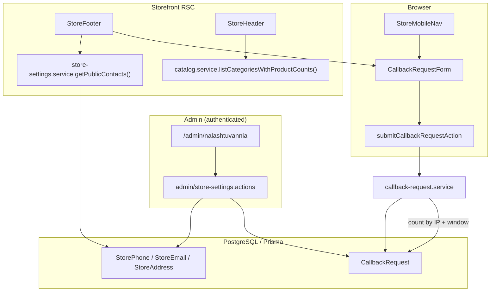

# Phase 26: Footer & mobile contact — Research

**Researched:** 2026-05-19  
**Domain:** Storefront footer/mobile UX, Prisma store settings, guest callback server actions, admin CRUD  
**Confidence:** HIGH (codebase patterns); MEDIUM (map embed + rate-limit constants)

## Summary

Phase 26 replaces the footer stub (`store-footer.tsx`) and extends the mobile drawer (`store-mobile-nav.tsx`) with **admin-managed contact data** and a **shared callback form**. The codebase already has the hard parts for FOOT-04: `listCategoriesWithProductCounts`, `categoriesWithAvailableProducts`, and `productCount` on categories passed into `StoreMobileNav` — only UI (right-aligned muted `Badge`) and the callback block are missing.

For FOOT-01/02, introduce **normalized Prisma models** for phones, emails, and addresses (multiple rows per type, `sortOrder`), plus **`CallbackRequest`** for guest submissions. Follow existing patterns: Zod validators in `src/server/validators/`, thin server actions, logic in `src/server/services/`, `requireAdmin()` for settings mutations, **DB-backed rate limiting** mirroring `chat.service.ts` `enforceRateLimit` (count rows in a time window — durable on Vercel serverless, no in-memory store).

Extract **`uaPhoneSchema`** from `order.ts` into a shared module so checkout and callback cannot drift. Add small **display/tel helpers** (no new npm package) for `+38 (0XX) XXX-XX-XX` and `tel:+380...`. Migrate **`getStoreNap()`** and homepage `JsonLd` to read the same DB settings service; keep `STORE_PHONE` / `STORE_ADDRESS` env optional for seed/dev only (per D-02/D-07).

**Primary recommendation:** One vertical slice — Prisma migration + `store-settings.service` + admin `/admin/nalashtuvannia` page + `CallbackRequestForm` + async `StoreFooter` + `StoreMobileNav` badges/separator/form — reusing chat-style DB rate limits and catalog-filters `Badge` layout for counts.

## Architectural Responsibility Map

| Capability | Primary Tier | Secondary Tier | Rationale |
|------------|-------------|----------------|-----------|
| Store contact CRUD | API / Backend (Prisma + admin server actions) | Admin UI (RSC + client forms) | Source of truth is DB; admin only mutates |
| Footer contacts + map display | Frontend Server (RSC `StoreFooter`) | CDN (lazy iframe) | SEO-friendly SSR; no client fetch for static contacts |
| Callback submit + validation | API / Backend (server action + service) | Browser (client form + inline errors) | Trust boundary: rate limit + persist server-side |
| Callback UX (toast success, inline errors) | Browser | — | D-12/D-13 are client concerns |
| Category `productCount` badges | Browser (`StoreMobileNav`) | Frontend Server (header already supplies data) | Presentation only; counts computed in `catalog.service` |
| UA phone format / `tel:` href | Shared lib (`src/lib/phone/`) | Validators (`uaPhoneSchema`) | Same normalization as checkout storage |
| Rate limit by IP | API / Backend (`CallbackRequest` count) | — | Must not rely on serverless memory |

<user_constraints>
## User Constraints (from CONTEXT.md)

### Locked Decisions

#### Store settings — admin source of truth (FOOT-01)
- **D-01:** Add an **admin settings page** (new sidebar nav item) where operators manage **phones**, **emails**, and **addresses** (each type may have **multiple entries** — e.g. two phones, two addresses).
- **D-02:** Persist settings in **database** (not `STORE_PHONE` / env as primary source for footer). Planner may use a singleton row + JSON arrays or normalized child tables; must support multiple values per type.
- **D-03:** Storefront renders **only non-empty** values configured in admin. If a type has zero entries → **omit that block entirely** on the frontend (no «незабаром» placeholder).
- **D-04:** **Phone:** display **human-readable** formatting (e.g. `+38 (050) 123-45-67`) with `href="tel:..."` using normalized digits (same normalization approach as checkout storage).
- **D-05:** **Email:** `mailto:` links for each configured email.
- **D-06:** **Address:** show full text (operator example: «Львів, Кавалерідзе 19»). **Click address** opens external map (Google Maps / OSM URL built from text or stored map URL field). **Additionally:** embed a **mini map with pin** in the footer — **always visible** on desktop layout, **`loading="lazy"`** iframe (or equivalent) **below the fold** so LCP/PageSpeed is not regressed; no heavy Maps JS SDK on initial load.
- **D-07:** Migrate storefront contact consumption away from footer stub and align **`getStoreNap()` / homepage** contact snippets to read the same store settings where they show phone/address (avoid duplicate sources of truth).

#### Callback requests (FOOT-02, FOOT-03)
- **D-08:** New **`CallbackRequest`** (or equivalent) **Prisma model** + server action; store phone, timestamp, optional metadata (IP for rate limit).
- **D-09:** **Admin:** section **«Заявки на дзвінок»** on the settings page (or clearly adjacent block) — list recent requests (newest first; planner defines pagination/limit).
- **D-10:** **Guest-only** submission — no login required (same as checkout).
- **D-11:** **Validation:** reuse checkout **`uaPhoneSchema`** rules (trim, 10–15 digits, same error copy style).
- **D-12:** **Success:** `toast.success` «Дякуємо, передзвонимо» + **clear phone field**.
- **D-13:** **Errors:** **inline only** under the field (validation + server/network); **no `toast.error`** on failure.
- **D-14:** **Rate limit** on server action — e.g. **N requests per hour per IP** (return friendly inline/server message when exceeded).
- **D-15:** **Copy:** label/heading **«Вкажіть свій номер — ми передзвонимо»**; submit button **«Передзвоніть мені»**.
- **D-16:** Single shared client component **`CallbackRequestForm`** used in **footer** and **mobile drawer** (identical behavior and copy).

#### Mobile drawer — categories & form (FOOT-03, FOOT-04)
- **D-17:** Under category list: **separator**, then **`CallbackRequestForm`** (no duplicate contact block in drawer — contacts stay in footer).
- **D-18:** **Category counts:** show **`productCount`** as **muted badge** aligned **right** of category name (not inline parentheses).
- **D-19:** Categories with **`productCount === 0`** remain **excluded** from drawer list (existing `categoriesWithAvailableProducts` pipeline from header — do not show zero-count categories).
- **D-20:** For every category shown, **always** display the count badge (all visible rows have count ≥ 1).

#### Footer layout (FOOT-01, FOOT-02)
- **D-21:** **Desktop:** two-column — **left:** contacts + address + lazy map embed; **right:** callback form.
- **D-22:** **Footer bottom:** keep **© + brand** row as today («Техніка б/у Львів»); do not duplicate bare «м. Львів» if full address is already shown (D-06 supersedes stub line).

#### Tests & quality (ROADMAP)
- **D-23:** Unit tests for phone schema reuse / callback validator; server action rate-limit behavior where testable; update or add tests for drawer count rendering contract. `npm run build` required.

### Claude's Discretion
- Exact Prisma schema (singleton `StoreSettings` vs normalized `StorePhone`/`StoreEmail`/`StoreAddress` tables).
- Admin form UX (repeatable fields, drag order, primary flag).
- Map embed provider (Google Maps embed URL vs OpenStreetMap) and coordinate storage vs geocoding from address string.
- Rate limit N and storage (memory vs DB) for serverless — prefer simple durable-enough approach.
- Whether to deprecate `STORE_PHONE` env or keep as seed/fallback only (prefer DB-only for display per D-02).

### Deferred Ideas (OUT OF SCOPE)
- **Email/push notification** to operator on new callback — not requested; add in future phase if needed.
- **Contacts block inside mobile drawer** — user chose categories + callback only in drawer; footer holds contacts/map.
- **CAPTCHA / honeypot** beyond IP rate limit — deferred unless spam appears in production.
</user_constraints>

<phase_requirements>
## Phase Requirements

| ID | Description | Research Support |
|----|-------------|------------------|
| FOOT-01 | Footer shows store phone and email | `StorePhone` / `StoreEmail` models + `getStoreContactSettings()`; async `StoreFooter` renders `tel:` / `mailto:` only when rows exist (D-03–D-05) |
| FOOT-02 | Footer callback form «Вкажіть свій номер — ми передзвонимо» | Shared `CallbackRequestForm` + `submitCallbackRequestAction` + `CallbackRequest` model; desktop right column (D-21) |
| FOOT-03 | Same callback form in mobile drawer under categories | `StoreMobileNav`: `Separator` + `CallbackRequestForm` after category list (D-17, D-16) |
| FOOT-04 | Mobile drawer category `productCount` badges | Data already in header pipeline; UI: `flex justify-between` + `Badge variant="secondary"` like `catalog-filters.tsx` (D-18–D-20) |
</phase_requirements>

## Standard Stack

### Core

| Library | Version | Purpose | Why Standard |
|---------|---------|---------|--------------|
| **Next.js** | 16.2.6 (project) | App Router, Server Actions, RSC footer | Already used; footer stays server component with client islands |
| **Prisma** | 7.8.0 | `StorePhone`, `StoreEmail`, `StoreAddress`, `CallbackRequest` | Matches all persistence in repo |
| **Zod** | 4.4.3 | Callback + admin settings validators | Same as `order.ts`, admin validators |
| **react-hook-form** + **@hookform/resolvers** | 7.76.0 / 5.2.2 | `CallbackRequestForm`, admin settings forms | Checkout + admin forms pattern |
| **sonner** | 2.0.7 | Success toast only (D-12) | `Toaster` in storefront layout |
| **shadcn/ui** | project | `Badge`, `Separator`, `Input`, `Button` | `catalog-filters` badge precedent |

### Supporting

| Library | Version | Purpose | When to Use |
|---------|---------|---------|-------------|
| Vitest + @testing-library/react | 4.1.6 / 16.3.2 | Unit + component tests (D-23) | Validators, service rate limit, `StoreMobileNav` |

### Alternatives Considered

| Instead of | Could Use | Tradeoff |
|------------|-----------|----------|
| Normalized contact tables | Singleton `StoreSettings` JSON | JSON simpler but worse admin CRUD, typing, and per-address map fields |
| DB rate limit (chat pattern) | `express-rate-limit` / memory | Memory breaks on Vercel serverless; package not in app dependencies |
| `libphonenumber-js` | Inline UA formatter | Extra dependency; 10–15 digit schema already sufficient for MVP |

**Installation:** No new npm packages required for this phase. [VERIFIED: `package.json` dependencies]

**Version verification:** Stack versions read from `/Users/michael_ivashko/WebStormProjects/web/appliance-store/package.json` (2026-05-19).

## Package Legitimacy Audit

> No new packages recommended. Optional `libphonenumber-js` was considered and **rejected** — use shared Zod schema + small `src/lib/phone/` helpers instead.

| Package | Registry | slopcheck | Disposition |
|---------|----------|-----------|-------------|
| _(none)_ | — | slopcheck unavailable | No installs |

**Packages removed due to slopcheck [SLOP] verdict:** none  
**Packages flagged as suspicious [SUS]:** none  

*slopcheck was unavailable at research time; phase intentionally adds zero dependencies.*

## Project Constraints (from .cursor/rules/)

From `.cursor/rules/gsd.mdc` and `AGENTS.md`:

- **Next.js 16:** Read `node_modules/next/dist/docs/` before writing framework code; APIs may differ from training data.
- **Stack:** Next.js App Router + TypeScript, Prisma + PostgreSQL, Tailwind + shadcn, Ukrainian-only UI.
- **Locale:** All user-facing copy in Ukrainian.
- **Auth:** Better Auth; admin routes use `requireAdmin()`.
- **Single-store:** Used appliances, Lviv — no multi-tenant settings.

## Architecture Patterns

### System Architecture Diagram



### Recommended Project Structure

```
prisma/schema.prisma                    # StorePhone, StoreEmail, StoreAddress, CallbackRequest
src/server/services/store-settings.service.ts
src/server/services/callback-request.service.ts
src/server/validators/phone.ts          # shared uaPhoneSchema (extracted)
src/server/validators/callback.ts
src/server/validators/admin-store-settings.ts
src/server/actions/callback.actions.ts
src/server/actions/admin/store-settings.actions.ts
src/lib/phone/format-ua.ts              # display + tel: normalization
src/lib/catalog/store-nap.ts            # delegate to store-settings service
src/components/store/callback-request-form.tsx
src/components/layout/store-footer.tsx  # async RSC
src/components/layout/store-mobile-nav.tsx
src/app/(admin)/admin/nalashtuvannia/page.tsx
src/components/admin/store-settings-form.tsx
src/components/admin/callback-requests-table.tsx
```

### Pattern 1: Normalized store contact tables (recommended)

**What:** Three tables with `sortOrder Int`, multiple rows; optional `label` (e.g. «Відділ продажу»). `StoreAddress` adds `mapUrl String?`, `latitude Float?`, `longitude Float?` for embed vs link-only.

**When to use:** Locked by D-01/D-02 (multiple phones/emails/addresses).

**Example schema sketch:**

```prisma
model StorePhone {
  id        String   @id @default(cuid())
  digits    String   // normalized 10–15 digits for storage + tel:
  label     String?
  sortOrder Int      @default(0)
  createdAt DateTime @default(now())
  updatedAt DateTime @updatedAt
}

model CallbackRequest {
  id        String   @id @default(cuid())
  phone     String   // normalized digits
  ipAddress String?
  createdAt DateTime @default(now())

  @@index([ipAddress, createdAt])
}
```

### Pattern 2: DB-backed rate limit (mirror chat)

**What:** Count `CallbackRequest` rows where `ipAddress = ?` AND `createdAt >= since`.

**When to use:** D-14 on Vercel serverless.

**Example (from existing chat service):**

```162:174:src/server/services/chat.service.ts
async function enforceRateLimit(senderId: string) {
  const since = new Date(Date.now() - RATE_LIMIT_WINDOW_MS);
  const recent = await prisma.message.count({
    where: {
      senderId,
      createdAt: { gte: since },
    },
  });

  if (recent >= RATE_LIMIT_MAX) {
    throw new ChatRateLimitError();
  }
}
```

**Recommended constants:** `CALLBACK_RATE_LIMIT_WINDOW_MS = 3_600_000`, `CALLBACK_RATE_LIMIT_MAX = 5` per IP per hour. [ASSUMED — planner may tune]

### Pattern 3: Client IP on Vercel

**What:** Read `x-forwarded-for` (first comma-separated value) or `x-real-ip` from `headers()` inside server action.

**When to use:** Persist `ipAddress` on `CallbackRequest` for rate limit.

[CITED: Vercel request headers — `x-forwarded-for` identifies originating IP when deployed on Vercel](https://vercel.com/docs/headers/request-headers#x-forwarded-for)

### Pattern 4: Mobile drawer category badge (FOOT-04)

**What:** Match catalog sidebar: flex row, name left, `Badge variant="secondary"` right.

```207:216:src/components/catalog/catalog-filters.tsx
              <Link
                href={`/katalog/${cat.slug}`}
                className={cn(
                  "flex items-center gap-2 rounded-md px-2 py-1.5 hover:bg-muted",
                  activeCategorySlug === cat.slug && "bg-muted font-medium",
                )}
              >
                <span>{cat.name}</span>
                <Badge variant="secondary">{cat.productCount}</Badge>
              </Link>
```

Apply `justify-between w-full` in drawer links; `productCount` is already on `MobileNavCategory` type in `store-mobile-nav.tsx`.

### Pattern 5: Shared phone validator

**What:** Move `uaPhoneSchema` to `src/server/validators/phone.ts`; export from `order.ts` re-export for backward compatibility.

**When to use:** D-11; prevents callback/checkout drift.

Current definition (not exported today):

```3:6:src/server/validators/order.ts
const uaPhoneSchema = z
  .string()
  .trim()
  .regex(/^\d{10,15}$/, "Вкажіть номер телефону — лише цифри, від 10 до 15");
```

### Pattern 6: Footer server + client island

**What:** `StoreFooter` async — `await getPublicStoreContacts()`; render nothing for empty sections. Embed `<CallbackRequestForm />` client component in right column.

**When to use:** D-21; keeps LCP clean (no map SDK; lazy iframe only in left column).

### Pattern 7: Map without Maps JavaScript SDK

**What:**
- **Click address:** `https://www.google.com/maps/search/?api=1&query=${encodeURIComponent(text)}` OR stored `mapUrl`.
- **Lazy embed:** If `latitude`/`longitude` on primary address → OpenStreetMap embed iframe (no API key): `https://www.openstreetmap.org/export/embed.html?bbox=...&marker=lat,lng` with `loading="lazy"` and fixed height (~200px). If no coordinates, omit iframe (link still works) or store operator-pasted embed URL in `mapUrl`.

**When to use:** D-06 performance constraint.

### Anti-Patterns to Avoid

- **Env as display source:** `getStoreNap()` reading `STORE_PHONE` — violates D-02; keep env for seed script only.
- **Error toasts on callback failure:** Forbidden by D-13; use `form.setError("phone", { message })` like admin forms.
- **In-memory rate limit:** Unreliable across serverless instances.
- **Showing zero-count categories in drawer:** Breaks D-19; header already filters via `categoriesWithAvailableProducts`.
- **Duplicate callback forms** with different copy — use one `CallbackRequestForm` (D-16).

## Don't Hand-Roll

| Problem | Don't Build | Use Instead | Why |
|---------|-------------|-------------|-----|
| Phone validation rules | Second regex in callback | Shared `uaPhoneSchema` | Checkout tests already define contract |
| Rate limiting | Custom TTL cache | Prisma count in time window | Proven in `chat.service.ts` for serverless |
| Category availability counts | New query in drawer | Existing `listCategoriesWithProductCounts` + filter | Phase 25 locked count semantics |
| Admin auth gate | Per-action checks | `requireAdmin()` in actions + admin layout | Consistent with categories/products |
| Toast system | Custom notifier | `sonner` via layout `Toaster` | Already mounted storefront |

**Key insight:** FOOT-04 is mostly UI; FOOT-01/02 need data layer + one form component, not new catalog logic.

## Common Pitfalls

### Pitfall 1: `uaPhoneSchema` not exported

**What goes wrong:** Callback validator duplicates regex; tests diverge.  
**Why it happens:** Schema is private in `order.ts`.  
**How to avoid:** Extract to `phone.ts` in same commit as callback validator.  
**Warning signs:** Two different error messages for same invalid input.

### Pitfall 2: Checkout accepts digits-only but user types `+380`

**What goes wrong:** Callback UX confusion if client doesn’t strip non-digits before validate.  
**How to avoid:** Optional client `onChange` strip to digits only (max 15); server still validates with schema.  
**Warning signs:** Users paste `+380501234567` and always fail.

### Pitfall 3: Forgetting `revalidatePath` after admin settings save

**What goes wrong:** Footer shows stale contacts until hard refresh.  
**How to avoid:** `revalidatePath("/", "layout")` in settings actions (same as checkout).  
**Warning signs:** Admin sees new phone, footer shows old env stub.

### Pitfall 4: Map iframe hurting LCP

**What goes wrong:** Large embed above fold regresses PageSpeed.  
**How to avoid:** Map only in footer left column below contacts; `loading="lazy"`; no Google Maps JS SDK.  
**Warning signs:** Lighthouse flags iframe in LCP element.

### Pitfall 5: Rate limit without IP

**What goes wrong:** Limit ineffective or blocks all users behind one NAT.  
**How to avoid:** Store IP when present; skip limit only in test env with explicit mock header.  
**Warning signs:** All guests share one bucket.

### Pitfall 6: Inline errors missing on checkout-style top Alert only

**What goes wrong:** Callback uses `Alert` at top like checkout — violates D-13.  
**How to avoid:** Field-level `form.formState.errors.phone` + server `setError` (see `category-form.tsx`).  
**Warning signs:** `toast.error` in callback submit handler.

## Code Examples

### Extract and reuse `uaPhoneSchema`

```typescript
// src/server/validators/phone.ts
import { z } from "zod";

export const uaPhoneSchema = z
  .string()
  .trim()
  .regex(/^\d{10,15}$/, "Вкажіть номер телефону — лише цифри, від 10 до 15");

// src/server/validators/callback.ts
import { uaPhoneSchema } from "./phone";

export const callbackRequestSchema = z.object({
  phone: uaPhoneSchema,
});
```

### Callback server action result shape

```typescript
// Discriminated union for client inline errors (no toast.error)
export type SubmitCallbackResult =
  | { ok: true }
  | { ok: false; error: "VALIDATION" | "RATE_LIMIT" | "UNKNOWN"; message?: string };
```

### Display + tel href (no new package)

```typescript
// src/lib/phone/format-ua.ts — 10-digit UA mobile starting with 0
export function formatUaPhoneDisplay(digits: string): string {
  const d = digits.replace(/\D/g, "");
  if (d.length === 10 && d.startsWith("0")) {
    return `+38 (${d.slice(1, 4)}) ${d.slice(4, 7)}-${d.slice(7, 9)}-${d.slice(9)}`;
  }
  return `+${d}`;
}

export function uaPhoneTelHref(digits: string): string {
  const d = digits.replace(/\D/g, "");
  const e164 = d.length === 10 && d.startsWith("0") ? `38${d.slice(1)}` : d;
  return `tel:+${e164}`;
}
```

### `CallbackRequestForm` success path

```typescript
const result = await submitCallbackRequestAction({ phone: values.phone });
if (result.ok) {
  toast.success("Дякуємо, передзвонимо");
  form.reset({ phone: "" });
  return;
}
form.setError("phone", {
  message:
    result.error === "RATE_LIMIT"
      ? "Забагато спроб. Спробуйте пізніше."
      : "Не вдалося надіслати заявку. Спробуйте ще раз.",
});
```

### `StoreMobileNav` category row with badge

```tsx
<li key={category.slug}>
  <Link
    href={`/katalog/${category.slug}`}
    className="flex min-h-11 w-full items-center justify-between gap-2 py-2 text-sm"
    onClick={() => setOpen(false)}
  >
    <span>{category.name}</span>
    <Badge variant="secondary">{category.productCount}</Badge>
  </Link>
</li>
```

## State of the Art

| Old Approach | Current Approach | When Changed | Impact |
|--------------|------------------|--------------|--------|
| Footer stub «незабаром» | DB-backed contacts | Phase 26 | FOOT-01 |
| Env-only `getStoreNap()` | `store-settings.service` | Phase 26 | D-07, JsonLd on homepage |
| Drawer categories without counts | Badge from existing `productCount` | Phase 26 | FOOT-04 |

**Deprecated/outdated:**
- `STORE_PHONE` / `STORE_ADDRESS` as **display** source — seed/dev fallback only after migration.

## Assumptions Log

| # | Claim | Section | Risk if Wrong |
|---|-------|---------|---------------|
| A1 | Rate limit **5 requests / hour / IP** | Pattern 2 | Too strict or too loose for spam |
| A2 | OpenStreetMap embed when lat/lng present; no geocoding in MVP | Pattern 7 | Footer map missing until operator enters coords |
| A3 | Normalized tables preferred over JSON singleton | Pattern 1 | Planner may choose JSON if faster — must still support multiple entries |
| A4 | `x-forwarded-for` first IP is correct on Vercel | Pattern 3 | Rate limit mis-attribution behind proxies |
| A5 | Admin route slug `/admin/nalashtuvannia` | Project structure | Cosmetic — any Ukrainian slug works |

## Open Questions

1. **Primary address for map embed when multiple addresses exist**
   - What we know: D-06 allows multiple addresses; embed should not multiply iframes.
   - What's unclear: Which row drives the mini-map.
   - Recommendation: Lowest `sortOrder` address with coordinates or `mapUrl`; at most one iframe.

2. **Seed data for empty DB**
   - What we know: Env has optional `STORE_PHONE` / `STORE_ADDRESS`.
   - Recommendation: Extend `prisma/seed.ts` to insert default Lviv contacts if tables empty; do not read env on runtime display.

## Environment Availability

| Dependency | Required By | Available | Version | Fallback |
|------------|-------------|-----------|---------|----------|
| Node.js | build/test | ✓ | v24.14.0 | — |
| npm | scripts | ✓ | 11.9.0 | — |
| Vitest | D-23 unit tests | ✓ | 4.1.6 | — |
| PostgreSQL / Prisma | models + migration | ✓ (project standard) | Prisma 7.8.0 | Local Neon/Docker per dev setup |
| Vercel headers | IP rate limit | ✓ when deployed | — | Dev: use `x-forwarded-for` from Request or test helper |

**Missing dependencies with no fallback:** none (no new external services).

## Validation Architecture

### Test Framework

| Property | Value |
|----------|-------|
| Framework | Vitest 4.1.6 |
| Config file | `vitest.config.ts` |
| Quick run command | `npm test -- src/server/validators/phone.test.ts src/server/validators/callback.test.ts -x` |
| Full suite command | `npm test` |

### Phase Requirements → Test Map

| Req ID | Behavior | Test Type | Automated Command | File Exists? |
|--------|----------|-----------|-------------------|-------------|
| FOOT-01 | Public contacts omit empty sections | unit | `npm test -- src/server/services/store-settings.service.test.ts -x` | ❌ Wave 0 |
| FOOT-02 | Callback schema accepts/rejects like checkout phone | unit | `npm test -- src/server/validators/callback.test.ts -x` | ❌ Wave 0 |
| FOOT-02 | Rate limit blocks after N per IP | unit | `npm test -- src/server/services/callback-request.service.test.ts -x` | ❌ Wave 0 |
| FOOT-03 | Form uses shared component (smoke) | component | `npm test -- src/components/store/callback-request-form.test.tsx -x` | ❌ Wave 0 |
| FOOT-04 | Drawer renders badge per category | component | `npm test -- src/components/layout/store-mobile-nav.test.tsx -x` | ❌ Wave 0 |
| D-23 | Build passes | integration | `npm run build` | ✅ (CI script exists) |

### Sampling Rate

- **Per task commit:** `npm test -- <files touched>.test.ts -x`
- **Per wave merge:** `npm test`
- **Phase gate:** `npm run build` + full `npm test` before `/gsd-verify-work`

### Wave 0 Gaps

- [ ] `src/server/validators/phone.ts` + `phone.test.ts` — extract schema; mirror `order.test.ts` cases
- [ ] `src/server/validators/callback.test.ts` — callback schema
- [ ] `src/server/services/callback-request.service.test.ts` — rate limit count mock
- [ ] `src/server/services/store-settings.service.test.ts` — empty vs populated public DTO
- [ ] `src/components/layout/store-mobile-nav.test.tsx` — badge + separator + form slot
- [ ] `src/components/store/callback-request-form.test.tsx` — success toast + `setError` on failure (mock action)

## Security Domain

### Applicable ASVS Categories

| ASVS Category | Applies | Standard Control |
|---------------|---------|------------------|
| V2 Authentication | no (guest callback) | N/A for submit; admin uses `requireAdmin()` |
| V3 Session Management | no | Guest-only |
| V4 Access Control | yes (admin settings) | `requireAdmin()` on all settings mutations |
| V5 Input Validation | yes | Zod `uaPhoneSchema` + admin settings schemas |
| V6 Cryptography | no | Phone stored as digits, not secrets |

### Known Threat Patterns for {stack}

| Pattern | STRIDE | Standard Mitigation |
|---------|--------|---------------------|
| Callback spam | DoS | DB rate limit per IP (D-14) |
| Stored XSS in address/label | Tampering / Spoofing | React text nodes; validate max length in admin schema |
| Unauthorized settings change | Elevation | `requireAdmin()` in server actions |
| IP header spoofing (dev) | Spoofing | Trust `x-forwarded-for` only in production behind Vercel; optional cap in dev |

## Sources

### Primary (HIGH confidence)
- Codebase: `store-footer.tsx`, `store-mobile-nav.tsx`, `store-header.tsx`, `order.ts`, `chat.service.ts`, `catalog-filters.tsx`, `checkout-form.tsx`, `prisma/schema.prisma`
- Context7 `/vercel/next.js/v16.2.2` — Server Actions, `revalidatePath`, headers forwarding
- [Vercel request headers — x-forwarded-for](https://vercel.com/docs/headers/request-headers#x-forwarded-for)

### Secondary (MEDIUM confidence)
- Phase 25 `25-PATTERNS.md` — category count pipeline locked
- Phase 26 `26-CONTEXT.md` — locked decisions

### Tertiary (LOW confidence)
- OSM embed URL shape without stored coordinates — validate in implementation against [OpenStreetMap embed wiki](https://wiki.openstreetmap.org/wiki/OpenStreetMap_in_Frame_Embed)

## Metadata

**Confidence breakdown:**
- Standard stack: HIGH — no new dependencies; matches existing project
- Architecture: HIGH — patterns copied from chat + admin + catalog
- Pitfalls: HIGH — verified against CONTEXT and current stubs

**Research date:** 2026-05-19  
**Valid until:** 2026-06-19 (stable domain)

## RESEARCH COMPLETE

**Phase:** 26 - Footer & mobile contact  
**Confidence:** HIGH

### Key Findings
- FOOT-04 is UI-only: `productCount` already flows into `StoreMobileNav`; copy `Badge` layout from `catalog-filters.tsx`.
- FOOT-01/02 need Prisma contact tables + `CallbackRequest`, shared `uaPhoneSchema`, and one `CallbackRequestForm` (success toast only).
- Rate limit should use **DB row count by IP** like chat messages — not in-memory.
- `getStoreNap()` / homepage JsonLd must switch to DB settings; deprecate env for display.
- **No new npm packages**; optional `libphonenumber-js` rejected.

### File Created
`.planning/phases/26-footer-mobile-contact/26-RESEARCH.md`

### Confidence Assessment
| Area | Level | Reason |
|------|-------|--------|
| Standard Stack | HIGH | Existing deps only |
| Architecture | HIGH | Clear analogs in repo |
| Pitfalls | HIGH | CONTEXT + code review |

### Open Questions
- Which address row powers the single lazy map iframe when multiple addresses exist (recommend lowest `sortOrder` with coords).

### Ready for Planning
Research complete. Planner can create PLAN.md tasks.
