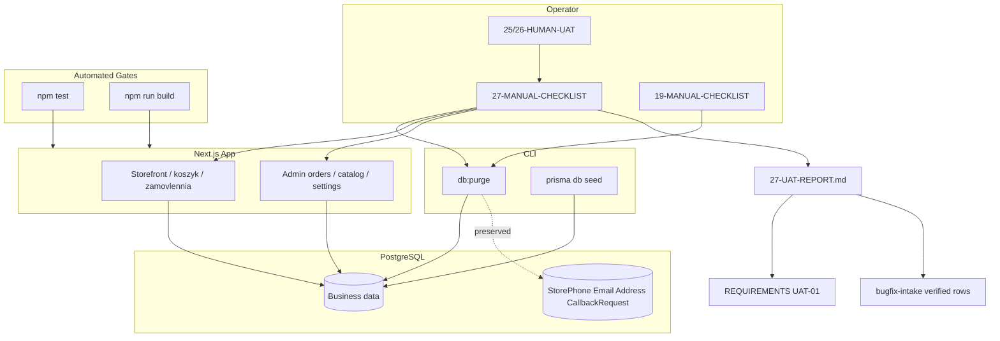

# Phase 27: Human UAT closure — Research

**Researched:** 2026-05-19  
**Domain:** Quality / manual verification / milestone closure (v1.5)  
**Confidence:** HIGH (codebase + CONTEXT locked); MEDIUM (operator-run outcomes)

## Summary

Phase 27 closes **UAT-01** for milestone v1.5 without shipping new product features. Work is **documentation + operator execution + artifact updates**: two checklists (`27-MANUAL-CHECKLIST.md` master, `19-MANUAL-CHECKLIST.md` purge-only), human pass on phase **25** debt, optional phase **26** browser checks, automated **`npm test`** + **`npm run build`** gate, and closure report **`27-UAT-REPORT.md`** linking intake **BUG-18…23** to verified rows.

Code for v1.5 (phases 22–26) is already merged; verification files show **22, 23, 24, 26 = passed**, **25 = human_needed** with all three rows in `25-HUMAN-UAT.md` still `pending`. Phase 19 purge/empty-state was implemented in v1.3 but **never had a committed `19-MANUAL-CHECKLIST.md`** (phase dir archived per ROADMAP); ROADMAP success criterion #1 is satisfied by recreating that filename under phase 27 (D-11).

**Primary recommendation:** Plan as **3 executable waves** — (1) author checklists + optional `26-HUMAN-UAT.md`, (2) run automated gate then operator manual session with purge/seed discipline, (3) closure artifacts (report, REQUIREMENTS, intake, frontmatter). Do **not** expand to legacy phases 04/07/18 or full v1.0–v1.4 regression. Treat **`prisma/seed.test.ts` out-of-stock failure** as **P2** if present after `npx prisma db seed`; do **not** block UAT-01 on it unless operator chooses zero-gap test policy. Do **not** use stale **`e2e/cart-auth.spec.ts`** as a gate — it still expects guest redirect to login while storefront now serves `GuestCartView` on `/koszyk` [VERIFIED: codebase grep].

<user_constraints>
## User Constraints (from CONTEXT.md)

### Locked Decisions

**UAT scope**
- **D-01:** v1.5 closure target; phases 22, 23, 24, 26 already `passed`; phase 25 `human_needed` — complete in this phase.
- **D-02:** Phase 19 purge UAT via new checklist in phase 27 dir (D-04/D-11), not archived folders.
- **D-03:** Legacy phases 04, 07, 18 stay deferred — document in `27-UAT-REPORT.md`; do not block v1.5.

**Gap severity**
- **D-04 P0 (block UAT-01):** HTTP 5xx, crash, guest checkout broken, admin cannot log in, illegal order status persisted despite ORD-04.
- **D-05 P1 (fix in Phase 27 if ≤30 min):** Wrong UI copy, missing badge, failed manual step for v1.5 requirement already in code.
- **D-06 P2 (defer):** seed.test DB state, Cloudinary orphans after purge, legacy milestone UAT, polish.

**Test database**
- **D-07:** Local/dev Neon or Postgres; baseline: optional `npm run db:purge` + `npx prisma db seed` once per session before purge block; catalog smoke may use seeded data without purge.
- **D-08:** Purge does not delete `StorePhone`, `StoreEmail`, `StoreAddress`, `CallbackRequest` — footer contacts may remain after purge.
- **D-09:** Document commands: `CONFIRM_DB_PURGE=yes npm run db:purge`, then `npx prisma db seed` when catalog needed.

**Checklist artifacts**
- **D-10:** `27-MANUAL-CHECKLIST.md` — master (environment → purge/empty → smoke → v1.5 22–26 → sign-off).
- **D-11:** `19-MANUAL-CHECKLIST.md` in phase 27 dir — purge & empty-state only.
- **D-12:** Link to `24-HUMAN-UAT.md`, `25-HUMAN-UAT.md`, `26-HUMAN-UAT.md` (if created); no full duplicate of phase HUMAN-UAT bodies.

**Execution**
- **D-13:** Operator manual browser (desktop + one mobile viewport).
- **D-14:** Gate: `npm test` + `npm run build` green; flaky `prisma/seed.test.ts` out-of-stock = P2 if still failing.
- **D-15:** `/gsd-verify-work 27` optional after checklist.

**Critical flows**
- **D-16:** Guest checkout: cart → `/koszyk` → `/zamovlennia` → confirmation with order number.
- **D-17:** Admin orders: list + detail; pickup no «Доставляється»; Lviv delivery no «Готово до самовивозу»; invalid transition rejected.
- **D-18:** After purge: `/`, `/katalog`, `/admin/kategorii`, `/admin/tovary` — no error, sensible empty copy.
- **D-19:** HOME-03: no orphan `#kategorii` when no in-stock products per category.
- **D-20:** FOOT-01…04: `/admin/nalashtuvannia`, footer, drawer, callback toast + rate limit.

**Intake & tracking**
- **D-21:** On section pass → `bugfix-intake-2026-05-19-v1.5.md` BUG-18…23 → `verified`.
- **D-22:** Complete: `gsd-sdk query phase.complete 27`, UAT-01 in REQUIREMENTS.md, intake todo → completed if all verified.
- **D-23:** `27-UAT-REPORT.md` with date, DB baseline, per-section pass/fail, P1 fixes, P2 deferred.

### Claude's Discretion

- Exact checklist wording and step order.
- `26-HUMAN-UAT.md` vs inline master checklist for phase 26 human rows.
- Small P1 code fixes discovered during UAT.

### Deferred Ideas (OUT OF SCOPE)

- Extend `db:purge` to wipe callback/store contacts.
- Automated E2E for guest checkout (post–v1.5).
- Close legacy phase 04/07 HUMAN-UAT.
</user_constraints>

<phase_requirements>
## Phase Requirements

| ID | Description | Research Support |
|----|-------------|------------------|
| UAT-01 | Manual UAT for Phase 19 (purge + empty DB) recorded; optional `/gsd-verify-work` for critical flows | `19-MANUAL-CHECKLIST.md` + purge script scope; empty routes in admin/storefront; `27-UAT-REPORT.md` + REQUIREMENTS checkbox; master checklist covers v1.5 smoke (guest checkout, admin orders) |
</phase_requirements>

## Architectural Responsibility Map

| Capability | Primary Tier | Secondary Tier | Rationale |
|------------|-------------|----------------|-----------|
| Purge / DB baseline | Operator + CLI (`db:purge`, seed) | API/DB (Prisma transaction) | Data mutation is scripted; app only reads result |
| Empty-state UX | Frontend Server (RSC pages) | — | Empty copy rendered in page components when query returns zero |
| Guest checkout smoke | Browser (localStorage cart) + Server Actions | API validation | Cart client-side; order creation server-side |
| Admin order status rules | API (`updateOrderStatus`) | Admin UI (select filtering) | ORD-04 server enforcement; ORD-03 UI |
| UAT artifacts / traceability | Planning docs (`.planning/`) | — | No runtime code for closure |
| Automated quality gate | CI scripts (`npm test`, `build`) | Vitest unit tests | Pre-human gate per D-14 |

## Checklist Artifact Patterns (from 24/25 HUMAN-UAT)

Phases 24 and 25 established the **canonical HUMAN-UAT frontmatter + body** pattern [VERIFIED: `.planning/phases/24-product-edit-auto-save-ux/24-HUMAN-UAT.md`, `25-HUMAN-UAT.md`]:

```yaml
---
status: partial | resolved
phase: <slug>
source: [<phase>-VERIFICATION.md]
started: <ISO date>
updated: <ISO date>
---

## Current Test
<one-line focus for operator>

## Tests
### N. <title>
expected: <observable outcome>
result: pending | passed | failed | skipped

## Summary
total: N
passed: ...
issues: ...
pending: ...

## Gaps
```

**24 (resolved):** Three tests with Ukrainian labels matching admin product edit (create footer, auto-save, delete/back). Operator marked all `passed`; `status: resolved`.

**25 (pending — must close in 27):** Three tests for HOME-03:
1. No `#kategorii` / orphan h2 on `/` when all categories empty (post purge/seed with zero in-stock per category).
2. Header nav category slugs match homepage cards.
3. Sparse grid (1–3 categories) keeps `grid-cols-2 md:grid-cols-4`.

**26 (no HUMAN-UAT file yet):** `26-VERIFICATION.md` lists four optional human steps (settings, footer columns, drawer, callback rate limit). Research recommends **`26-HUMAN-UAT.md`** mirroring 24/25 (4 tests, link from master checklist) — keeps D-12 “no duplicate prose” while giving checkboxes for BUG-23.

**MANUAL-CHECKLIST pattern (milestones v1.3/v1.4):** Referenced in ROADMAP/BUGFIX-WORKFLOW but **no `*-MANUAL-CHECKLIST.md` in repo today** [VERIFIED: glob]. Phase 27 invents:
- **Operator checklist** — numbered steps, prerequisites, URLs (`http://localhost:3000`), commands, pass/fail column.
- **19-MANUAL-CHECKLIST** — subset: only purge + empty routes (ROADMAP criterion #1 by filename).
- **27-MANUAL-CHECKLIST** — superset: links + sections for 22–26.

**VERIFICATION frontmatter updates on close:**
- `25-HUMAN-UAT.md`: `status: resolved`, all `result: passed`.
- `25-VERIFICATION.md`: `status: passed` (from `human_needed`).
- Optional: note in `22-VERIFICATION.md` if manual admin-order smoke done (currently “optional”).

## Purge & Empty-State Routes

### Purge scope [VERIFIED: `prisma/purge-business-data.ts`]

Deletes (FK order): Message → Conversation → OrderItem → Order → CartItem → Cart → WishlistItem → ProductImage → Product → Category.

**Never deleted:** User, Session, Account, Verification (Better Auth).

**Not in PURGE_STEPS (survive purge):** `StorePhone`, `StoreEmail`, `StoreAddress`, `CallbackRequest` [VERIFIED: schema + CONTEXT D-08].

**Commands:**
```bash
CONFIRM_DB_PURGE=yes npm run db:purge
# production additionally: ALLOW_PRODUCTION_PURGE=yes
npx prisma db seed   # separate; not automatic; heavy Cloudinary seed
```

### Routes for 19-MANUAL-CHECKLIST (post-purge, no seed)

| Route | Expected (no 500) | Empty copy / behavior [VERIFIED: codebase] |
|-------|-------------------|---------------------------------------------|
| `/` | 200 | `CategoryGrid` returns `null` — no `#kategorii` section |
| `/katalog` | 200 | Listing with zero products (filters/toolbar OK) |
| `/katalog/[slug]` | 404 or empty category page | «У цій категорії поки немає товарів» when category exists but empty |
| `/admin/kategorii` | 200 | «Немає категорій» when `categories.length === 0` |
| `/admin/tovary` | 200 | «Товарів не знайдено. Створіть перший товар…» |
| `/koszyk` (guest) | 200 | `GuestCartView` / `CartEmpty` — not login redirect |
| `/admin` dashboard | 200 | «Замовлень ще немає» on orders widget |

**After seed (catalog block):** Re-run HOME-03 / header parity with in-stock products; guest checkout needs at least one in-stock product (create via admin or seed).

### Purge caveats for checklist text

- README + purge script: Cloudinary assets **not** deleted [VERIFIED: `README.md`, purge header comment].
- `npm test` expects seeded data for full assertions; post-purge run **`npx prisma db seed`** before automated gate unless documenting P2 for `seed.test.ts` only [VERIFIED: `prisma/seed.test.ts`, README §6].

## Smoke Flows (Guest Checkout, Admin Orders)

### Guest checkout (D-16) [VERIFIED: routes]

| Step | URL / action | Notes |
|------|----------------|-------|
| 1 | Add product as guest (PDP → localStorage cart) | No `/uviity` redirect on add [VERIFIED: `koszyk/page.tsx` → `GuestCartView`] |
| 2 | `/koszyk` | Subtitle: «Оформлення без реєстрації…» |
| 3 | Proceed to `/zamovlennia` | `GuestCheckoutView` / checkout form |
| 4 | Submit name + phone + delivery type | Pickup or Lviv delivery |
| 5 | `/zamovlennia/pidtverdzhennia/[orderNumber]` | Order number visible; guest access cookie |

**E2E gap:** `e2e/cart-auth.spec.ts` still asserts guest **redirect to login** on `/koszyk`, `/zamovlennia`, add-to-cart — **contradicts phase 20** [VERIFIED: file content vs `GuestCartView`]. Do **not** add `npm run test:e2e` to phase 27 gate without updating or skipping those tests (recommend **P2 defer** or targeted Playwright file for guest path).

Existing `e2e/checkout.spec.ts` uses **registered** buyer, not guest — useful for stock decrement smoke only.

### Admin orders (D-17) [VERIFIED: tests + labels]

Manual matrix (create one pickup + one Lviv delivery order via guest or registered checkout):

| deliveryType | Must NOT appear in status select | Allowed next (examples) |
|--------------|----------------------------------|-------------------------|
| PICKUP | «Доставляється» (`OUT_FOR_DELIVERY`) | «Готово до самовивозу», etc. |
| LVIV_DELIVERY | «Готово до самовивозу» (`READY_FOR_PICKUP`) | «Доставляється», etc. |

Server rejection: Vitest covers `updateOrderStatus` rejects illegal targets [VERIFIED: `admin-order.service.test.ts`]. Manual step: attempt invalid transition via UI if exposed, or note API-only proof from automated tests per phase 22 VERIFICATION.

**Targeted automated command (phase 22 regression):**
```bash
npm test -- --run src/lib/order/status-transitions.test.ts src/components/admin/order-list-status-select.test.ts src/server/services/admin-order.service.test.ts
```

### Footer & mobile (D-20) — from 26-VERIFICATION

| Check | Where |
|-------|--------|
| Configure contacts | `/admin/nalashtuvannia` |
| Footer phone/email | `StoreFooter` |
| Callback form | Footer + drawer (`CallbackRequestForm`, `idPrefix="drawer"`) |
| Rate limit | 6th callback/hour → inline error (validator tests exist) |

## Phase 22–26 Human Debt Rollup

| Phase | Automated verification | Human debt | Action in 27 |
|-------|------------------------|------------|--------------|
| **22** delivery-aware status | `passed` 4/4 | Optional rows in 22-VALIDATION — not blocking | Optional smoke in master checklist § admin orders; BUG-18 → verified when pass |
| **23** category polish | `passed` | None required | Spot-check ADM-CAT-03/04 in master; BUG-19, BUG-21 → verified |
| **24** product auto-save | `passed` | **Resolved** in `24-HUMAN-UAT.md` | Re-run only if P1 regression suspected; BUG-20 → verified |
| **25** homepage categories | `human_needed` 8/8 automated | **3 pending** in `25-HUMAN-UAT.md` | **Required** — complete all tests; update frontmatter |
| **26** footer/mobile | `passed` 4/4 | 4 optional steps in VERIFICATION only | Create `26-HUMAN-UAT.md` or inline; BUG-23 → verified |

**Intake mapping (BUG → phase → checklist section):**

| BUG | Area | Fixed in phase | Verify via |
|-----|------|----------------|------------|
| BUG-18 | orders | 22 | Admin order status smoke |
| BUG-19 | admin | 23 | Category edit toolbar icons |
| BUG-20 | admin | 24 | Product edit UAT (already passed) |
| BUG-21 | admin | 23 | Categories list «Товари» column |
| BUG-22 | storefront | 25 | Homepage `#kategorii` / header parity |
| BUG-23 | storefront | 26 | Footer + drawer + callback |

## Automated Gates

| Gate | Command | Current project state (2026-05-19) | Policy |
|------|---------|-----------------------------------|--------|
| Unit/component | `npm test` | **256/257 pass**; 1 fail: `prisma/seed.test.ts` «out-of-stock demo products» (count 0) | Run **after** `npx prisma db seed` for green; else document P2 per D-14 |
| Production build | `npm run build` | **PASS** [VERIFIED: local run] | Required before sign-off |
| Targeted v1.5 | See phase-specific `npm test -- --run <files>` | Phase 22/25/26 targeted suites pass | Run in plan 27-02 for fast signal |
| E2E Playwright | `npm run test:e2e` | **Risk:** stale guest-auth specs | **Out of default gate** unless fixed in P1 |

**Recommended gate order for operator session:**
1. `npx prisma db seed` (if DB was purged or incomplete).
2. `npm test` + `npm run build`.
3. Manual checklists (purge block may require **second** purge — re-seed before step 2 if needed).

## Standard Stack

### Core (no new installs)

| Tool | Version | Purpose |
|------|---------|---------|
| Vitest | ^4.1.6 | Automated gate |
| Next.js | 16.2.6 | App under test |
| Prisma | ^7.8.0 | Purge + seed |
| tsx | ^4.19.4 | `db:purge` script |
| Playwright | ^1.60.0 | Optional; not default gate |

**Installation:** None required for phase 27.

## Package Legitimacy Audit

No new external packages in this phase. Existing devDependencies already in `package.json` [VERIFIED: `package.json`]. slopcheck not available in environment — N/A.

## Architecture Patterns

### System Architecture Diagram



### Recommended artifacts (phase dir)

```
.planning/phases/27-human-uat-closure/
├── 27-CONTEXT.md          # exists
├── 27-RESEARCH.md         # this file
├── 19-MANUAL-CHECKLIST.md # purge + empty only (D-11)
├── 27-MANUAL-CHECKLIST.md # master (D-10)
├── 26-HUMAN-UAT.md        # optional (discretion)
├── 27-UAT-REPORT.md       # closure (D-23)
└── 27-0N-PLAN.md          # planner output
```

### Pattern: Intake row → verified

When a checklist section passes, edit `bugfix-intake-2026-05-19-v1.5.md` Status column `open` → `verified` [VERIFIED: `.planning/BUGFIX-WORKFLOW.md` §5–7].

### Anti-Patterns to Avoid

- **Running full legacy UAT (04, 07, 18):** Explicitly out of scope (D-03).
- **Using `test:e2e` without fixing cart-auth:** False failures on guest paths.
- **Expecting blank footer after purge:** Contacts persist (D-08).
- **Purge then guest checkout without seed/create product:** Empty catalog blocks checkout smoke.

## Don't Hand-Roll

| Problem | Don't Build | Use Instead | Why |
|---------|-------------|-------------|-----|
| Purge orchestration | Custom SQL scripts | `npm run db:purge` + `purge-business-data.ts` | FK order, confirm flags, auth preservation |
| Manual test tracking | Spreadsheet only | HUMAN-UAT frontmatter + MANUAL-CHECKLIST | GSD traceability to VERIFICATION |
| E2E for this phase | New Cypress suite | Operator checklist + existing Vitest | CONTEXT D-15; scope is closure not automation |

## Common Pitfalls

### Pitfall 1: Stale Playwright guest tests
**What goes wrong:** `npm run test:e2e` fails on `/koszyk` expecting login.  
**Why:** Phase 20 guest checkout shipped; `e2e/cart-auth.spec.ts` not updated.  
**How to avoid:** Exclude e2e from phase 27 gate; manual guest path per D-16.  
**Warning signs:** Red e2e on cart routes while manual guest works.

### Pitfall 2: seed.test after purge without seed
**What goes wrong:** `npm test` fails on out-of-stock count (0 &lt; 2).  
**Why:** Purge removes products; seed creates demo out-of-stock SKUs.  
**How to avoid:** `npx prisma db seed` before automated gate; or P2 document.  
**Warning signs:** Same failure noted in 22/25/26 VERIFICATION files.

### Pitfall 3: Confusing empty catalog with empty contacts
**What goes wrong:** Operator thinks purge failed because footer still shows phone.  
**Why:** Store settings tables outside PURGE_STEPS.  
**How to avoid:** Checklist note in 19-MANUAL-CHECKLIST (D-08).

### Pitfall 4: HOME-03 test without correct DB state
**What goes wrong:** `#kategorii` still visible or false pass.  
**Why:** Need categories with **zero in-stock** products, not missing categories.  
**How to avoid:** After purge+seed, use seed data where all qty=0 OR adjust stock in admin before `/` check.

## Code Examples

### Purge confirm (operator)

```bash
CONFIRM_DB_PURGE=yes npm run db:purge
npx prisma db seed   # when catalog or npm test full green needed
```

### HUMAN-UAT test row update (operator)

```markdown
### 1. Homepage hides section when all categories empty
expected: No `#kategorii` section or orphan h2 on `/`
result: passed
```

### Targeted status regression

```bash
npm test -- --run src/lib/order/status-transitions.test.ts \
  src/components/admin/order-list-status-select.test.ts \
  src/server/services/admin-order.service.test.ts
```

## State of the Art

| Old Approach | Current Approach | Impact |
|--------------|------------------|--------|
| Guest must login for cart | Guest localStorage cart + checkout | Manual UAT must use guest path; e2e cart-auth obsolete |
| Phase 19 checklist in archived dir | Recreate `19-MANUAL-CHECKLIST.md` in phase 27 | ROADMAP #1 satisfied by filename + content |
| Single scattered HUMAN-UAT | Master `27-MANUAL-CHECKLIST` + links | Operator one entry point (D-10) |

## Assumptions Log

| # | Claim | Section | Risk if Wrong |
|---|-------|---------|---------------|
| A1 | Operator has working admin session on dev DB | Smoke flows | Cannot verify admin orders |
| A2 | `npm run dev` at `localhost:3000` | Checklists | Steps fail if port differs |
| A3 | `npx prisma db seed` creates ≥2 qty=0 products | Automated gate | seed.test stays red |
| A4 | Legacy 04/07/18 debt unchanged in STATE | Closure report | Accidental scope creep |

## Open Questions

1. **Fix `e2e/cart-auth.spec.ts` in phase 27 or defer?**
   - What we know: Contradicts guest checkout; not in D-14 gate.
   - Recommendation: **P2 defer** unless operator wants CI e2e green — then P1 plan task (~30 min).

2. **`26-HUMAN-UAT.md` separate file vs master inline?**
   - Recommendation: **Separate file** (4 tests) for BUG-23 traceability; link from 27-MANUAL-CHECKLIST.

## Environment Availability

| Dependency | Required By | Available | Version | Fallback |
|------------|-------------|-----------|---------|----------|
| Node.js | npm scripts | ✓ | v24.14.0 | — |
| npm | test/build | ✓ | 11.9.0 | — |
| PostgreSQL (Neon/local) | purge/seed/UAT | ✓ (project uses DATABASE_URL) | Prisma 7.8 | — |
| `npm run dev` | Manual UAT | ✓ (operator) | Next 16.2.6 | — |
| Admin credentials | Admin smoke | ✓ (Better Auth preserved after purge) | — | Re-seed admin if missing |
| slopcheck | Package audit | ✗ | — | N/A (no new packages) |

**Missing dependencies with no fallback:** None for planned scope.

## Validation Architecture

### Test Framework

| Property | Value |
|----------|-------|
| Framework | Vitest 4.1.6 |
| Config file | `vitest.config.ts` |
| Quick run command | `npm test -- --run src/lib/order/status-transitions.test.ts src/components/admin/order-list-status-select.test.ts` |
| Full suite command | `npm test` |
| Build command | `npm run build` |

### Phase Requirements → Test Map

| Req ID | Behavior | Test Type | Automated Command | File Exists? |
|--------|----------|-----------|-------------------|-------------|
| UAT-01 | Purge deletes business data, preserves auth | manual + script | `CONFIRM_DB_PURGE=yes npm run db:purge` | ✅ script |
| UAT-01 | Empty routes no 500 | manual | 19-MANUAL-CHECKLIST steps | ❌ Wave 0 (create checklist) |
| UAT-01 | Guest checkout E2E | manual | 27-MANUAL-CHECKLIST § smoke | ❌ Wave 0 |
| UAT-01 | Admin order status rules | manual + unit | `npm test -- --run …status…` | ✅ tests exist |
| UAT-01 | HOME-03 homepage | manual | `25-HUMAN-UAT.md` tests | ✅ file exists |
| UAT-01 | FOOT footer/drawer | manual | 26 human section | ✅ VERIFICATION; optional HUMAN-UAT |
| UAT-01 | Regression gate | automated | `npm test` && `npm run build` | ✅ |

### Sampling Rate

- **Per task commit:** `npm test -- --run <touched-area>` if P1 code fix
- **Per wave merge:** `npm test` + `npm run build`
- **Phase gate:** All checklist sections pass or gaps documented P0/P1/P2; UAT-01 checked; `27-UAT-REPORT.md` complete

### Wave 0 Gaps

- [ ] `19-MANUAL-CHECKLIST.md` — purge + empty routes
- [ ] `27-MANUAL-CHECKLIST.md` — master operator script
- [ ] `26-HUMAN-UAT.md` — optional but recommended
- [ ] `27-UAT-REPORT.md` — closure template
- [ ] Update `25-HUMAN-UAT.md` results — execution wave
- [ ] No new test framework — use existing Vitest

## Security Domain

### Applicable ASVS Categories

| ASVS Category | Applies | Standard Control |
|---------------|---------|------------------|
| V2 Authentication | yes (admin login smoke) | Better Auth session |
| V4 Access Control | yes (admin routes) | Server-side session on admin layout |
| V5 Input Validation | yes (callback phone) | Zod + rate limit (phase 26 tests) |
| V6 Cryptography | no change | — |

### Known Threat Patterns

| Pattern | STRIDE | Mitigation |
|---------|--------|------------|
| Accidental production purge | Denial of service | `CONFIRM_DB_PURGE` + `ALLOW_PRODUCTION_PURGE` |
| Illegal order status escalation | Tampering | ORD-04 server validation (verify in UAT) |
| Callback spam | DoS | Rate limit (manual 6th request test) |

## Project Constraints (from .cursor/rules/)

- UI **Ukrainian only**; test steps should use production labels («Передзвоніть мені», «Налаштування», etc.).
- Stack: Next.js App Router, Prisma + PostgreSQL, Better Auth, Tailwind + shadcn.
- Bugfixes follow **intake → plan → execute** (`.planning/BUGFIX-WORKFLOW.md`); phase 27 verifies intake rows, not ad-hoc fixes.
- Read Next.js breaking changes in `node_modules/next/dist/docs/` before any code change in P1 fixes.

## Risks

| Risk | Likelihood | Impact | Mitigation |
|------|------------|--------|------------|
| Operator skips purge block | Medium | Miss Phase 19 / empty-state UAT | 19-MANUAL-CHECKLIST mandatory section in master |
| seed.test red blocks sign-off | High (current DB) | Process confusion | seed before gate or P2 in report |
| Stale e2e run in CI | Medium | False regression | Do not add e2e to phase 27 plans without cart-auth fix |
| P1 scope creep (legacy UAT) | Low | Delay v1.5 | D-03 explicit defer list in report |
| Purge on shared Neon branch | Low | Data loss | Document backup; dev branch only |

## Plan Structure Recommendation

**Recommended: 3 plans (3 waves)** — quality phase, minimal code unless P1 gaps found.

| Plan | Wave | Goal | Deliverables |
|------|------|------|--------------|
| **27-01** | 1 | Artifacts | `27-MANUAL-CHECKLIST.md`, `19-MANUAL-CHECKLIST.md`, optional `26-HUMAN-UAT.md`, closure template stub |
| **27-02** | 2 | Automated gate + human execution | Run seed/test/build; operator executes checklists; update `25-HUMAN-UAT.md`, intake BUG rows; P1 fixes if any |
| **27-03** | 3 | Closure | `27-UAT-REPORT.md`, REQUIREMENTS UAT-01 `[x]`, `gsd-sdk query phase.complete 27`, move intake to `completed/`, VERIFICATION frontmatter |

**Alternative (4 plans):** Split 27-02 into **27-02a automated gate** and **27-02b operator UAT** if executor is different person/day.

**Do not plan:** New features, purge extension to store settings, full Playwright suite, legacy phase 04/07/18 checklists.

**Estimated checklist size:** ~40–60 master steps (environment 5, purge 10, smoke 15, v1.5 spot-checks 15, sign-off 5).

## Sources

### Primary (HIGH confidence)
- `.planning/phases/27-human-uat-closure/27-CONTEXT.md` — locked decisions
- `.planning/REQUIREMENTS.md` — UAT-01
- `.planning/ROADMAP.md` — Phase 27 success criteria
- `prisma/purge-business-data.ts`, `package.json`, `README.md`
- `24-HUMAN-UAT.md`, `25-HUMAN-UAT.md`, `22–26-VERIFICATION.md`
- `bugfix-intake-2026-05-19-v1.5.md`
- Local runs: `npm test` (256/257), `npm run build` (pass)

### Secondary (MEDIUM confidence)
- `.planning/milestones/v1.3-ROADMAP.md` — Phase 19 original scope
- `.planning/BUGFIX-WORKFLOW.md`, `.planning/STATE.md`

## Metadata

**Confidence breakdown:**
- Standard stack: HIGH — no new packages; existing scripts verified
- Architecture / artifacts: HIGH — patterns from 24/25 + CONTEXT
- Pitfalls: HIGH — seed.test and e2e cart-auth confirmed in repo
- Operator outcomes: MEDIUM — depends on manual execution

**Research date:** 2026-05-19  
**Valid until:** 2026-06-19 (stable verification process)

## RESEARCH COMPLETE
